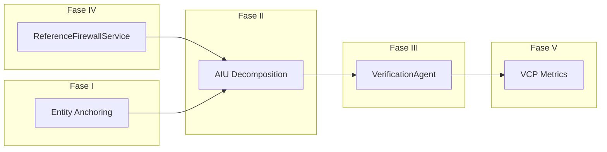

# Plan: Implementacion de Arquitectura Adversarial en Watcher (5 Fases)

**Test data:** 5 PDFs del 02/01/2026 (`boletines/2026/01/20260102_{1-5}_Secc.pdf`)

---

## Fase IV: Reference Firewall (prioridad 1 -- bajo esfuerzo, alto impacto)

Crear un servicio determinista que intercepte outputs LLM y valide que toda referencia a boletines, decretos, resoluciones, licitaciones y organismos exista realmente en la base de datos.

### Cambios

**Nuevo archivo:** `app/services/reference_firewall.py`

- Clase `ReferenceFirewallService` con metodos:
  - `validate_references(text: str) -> ReferenceValidationResult` -- punto de entrada principal
  - `_extract_references(text: str) -> List[Reference]` -- regex para N de boletin, decreto, resolucion, licitacion, expediente
  - `_validate_boletin_ref(ref) -> bool` -- query contra tabla `boletines` (por filename/date)
  - `_validate_organismo_ref(ref) -> bool` -- query contra `entidades_extraidas` (tipo=organismo)
  - `_validate_acto_ref(ref) -> bool` -- FTS5 query via `FTSService.search_bm25()` buscando el numero de acto en los chunks indexados
- Modelo `ReferenceValidationResult`: lista de `Reference` con status (verified/unverified/not_found), score global
- El firewall NO bloquea, solo anota (flag). En V1 es informativo.

**Integracion:** Interceptar en dos puntos:

1. [watcher_service.py](watcher-backend/app/services/watcher_service.py) `analyze_fragment()` (linea ~362) -- validar post-Gemini antes de retornar
2. [agents/insight_reporting/agent.py](watcher-backend/agents/insight_reporting/agent.py) `answer_query()` (linea ~195) -- validar respuestas del agente de reportes

**Test:** Procesar los 5 boletines del 02/01/2026 con el pipeline actual, luego pasar los outputs de `WatcherService.analyze_content()` por el firewall. Verificar que los numeros de decreto/resolucion extraidos matcheen con los chunks indexados.

---

## Fase I: Entity Anchoring Enhancement (prioridad 2 -- esfuerzo medio, impacto alto)

Ejecutar extraccion de entidades ANTES del chunking para construir un EntityMap persistente que ancle entidades a chunks y evite fragmentacion de contexto.

### Cambios

**Modificar:** [app/services/entity_service.py](watcher-backend/app/services/entity_service.py)

- Agregar metodo `build_entity_map(entities: List[EntityResult]) -> EntityMap` que agrupe entidades por rango de posicion (start_char, end_char)
- `EntityMap` es un dict/dataclass: `Dict[Tuple[int,int], List[EntityResult]]` con metodo `get_entities_in_range(start, end)`

**Modificar:** [app/services/chunking_service.py](watcher-backend/app/services/chunking_service.py)

- Extender `ChunkResult` (linea 47) con campo `entity_anchors: Optional[List[EntityResult]]`
- Extender `chunk()` (linea 76) con parametro `entity_map: Optional[EntityMap] = None`
- En el loop de construccion de ChunkResult (linea 99-117), asignar entidades del EntityMap que caen en el rango `[start_char, end_char]`
- Logica de boundary-awareness: si un separador cortaria a una entidad por la mitad, intentar ajustar el punto de corte +/- 50 chars

**Modificar:** [app/services/chunk_enricher.py](watcher-backend/app/services/chunk_enricher.py)

- Extender `enrich()` (linea 92) con parametro `anchored_entities: Optional[List[EntityResult]]`
- Si se reciben anchored_entities, usarlas en vez de `_extract_basic_entities()` para `entities_json`
- Agregar campo `entity_anchored: bool` al metadata

**Modificar:** Pipeline -- insertar Entity Pre-Scan entre cleaning y chunking:

- En [app/api/v1/endpoints/pipeline.py](watcher-backend/app/api/v1/endpoints/pipeline.py) `_process_document_pipeline()` (entre lineas 508 y 510): agregar stage "ENTITY_MAPPING" que llame a `EntityService.extract_entities(cleaned_text)` + `build_entity_map()`
- Pasar el `entity_map` al chunking y luego al enricher via indexing

**Test:** Procesar `20260102_1_Secc.pdf` con y sin entity anchoring. Comparar: (a) cuantas entidades se detectan por chunk, (b) cuantas entidades quedan "cortadas" entre chunks, (c) consistencia del `entities_json` en ChunkRecord.

---

## Fase II: AIU Decomposition Service (prioridad 3 -- esfuerzo medio, impacto medio-alto)

Descomponer outputs LLM en Atomic Information Units verificables individualmente.

### Cambios

**Nuevo archivo:** `app/services/aiu_service.py`

- Clase `AIUService`:
  - `decompose(text: str, source_type: str) -> List[AIU]` -- descompone texto en unidades atomicas
  - Para outputs de `WatcherService` (structured JSON): descomponer cada campo del acto en un AIU (sujeto, accion, referencia, monto, temporal)
  - Para outputs de agentes (texto libre): usar Gemini Flash con prompt especifico para extraer claims atomicos
- Modelo `AIU`:
  - `claim_text: str` -- la afirmacion atomica
  - `claim_type: str` -- subject, action, reference, amount, temporal, relationship
  - `source_output_id: Optional[str]` -- referencia al output que lo genero
  - `source_chunk_id: Optional[str]` -- chunk fuente (si es rastreable)
  - `verification_status: str` -- pending, verified, unverifiable, contradicted
  - `evidence_text: Optional[str]` -- texto fuente que soporta/contradice
  - `evidence_score: Optional[float]` -- score de match

**Integracion con WatcherService:** Despues de `analyze_fragment()`, tomar cada acto del JSON y crear AIUs:

- El campo `organismo` -> AIU tipo "subject"
- El campo `tipo_acto` + `numero` -> AIU tipo "reference" (pasa por Reference Firewall)
- El campo `beneficiarios` -> AIU tipo "subject" por cada beneficiario
- El campo `montos` + `monto_total_numerico` -> AIU tipo "amount"
- El campo `descripcion` -> posiblemente multiples AIUs tipo "action"
- El campo `texto_original` -> AIU tipo "evidence_anchor" (se verifica que exista literalmente en el chunk)

**Nuevo modelo DB (opcional):** Tabla `aiu_records` para persistir AIUs y su estado de verificacion. Permite tracking historico de VCP.

**Test:** Tomar los outputs de `analyze_content()` para los 5 boletines del 02/01/2026. Descomponer en AIUs. Contar total de AIUs generados por tipo. Verificar que `texto_original` de cada acto matchee literalmente con algun chunk indexado (esto es la AIU mas facil de verificar y sirve como baseline).

---

## Fase III: Verification Agent (prioridad 4 -- esfuerzo alto, impacto muy alto)

Crear un agente adversarial que verifique cada AIU contra el corpus usando hybrid search.

### Cambios

**Nuevo archivo:** `agents/verification/agent.py`

- Clase `VerificationAgent`:
  - `execute(workflow: WorkflowState, task: TaskDefinition) -> Dict[str, Any]` -- interface standard
  - `verify_aius(aius: List[AIU], boletin_id: Optional[int] = None) -> VerificationResult`
  - `_verify_single_aiu(aiu: AIU) -> AIU` -- para cada AIU:
    1. Construir query de busqueda a partir del `claim_text`
    2. Ejecutar `RetrievalService.hybrid_search(query, top_k=5)` con filtro por `boletin_id` si disponible
    3. Evaluar match: si el top result tiene score > threshold (0.7), marcar como verified. Si score < 0.3, marcar como unverifiable. Si se encuentra contradiccion explicita, marcar como contradicted.
    4. Para AIUs tipo "reference", delegar al `ReferenceFirewallService` (Fase IV)
    5. Para AIUs tipo "amount", hacer match exacto de cifra en chunks
  - `_calculate_vcp(aius: List[AIU]) -> float` -- VCP = verified / total
- Modelo `VerificationResult`:
  - `vcp_score: float`
  - `total_aius: int`
  - `verified: int`, `unverifiable: int`, `contradicted: int`
  - `aius: List[AIU]` con status actualizado
  - `requires_human_review: bool` -- True si hay AIUs contradicted o VCP < threshold

**Modificar:** [agents/orchestrator/state.py](watcher-backend/agents/orchestrator/state.py)

- Agregar `VERIFICATION = "verification"` al enum `AgentType` (linea 17)

**Modificar:** [agents/orchestrator/agent.py](watcher-backend/agents/orchestrator/agent.py)

- Registrar `VerificationAgent` como handler
- En `_execute_task()` (linea 244): opcionalmente, despues de ejecutar un handler de tipo INSIGHT_REPORTING o ANOMALY_DETECTION, encolar automaticamente una tarea de verificacion para el resultado

**Prompt del Auditor:**

```
Tu rol es INVALIDAR. No tienes incentivo de ayudar al Writer.
Para cada claim:
1. Busca evidencia en el corpus de boletines oficiales
2. Si no hay evidencia textual directa, marca NO VERIFICABLE
3. Si la evidencia contradice el claim, marca CONTRADICE y cita la fuente
4. Un claim es VERIFICADO solo si hay match textual directo o parafrasis cercana
5. Reporta VCP final
```

**Human-in-the-loop:** Si `requires_human_review=True`, la tarea pasa a status `WAITING_APPROVAL` (ya soportado por el orchestrator). El usuario ve las AIUs contradicted y decide si aceptar, rechazar o corregir.

**Test:** Pipeline completo con `20260102_1_Secc.pdf`:

1. Procesar con pipeline (extract -> clean -> entity_map -> chunk -> index)
2. Analizar con WatcherService -> obtener actos
3. Descomponer actos en AIUs (Fase II)
4. Verificar AIUs con VerificationAgent (Fase III)
5. Medir VCP. Objetivo: VCP > 0.85 para datos del propio boletin.

---

## Fase V: VCP Metrics y Observabilidad (prioridad 5 -- esfuerzo bajo, impacto medio)

Integrar Verified Claim Precision como metrica del sistema en el modulo de observabilidad existente.

### Cambios

**Modificar:** [app/core/observability.py](watcher-backend/app/core/observability.py)

- Agregar metricas especificas:
  - `vcp.score` (gauge) -- VCP del ultimo output verificado
  - `vcp.aius_total` (counter) -- total AIUs generados
  - `vcp.aius_verified` (counter) -- AIUs verificados
  - `vcp.aius_contradicted` (counter) -- AIUs contradicted (alerta critica)
  - `vcp.aius_unverifiable` (counter) -- AIUs no verificables
  - `verification.latency_ms` (histogram) -- tiempo de verificacion por output

**Modificar:** [app/api/v1/endpoints/observability.py](watcher-backend/app/api/v1/endpoints/observability.py)

- Agregar endpoint `GET /api/v1/observability/vcp` -- VCP dashboard: score actual, historico, breakdown por tipo de AIU, peores offenders
- Agregar endpoint `GET /api/v1/observability/vcp/{boletin_id}` -- VCP por boletin especifico

**Integracion:** El `VerificationAgent` emite metricas via `MetricsCollector` al finalizar cada verificacion. Usar el decorator `@traced_operation("verification")` existente.

**Dashboard data:** El endpoint `GET /api/v1/observability/dashboard` (existente) se extiende con seccion de VCP.

**Test:** Procesar los 5 boletines del 02/01/2026. Verificar que las metricas se registran correctamente. Consultar el dashboard y validar que muestra VCP por boletin y global.

---

## Orden de ejecucion y dependencias




- Fase IV y Fase I pueden ejecutarse **en paralelo** (sin dependencias mutuas)
- Fase II depende de Fase IV (Reference Firewall para AIUs tipo "reference") y Fase I (entity anchors para AIUs tipo "subject")
- Fase III depende de Fase II (recibe AIUs como input)
- Fase V depende de Fase III (registra metricas del VerificationAgent)

## Archivos nuevos (4)


| Archivo                              | Fase |
| ------------------------------------ | ---- |
| `app/services/reference_firewall.py` | IV   |
| `app/services/aiu_service.py`        | II   |
| `agents/verification/agent.py`       | III  |
| `agents/verification/__init__.py`    | III  |


## Archivos modificados (8)


| Archivo                                 | Fases  | Cambios                                     |
| --------------------------------------- | ------ | ------------------------------------------- |
| `app/services/entity_service.py`        | I      | + `build_entity_map()`, + `EntityMap` class |
| `app/services/chunking_service.py`      | I      | + `entity_map` param, + boundary awareness  |
| `app/services/chunk_enricher.py`        | I      | + `anchored_entities` param                 |
| `app/api/v1/endpoints/pipeline.py`      | I      | + stage ENTITY_MAPPING                      |
| `app/services/watcher_service.py`       | IV, II | + firewall hook, + AIU decomposition hook   |
| `agents/orchestrator/state.py`          | III    | + VERIFICATION agent type                   |
| `agents/orchestrator/agent.py`          | III    | + register VerificationAgent                |
| `app/core/observability.py`             | V      | + VCP metrics                               |
| `app/api/v1/endpoints/observability.py` | V      | + VCP endpoints                             |


