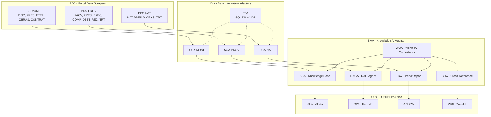
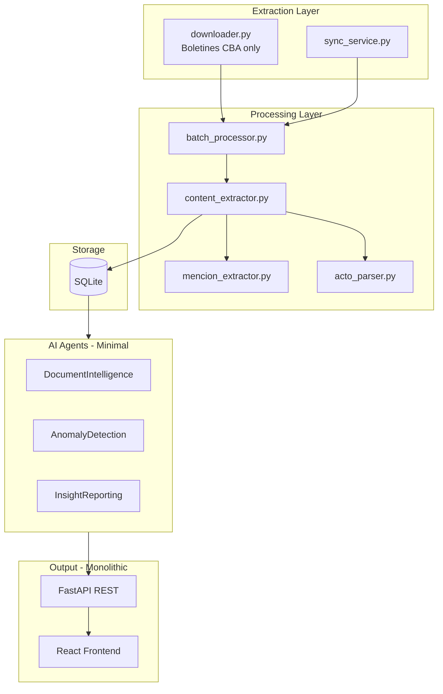

# Arquitectura Watcher - Analisis Comparativo y Plan de Refactor

## Interpretacion de la Arquitectura Propuesta (Imagen)

La imagen muestra una arquitectura en **4 capas** diseñada para escalar a multiples fuentes de datos:

---

## Arquitectura Actual del Repositorio

---

## Comparativa y Gaps Identificados

| Aspecto | Arquitectura Propuesta | Arquitectura Actual | Gap |

|---------|------------------------|---------------------|-----|

| **Fuentes de datos** | Multi-fuente (MUNI, PROV, NAT) | Single-source (Boletines CBA) | ALTO |

| **Scrapers** | Especializados por portal | Un downloader generico | MEDIO |

| **Adaptadores** | SCA-* por tipo de dato | Sin adaptadores, flujo lineal | ALTO |

| **Vector DB** | VDB para embeddings/RAG | Solo SQLite relacional | ALTO |

| **Agentes IA** | 5+ especializados (KBA, RAGA, TRA, CRA, WOA) | 3 genericos | MEDIO |

| **Orquestacion** | WOA dedicado central | Basica en workflow_crud | MEDIO |

| **Outputs** | Separados (ALA, RPA, API-GW, WUI) | Mezclados en API | BAJO |

---

## Evaluacion del Approach Propuesto

### Fortalezas

1. **Escalabilidad Multi-fuente**: Permite agregar nuevos portales (municipal, nacional) sin modificar el core
2. **Separacion de Concerns**: Cada capa tiene responsabilidad unica
3. **RAG-ready**: Inclusion de VDB habilita busqueda semantica y RAG
4. **Agentes Especializados**: Mejor precision y mantenibilidad

### Consideraciones

1. **Complejidad Inicial**: Requiere mas infraestructura (VDB, mas bases de datos)
2. **Overhead de Coordinacion**: WOA debe manejar comunicacion entre agentes
3. **Datos Disponibles**: Algunos portales (MUNI, NAT) pueden no tener APIs publicas

---

## Plan de Refactorizacion Incremental

### Fase 1: Abstraer Capa de Extraccion (PDS)

Crear interfaz base para scrapers y adaptar el downloader existente:

**Archivos clave:**

- Crear: `watcher-monolith/backend/app/scrapers/base_scraper.py`
- Refactor: [`downloader.py`](watcher-monolith/backend/app/api/v1/endpoints/downloader.py) -> `scrapers/pds_prov.py`
- Crear: `scrapers/pds_muni.py` (placeholder)

### Fase 2: Implementar Capa de Adaptadores (DIA)

Normalizar datos de diferentes fuentes a un schema comun:

**Archivos clave:**

- Crear: `watcher-monolith/backend/app/adapters/base_adapter.py`
- Crear: `adapters/sca_prov.py` (transformar boletines)
- Crear: `adapters/ppa.py` (persistencia unificada)

### Fase 3: Agregar Vector Database

Integrar ChromaDB/Pinecone para embeddings:

**Archivos clave:**

- Modificar: [`database.py`](watcher-monolith/backend/app/db/database.py) - agregar VDB
- Crear: `services/embedding_service.py`
- Modificar: [`batch_processor.py`](watcher-monolith/backend/app/services/batch_processor.py) - generar embeddings

### Fase 4: Especializar Agentes (KAA)

Refactorizar agentes existentes y agregar nuevos:

**Archivos clave:**

- Refactor: [`agents/`](agents/) -> estructura mas modular
- Crear: `agents/kba_agent.py` (Knowledge Base)
- Crear: `agents/raga_agent.py` (RAG con VDB)
- Potenciar: [`agents/document_intelligence.py`](agents/document_intelligence.py)

### Fase 5: Separar Outputs (OEx)

Desacoplar alertas, reportes y API:

**Archivos clave:**

- Crear: `services/alert_dispatcher.py` (ALA)
- Crear: `services/report_generator.py` (RPA)
- Refactor: endpoints para API Gateway pattern

---

## Recomendacion

**El approach es solido y escalable**, pero recomiendo implementarlo **incrementalmente**:

1. **Sprint 3**: Fase 1 - Abstraer scrapers (sin romper funcionalidad actual)
2. **Sprint 4**: Fase 2 + 3 - Adaptadores y Vector DB
3. **Sprint 5**: Fase 4 - Agentes especializados
4. **Sprint 6**: Fase 5 - Separar outputs

Esto permite validar cada capa antes de avanzar y mantener el sistema funcional durante la migracion.