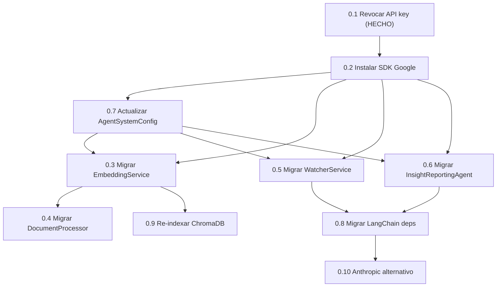

# Plan de Implementacion - Epica 0: Migracion OpenAI a Google Gemini

## Estado actual

- **Ticket 0.1** (Revocar API key OpenAI): **HECHO**
- **Tickets 0.2 - 0.10**: Todos en estado "Por hacer", Sprint 2

## Resumen de dependencias detectadas en el codigo

El codebase usa OpenAI directamente (no via LangChain) en 5 archivos principales:

- **Chat completions** (`gpt-3.5-turbo`): 3 ubicaciones
  - `watcher_service.py` -- analisis de contenido
  - `insight_reporting/agent.py` -- generacion de narrativas y respuestas
  - `compliance.py` endpoint
- **Embeddings** (`text-embedding-3-small`): 2 ubicaciones
  - `embedding_service.py` -- servicio principal de embeddings
  - `document_processor.py` -- procesamiento para compliance
- **LangChain**: listado en requirements.txt pero **sin uso real** en el codigo

## Grafo de dependencias entre tickets




## Orden de ejecucion recomendado (por oleadas)

### Oleada 1: Fundamentos (pueden hacerse en paralelo)

#### Ticket 0.2 -- Instalar SDK de Google AI

**Archivo:** [requirements.txt](watcher-monolith/backend/requirements.txt)

- Agregar `google-generativeai>=0.8.0` (SDK directo de Google)
- Agregar `langchain-google-genai>=2.0.0` (para ticket 0.8)
- Mantener `openai` temporalmente hasta completar la migracion
- Verificar instalacion con un script de smoke test

#### Ticket 0.7 -- Actualizar AgentSystemConfig

**Archivos:**

- [agent_config.py](watcher-monolith/backend/app/core/agent_config.py) -- Linea 101: reemplazar `openai_api_key` por `google_api_key` (o agregar ambas durante transicion)
- [config.py](watcher-monolith/backend/app/core/config.py) -- Linea 21: agregar `GOOGLE_API_KEY` setting
- [.env](watcher-monolith/backend/.env) -- Agregar variable `GOOGLE_API_KEY`

**Cambios concretos en `agent_config.py`:**

```python
# Reemplazar:
openai_api_key: str = Field(default_factory=lambda: os.getenv("OPENAI_API_KEY", ""))
# Con:
google_api_key: str = Field(default_factory=lambda: os.getenv("GOOGLE_API_KEY", ""))
```

### Oleada 2: Migracion de Embeddings

#### Ticket 0.3 -- Migrar EmbeddingService a Google text-embedding-004

**Archivo:** [embedding_service.py](watcher-monolith/backend/app/services/embedding_service.py)

Cambios principales:

- Reemplazar `import openai` por `import google.generativeai as genai`
- En `__init__()`: configurar `genai.configure(api_key=...)` en vez de `openai.api_key`
- En `generate_embedding()`: reemplazar `openai.Embedding.acreate()` por `genai.embed_content(model="models/text-embedding-004", ...)`
- Nota: `text-embedding-004` produce vectores de 768 dimensiones (vs 1536 de OpenAI). Esto impacta ChromaDB y requiere re-indexacion (ticket 0.9)

**Consideracion critica:** ChromaDB actualmente usa su embedding function por defecto (`all-MiniLM-L6-v2`, 384 dims) en `add_document()`. La migracion debe decidir si usar Google embeddings directamente o seguir con el modelo local de ChromaDB. Recomendacion: usar Google `text-embedding-004` como custom embedding function de ChromaDB para unificar.

#### Ticket 0.4 -- Migrar DocumentProcessor a Google embeddings

**Archivo:** [document_processor.py](watcher-monolith/backend/app/services/document_processor.py)

Cambios en `generate_embeddings()` (linea ~106-120):

- Reemplazar parametro `openai_client: AsyncOpenAI` por `google_client` o usar `genai` directamente
- Reemplazar `openai_client.embeddings.create(input=..., model="text-embedding-3-small")` por `genai.embed_content(model="models/text-embedding-004", content=...)`
- Actualizar endpoint compliance ([compliance.py](watcher-monolith/backend/app/api/v1/endpoints/compliance.py) linea 774-810) para usar Google client en vez de `AsyncOpenAI`

### Oleada 3: Migracion de LLM (Chat Completions)

#### Ticket 0.5 -- Migrar WatcherService a Google Gemini

**Archivo:** [watcher_service.py](watcher-monolith/backend/app/services/watcher_service.py)

Cambios principales:

- Reemplazar `from openai import AsyncOpenAI` por `import google.generativeai as genai`
- En `__init__()`: reemplazar `self.client = AsyncOpenAI(api_key=...)` por `genai.configure(api_key=...)` y `self.model = genai.GenerativeModel("gemini-2.0-flash")`
- En `analyze_fragment()` (linea ~170): reemplazar `self.client.chat.completions.create()` por `self.model.generate_content_async()`
- Adaptar formato de prompt: OpenAI usa `messages=[{"role": "system", ...}, {"role": "user", ...}]`, Gemini usa `contents` con formato diferente
- Modelo recomendado: `gemini-2.0-flash` (rapido y economico, equivalente a gpt-3.5-turbo)

#### Ticket 0.6 -- Migrar InsightReportingAgent a Google Gemini

**Archivo:** [agents/insight_reporting/agent.py](watcher-monolith/backend/agents/insight_reporting/agent.py)

Cambios principales (patron identico a 0.5):

- Reemplazar `from openai import AsyncOpenAI` por `import google.generativeai as genai`
- En `__init__()`: configurar Gemini client
- En `_generate_ai_narrative()` (linea ~296): reemplazar llamada OpenAI por Gemini
- En `_generate_ai_response()` (linea ~426): reemplazar llamada OpenAI por Gemini
- Modelo: `gemini-2.0-flash`

### Oleada 4: Limpieza de dependencias

#### Ticket 0.8 -- Migrar LangChain de langchain-openai a langchain-google-genai

**Archivo:** [requirements.txt](watcher-monolith/backend/requirements.txt)

- Dado que LangChain NO se usa activamente en el codigo, este ticket se simplifica a:
  - Eliminar `langchain-openai>=0.1.0` de requirements.txt
  - Agregar `langchain-google-genai>=2.0.0` (para uso futuro en epicas posteriores)
  - Verificar que ningun import de `langchain_openai` existe con grep

### Oleada 5: Re-indexacion

#### Ticket 0.9 -- Re-indexar ChromaDB con nuevo modelo de embeddings

**Archivos:**

- [scripts/reindex_multilingual.py](scripts/reindex_multilingual.py) -- Script base a adaptar
- [scripts/indexar_embeddings.py](scripts/indexar_embeddings.py) -- Script de indexacion masiva

Pasos:

1. Crear script `scripts/reindex_google_embeddings.py` basado en `reindex_multilingual.py`
2. Implementar `GoogleEmbeddingFunction` compatible con ChromaDB
3. Hacer backup de la coleccion actual (`watcher_documents`)
4. Crear nueva coleccion con Google `text-embedding-004` (768 dims)
5. Re-indexar todos los documentos procesados desde `data/processed/`
6. Validar resultados de busqueda con queries de prueba
7. Eliminar coleccion vieja una vez validado

### Oleada 6: Opcional

#### Ticket 0.10 -- Configurar Anthropic como provider alternativo

- Agregar `anthropic>=0.40.0` a requirements.txt
- Crear una abstraccion `LLMProvider` que soporte Google y Anthropic
- Configurar via variable de entorno `LLM_PROVIDER=google|anthropic`
- Esto se alinea con el ticket 6.3 (LLMProviderFactory) de la Epica 6

## Archivos clave a modificar (resumen)

- `watcher-monolith/backend/requirements.txt` -- Dependencias
- `watcher-monolith/backend/.env` -- Nueva `GOOGLE_API_KEY`
- `watcher-monolith/backend/app/core/agent_config.py` -- Config de API key
- `watcher-monolith/backend/app/core/config.py` -- Settings
- `watcher-monolith/backend/app/services/embedding_service.py` -- Embeddings
- `watcher-monolith/backend/app/services/document_processor.py` -- Doc processor
- `watcher-monolith/backend/app/services/watcher_service.py` -- LLM analysis
- `watcher-monolith/backend/agents/insight_reporting/agent.py` -- Insight agent
- `watcher-monolith/backend/app/api/v1/endpoints/compliance.py` -- Compliance endpoint
- `watcher-monolith/backend/check_config.py` -- Config verification
- `scripts/reindex_google_embeddings.py` -- Nuevo script de re-indexacion

## Riesgos y consideraciones

1. **Dimension de embeddings cambia**: OpenAI `text-embedding-3-small` = 1536 dims, Google `text-embedding-004` = 768 dims. Requiere re-indexacion completa de ChromaDB.
2. **API async**: Google SDK soporta async pero con API diferente a OpenAI. Verificar compatibilidad.
3. **Rate limits**: Google tiene rate limits diferentes. Usar `tenacity` para retry con backoff.
4. **Formato de prompts**: Gemini usa formato de contenido diferente a OpenAI chat completions. Los system prompts se manejan distinto.
5. **Costos**: Google `text-embedding-004` es gratuito hasta cierto volumen en el free tier. `gemini-2.0-flash` es significativamente mas barato que `gpt-3.5-turbo`.

