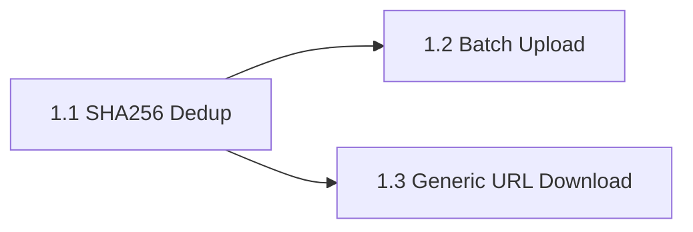

# Epic 1: Ingesta - Implementation Plan

## Current State

The backend has a working ingestion pipeline with:

- **Provincial scraper** ([pds_prov.py](watcher-monolith/backend/app/scrapers/pds_prov.py)) that downloads PDFs from the Cordoba provincial bulletin portal
- **Boletin model** ([models.py](watcher-monolith/backend/app/db/models.py)) with `filename` uniqueness but **no SHA256 hash field**
- **CRUD** ([crud.py](watcher-monolith/backend/app/db/crud.py)) that deduplicates only by `filename`
- **No file upload endpoint** -- only import from local directory (`POST /boletines/import/`)
- **No generic URL download** -- only the hardcoded provincial scraper URL template

## Task Dependencies




Task 1.1 must be implemented first because both 1.2 and 1.3 need the deduplication layer to function correctly.

---

## Task 1.1 - Implementar deduplicacion por SHA256 en upload

**Goal:** Add SHA256-based deduplication so that identical files are never stored/registered twice, regardless of filename.

### Changes

**1. Add `file_hash` column to `Boletin` model** in [models.py](watcher-monolith/backend/app/db/models.py):

```python
# Add after error_message field (line ~41)
file_hash = Column(String(64), nullable=True, index=True)  # SHA256 hash
file_size_bytes = Column(Integer, nullable=True)
```

**2. Create a utility function** `compute_sha256` in a new file `watcher-monolith/backend/app/services/hash_utils.py`:

```python
import hashlib
from pathlib import Path

def compute_sha256(filepath: Path) -> str:
    sha256 = hashlib.sha256()
    with open(filepath, "rb") as f:
        for chunk in iter(lambda: f.read(8192), b""):
            sha256.update(chunk)
    return sha256.hexdigest()

def compute_sha256_bytes(content: bytes) -> str:
    return hashlib.sha256(content).hexdigest()
```

**3. Update `create_boletin` in [crud.py](watcher-monolith/backend/app/db/crud.py):**

- Accept optional `file_hash` and `file_size_bytes` parameters
- Check for duplicates by `file_hash` first (if provided), then by `filename`
- If hash match found with different filename, return the existing record with a flag

**4. Update `ProvincialScraper.download_single**` in [pds_prov.py](watcher-monolith/backend/app/scrapers/pds_prov.py):

- After writing the file, compute SHA256 and include it in `ScraperResult.metadata`

**5. Add Alembic migration** (or manual ALTER TABLE if not using Alembic):

- Add `file_hash` and `file_size_bytes` columns to `boletines` table
- Since SQLite is used, this will be a simple `ALTER TABLE ADD COLUMN`

**6. Backfill script** -- optional utility in `scripts/` to compute hashes for existing boletines.

---

## Task 1.2 - Implementar batch upload (subir multiples archivos)

**Goal:** Create an endpoint to upload one or more PDF files directly via HTTP, with SHA256 deduplication.

### Changes

**1. Create new endpoint file** `watcher-monolith/backend/app/api/v1/endpoints/upload.py`:

```python
POST /api/v1/upload/files
```

- Accepts `List[UploadFile]` (multipart/form-data)
- For each file:
  - Compute SHA256 from file bytes
  - Check for duplicate via `file_hash` in DB
  - If duplicate: skip and report as "duplicate"
  - If new: save to `settings.UPLOADS_DIR / {year}/{month}/{filename}`, create `Boletin` record
- Parse filename to extract date/section (if format matches `YYYYMMDD_N_Secc.pdf`)
- Return summary: `{uploaded: N, duplicates: N, failed: N, details: [...]}`

**2. Register the router** in [api.py](watcher-monolith/backend/app/api/v1/api.py):

```python
from app.api.v1.endpoints import upload
api_router.include_router(upload.router, prefix="/upload", tags=["upload"])
```

**3. Add Pydantic schemas** for upload response in [schemas](watcher-monolith/backend/app/schemas/) or inline.

**4. File validation:**

- Check file is PDF (content-type and magic bytes)
- Minimum file size (>10KB, consistent with scraper validation)
- Maximum file size (configurable, e.g. 50MB)

---

## Task 1.3 - Implementar descarga generica por URL

**Goal:** Create an endpoint that downloads a document from any given URL, stores it, and registers it in the DB with deduplication.

### Changes

**1. Create new endpoint** in `watcher-monolith/backend/app/api/v1/endpoints/upload.py` (same file as 1.2, since conceptually related):

```python
POST /api/v1/upload/from-url
```

Request body:

```python
class DownloadFromURLRequest(BaseModel):
    url: str              # URL to download from
    filename: Optional[str]  # Override filename (auto-detected from URL if omitted)
    date: Optional[str]      # Override date (YYYYMMDD)
    section: Optional[str]   # Override section
    fuente: Optional[str]    # Source: provincial, municipal_capital, municipal_otros
```

**2. Implementation logic:**

- Download file from URL using `httpx` with timeout and retries
- Validate content-type is PDF (or allowed format)
- Compute SHA256 of downloaded content
- Check for duplicate in DB
- If new: save to `UPLOADS_DIR`, create `Boletin` record with `file_hash`
- If duplicate: return existing record info

**3. Add batch URL download variant:**

```python
POST /api/v1/upload/from-urls
```

- Accepts a list of URLs
- Downloads sequentially with rate limiting
- Returns summary similar to batch upload

**4. Update config** in [config.py](watcher-monolith/backend/app/core/config.py):

- Add `MAX_UPLOAD_SIZE_MB: int = 50`
- Add `ALLOWED_FILE_TYPES: List[str] = ["application/pdf"]`
- Add `DOWNLOAD_TIMEOUT: float = 60.0`

---

## Files to Create/Modify Summary


| Action | File                                                                      |
| ------ | ------------------------------------------------------------------------- |
| Modify | `watcher-monolith/backend/app/db/models.py` (add hash columns)            |
| Modify | `watcher-monolith/backend/app/db/crud.py` (hash-based dedup)              |
| Create | `watcher-monolith/backend/app/services/hash_utils.py`                     |
| Create | `watcher-monolith/backend/app/api/v1/endpoints/upload.py`                 |
| Modify | `watcher-monolith/backend/app/api/v1/api.py` (register router)            |
| Modify | `watcher-monolith/backend/app/scrapers/pds_prov.py` (add hash to results) |
| Modify | `watcher-monolith/backend/app/core/config.py` (upload settings)           |
| Create | `scripts/backfill_hashes.py` (optional backfill)                          |


