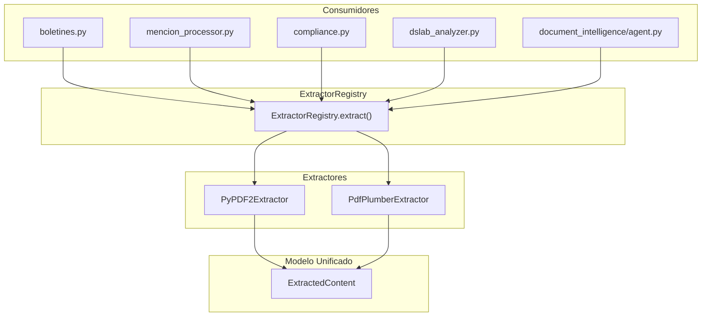

# Plan de Implementacion - Epica 2: Extraccion

## Situacion Actual

El sistema tiene **5 implementaciones distintas** de extraccion de PDF dispersas en el codebase, usando dos bibliotecas diferentes (PyPDF2 y pdfplumber), sin una interfaz unificada ni un modelo de datos comun:


| Archivo                                     | Biblioteca | Uso                                              |
| ------------------------------------------- | ---------- | ------------------------------------------------ |
| `pdf_service.py` (PDFProcessor)             | PyPDF2     | Boletines: PDF -> texto plano                    |
| `content_extractor.py` (ContentExtractor)   | PyPDF2     | Boletines: PDF -> secciones logicas              |
| `document_processor.py` (DocumentProcessor) | PyPDF2     | Compliance docs: PDF -> texto + stats            |
| `dslab_analyzer.py` (DSLabAnalyzer)         | pdfplumber | DS Lab: PDF -> texto + entidades                 |
| `document_intelligence/agent.py`            | pdfplumber | Agente: PDF -> texto + entidades + clasificacion |


Ademas, `mencion_processor.py` importa `ContentExtractor` pero en realidad usa `PDFProcessor` internamente (inconsistencia).

## Orden de Implementacion

Las tareas tienen dependencia logica: **2.3 -> 2.1 -> 2.2** (primero el modelo de datos, luego el extractor unificado, luego el registry que los conecta).

---

## Tarea 2.3: Definir modelo ExtractedContent unificado (Vencimiento: 2026-02-24)

**Objetivo:** Crear un modelo Pydantic que unifique la salida de todos los extractores, capturando texto, metadatos por pagina, estadisticas y tipo de seccion.

**Archivo nuevo:** [watcher-monolith/backend/app/schemas/extraction.py](watcher-monolith/backend/app/schemas/extraction.py)

**Modelo propuesto:**

```python
from pydantic import BaseModel
from typing import List, Optional, Dict, Any
from datetime import datetime
from enum import Enum

class ExtractionMethod(str, Enum):
    PYPDF2 = "pypdf2"
    PDFPLUMBER = "pdfplumber"

class SectionType(str, Enum):
    LICITACION = "licitacion"
    NOMBRAMIENTO = "nombramiento"
    RESOLUCION = "resolucion"
    SUBSIDIO = "subsidio"
    PRESUPUESTO = "presupuesto"
    GENERAL = "general"
    UNKNOWN = "unknown"

class PageContent(BaseModel):
    page_number: int
    text: str
    char_count: int

class ContentSection(BaseModel):
    section_type: SectionType
    content: str
    start_page: int
    end_page: int
    metadata: Dict[str, Any] = {}

class ExtractionStats(BaseModel):
    total_chars: int
    total_pages: int
    total_tokens: Optional[int] = None
    extraction_method: ExtractionMethod
    extraction_duration_ms: Optional[float] = None

class ExtractedContent(BaseModel):
    """Modelo unificado de contenido extraido de un documento."""
    success: bool
    source_path: str
    full_text: str
    pages: List[PageContent]
    sections: List[ContentSection] = []
    stats: ExtractionStats
    extracted_at: datetime
    error: Optional[str] = None
    metadata: Dict[str, Any] = {}
```

**Pasos:**

- Crear `app/schemas/extraction.py` con los modelos arriba
- Agregar tests unitarios para serialization/validation del modelo

---

## Tarea 2.1: Unificar extractores de PDF (PyPDF2 vs pdfplumber) (Vencimiento: 2026-02-25)

**Objetivo:** Crear una interfaz base `PDFExtractor` (ABC) con dos implementaciones concretas: `PyPDF2Extractor` y `PdfPlumberExtractor`, ambas retornando `ExtractedContent`.

**Archivo nuevo:** [watcher-monolith/backend/app/services/extractors/](watcher-monolith/backend/app/services/extractors/)

Estructura:

```
app/services/extractors/
    __init__.py
    base.py           # ABC PDFExtractor
    pypdf2_extractor.py
    pdfplumber_extractor.py
```

**Interfaz base (`base.py`):**

```python
from abc import ABC, abstractmethod
from pathlib import Path
from app.schemas.extraction import ExtractedContent, ExtractionMethod

class PDFExtractor(ABC):
    """Interfaz base para extractores de PDF."""

    @property
    @abstractmethod
    def method(self) -> ExtractionMethod: ...

    @abstractmethod
    async def extract(self, file_path: Path, **kwargs) -> ExtractedContent: ...
```

**Pasos:**

- Crear directorio `app/services/extractors/`
- Implementar `base.py` con la ABC
- Implementar `pypdf2_extractor.py`: migrar logica de [pdf_service.py](watcher-monolith/backend/app/services/pdf_service.py) y [document_processor.py](watcher-monolith/backend/app/services/document_processor.py), devolviendo `ExtractedContent`
- Implementar `pdfplumber_extractor.py`: migrar logica de [dslab_analyzer.py](watcher-monolith/backend/app/services/dslab_analyzer.py) y [document_intelligence/agent.py](watcher-monolith/backend/agents/document_intelligence/agent.py), devolviendo `ExtractedContent`
- Integrar la deteccion de secciones de [content_extractor.py](watcher-monolith/backend/app/services/content_extractor.py) como metodo compartido en la clase base o como un post-procesador
- Agregar tests unitarios para ambos extractores con un PDF de prueba

---

## Tarea 2.2: Crear ExtractorRegistry con Strategy Pattern (Vencimiento: 2026-02-27)

**Objetivo:** Crear un registry que permita seleccionar el extractor adecuado segun el tipo de archivo o preferencia, y refactorizar los consumidores para usar el registry en vez de instanciar extractores directamente.

**Archivo nuevo:** [watcher-monolith/backend/app/services/extractors/registry.py](watcher-monolith/backend/app/services/extractors/registry.py)

**Diseno:**

```python
class ExtractorRegistry:
    """Registry central de extractores con Strategy Pattern."""

    _extractors: Dict[str, PDFExtractor] = {}
    _default: str = "pdfplumber"  # pdfplumber produce mejor output

    @classmethod
    def register(cls, name: str, extractor: PDFExtractor): ...

    @classmethod
    def get(cls, name: Optional[str] = None) -> PDFExtractor: ...

    @classmethod
    def extract(cls, file_path: Path, method: Optional[str] = None) -> ExtractedContent: ...
```

**Pasos:**

- Implementar `registry.py` con auto-registro de los dos extractores
- Agregar configuracion en `.env` para elegir el extractor por defecto (`PDF_EXTRACTOR=pdfplumber|pypdf2`)
- Refactorizar consumidores (uno por uno) para usar el registry:
  - [boletines.py](watcher-monolith/backend/app/api/v1/endpoints/boletines.py): reemplazar `PDFProcessor` por `ExtractorRegistry`
  - [mencion_processor.py](watcher-monolith/backend/app/services/mencion_processor.py): reemplazar `PDFProcessor._extract_text_from_pdf()` por registry
  - [compliance.py](watcher-monolith/backend/app/api/v1/endpoints/compliance.py): reemplazar `DocumentProcessor` por registry (para extraccion de texto)
  - [dslab_analyzer.py](watcher-monolith/backend/app/services/dslab_analyzer.py): reemplazar `pdfplumber.open()` directo por registry
  - [document_intelligence/agent.py](watcher-monolith/backend/agents/document_intelligence/agent.py): reemplazar `pdfplumber.open()` directo por registry
- Marcar como deprecated pero mantener los archivos originales (`pdf_service.py`, `content_extractor.py`) con imports de compatibilidad
- Agregar tests de integracion que validen el registry con ambos extractores

---

## Diagrama de Arquitectura




## Estimacion Total

- **Tarea 2.3:** ~1-2 horas (modelo de datos + tests)
- **Tarea 2.1:** ~3-4 horas (2 extractores + migracion de logica + tests)
- **Tarea 2.2:** ~3-4 horas (registry + refactorizar 5 consumidores + tests de integracion)
- **Total:** ~7-10 horas

## Notas Importantes

- **pdfplumber** produce mejor output que PyPDF2 para PDFs complejos (tablas, columnas), por lo que sera el extractor por defecto
- Se mantiene PyPDF2 como fallback rapido para PDFs simples
- No se elimina ningun archivo viejo inmediatamente; se marca deprecated y se agregan wrappers de compatibilidad
- El notebook `epic_2_extraccion.ipynb` se creara para validar los extractores con datos reales de boletines

