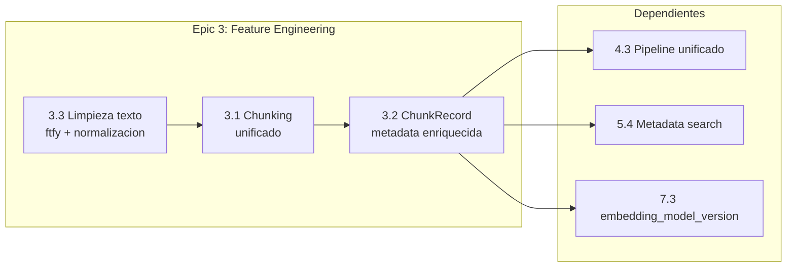
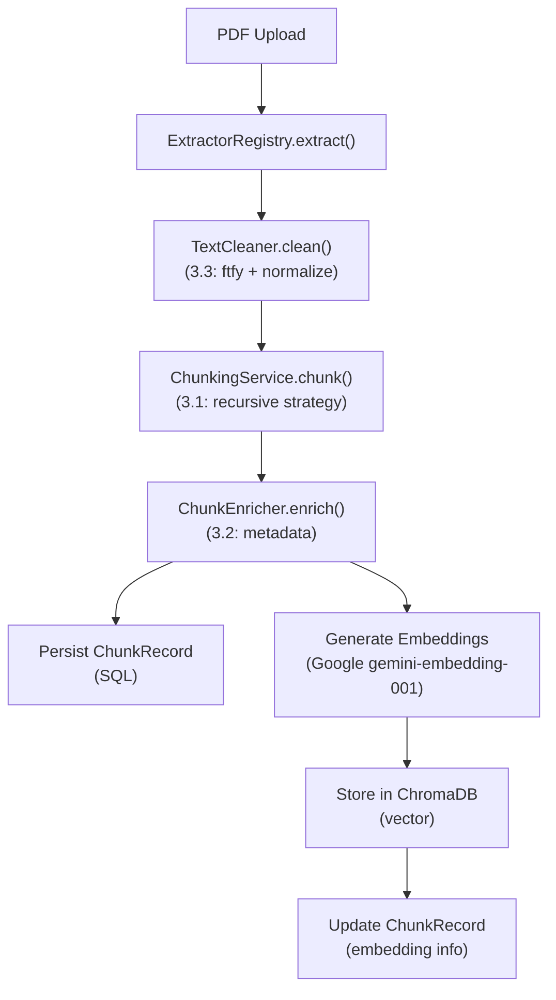

# Plan: Epica 3 - Feature Engineering

## Estado actual en Notion


| Tarea | Estado | Vencimiento | Page ID |
| ----- | ------ | ----------- | ------- |


- **3.3** Agregar limpieza de texto (ftfy + normalizacion) -- Por hacer -- 2026-02-24
- **3.1** Unificar estrategia de chunking -- Por hacer -- 2026-02-28
- **3.2** Implementar metadata enriquecida por chunk (ChunkRecord) -- Por hacer -- 2026-03-03

## Orden de implementacion

El orden logico es **3.3 -> 3.1 -> 3.2** porque:

1. La limpieza de texto debe ocurrir ANTES del chunking
2. El chunking unificado produce los chunks que luego se enriquecen con metadata
3. El ChunkRecord persiste el resultado final del pipeline




---

## Tarea 3.3: Agregar limpieza de texto (ftfy + normalizacion)

**Problema:** El texto extraido de PDFs llega crudo al chunking. No hay limpieza de encoding, mojibake, ni normalizacion de caracteres especiales. Solo existe normalizacion limitada para entidades (`entity_service.py`) y menciones (`mencion_extractor.py`).

**Solucion:** Crear un servicio de limpieza de texto que se aplique automaticamente despues de la extraccion y antes del chunking.

### Archivos a modificar/crear

1. **Agregar dependencia `ftfy**` en [watcher-monolith/backend/requirements.txt](watcher-monolith/backend/requirements.txt)
2. **Crear servicio** `watcher-monolith/backend/app/services/text_cleaner.py`:
  - Clase `TextCleaner` con metodos:
    - `clean(text: str) -> str` -- pipeline completo de limpieza
    - `fix_encoding(text: str) -> str` -- usa ftfy para corregir mojibake
    - `normalize_unicode(text: str) -> str` -- NFKC normalization
    - `normalize_whitespace(text: str) -> str` -- colapsar espacios, normalizar newlines
    - `remove_artifacts(text: str) -> str` -- headers/footers repetidos de PDF, numeros de pagina sueltos
    - `normalize_legal_text(text: str) -> str` -- normalizacion especifica para boletines oficiales (abreviaturas, formato de articulos)
  - Configurable via `CleaningConfig` (Pydantic model) para activar/desactivar pasos
3. **Integrar en el pipeline de extraccion**: modificar [watcher-monolith/backend/app/services/extractors/registry.py](watcher-monolith/backend/app/services/extractors/registry.py) para aplicar limpieza automaticamente al resultado de `extract()`. O, alternativamente, integrar en el flujo de `EmbeddingService.add_document()` antes del chunking.
4. **Tests**: Crear tests con textos reales de boletines con problemas tipicos (mojibake, encoding roto, artifacts de PDF).

### Referencia del codigo actual de normalizacion limitada

En `entity_service.py` lines 289-302 existe `normalize_entity()` y `_remove_accents()` -- solo para nombres de entidades.
En `mencion_extractor.py` lines 200-206 existe `_normalizar_texto()` -- solo remueve espacios multiples.

---

## Tarea 3.1: Unificar estrategia de chunking

**Problema:** Existen DOS implementaciones divergentes de chunking:

- `[EmbeddingService.chunk_text()](watcher-monolith/backend/app/services/embedding_service.py)` (linea 163): Character-based, retorna `List[str]`, intenta romper en boundaries de oracion.
- `[DocumentProcessor.chunk_text()](watcher-monolith/backend/app/services/document_processor.py)` (linea 143): Token-based (con tiktoken) o character-based como fallback, retorna `List[Dict]` con metadata.

Ninguno usa separadores inteligentes ni es consciente de la estructura del documento.

**Solucion:** Crear un `ChunkingService` unico con estrategia `RecursiveCharacterTextSplitter`-like que sea consciente de la estructura de boletines oficiales.

### Archivos a modificar/crear

1. **Crear servicio** `watcher-monolith/backend/app/services/chunking_service.py`:
  - Clase `ChunkingService` con:
    - `chunk(text: str, config: ChunkingConfig) -> List[ChunkResult]`
    - Estrategia recursiva con separadores jerarquicos: `["\n\n\n", "\n\n", "\n", ". ", " "]`
    - Separadores adicionales para boletines: `["ARTICULO", "DECRETO", "RESOLUCION", "---"]`
    - Configuracion via `ChunkingConfig` (Pydantic):
      - `chunk_size: int = 1000` (en caracteres)
      - `chunk_overlap: int = 200`
      - `min_chunk_size: int = 100` (evitar chunks muy chicos)
      - `strategy: str = "recursive"` (extensible a futuro)
  - Modelo de resultado `ChunkResult` (Pydantic):
    - `text: str`
    - `chunk_index: int`
    - `start_char: int`
    - `end_char: int`
    - `num_chars: int`
2. **Refactorizar `EmbeddingService**` ([embedding_service.py](watcher-monolith/backend/app/services/embedding_service.py)):
  - Reemplazar `chunk_text()` por uso del nuevo `ChunkingService`
  - `add_document()` llama a `ChunkingService.chunk()` en vez de `self.chunk_text()`
3. **Deprecar `DocumentProcessor.chunk_text()**` ([document_processor.py](watcher-monolith/backend/app/services/document_processor.py)):
  - Marcar como deprecated, delegar al nuevo servicio
4. **Tests**: Tests unitarios del chunking con textos de distintos tamanios, edge cases (texto vacio, un solo parrafo, texto enorme).

---

## Tarea 3.2: Implementar metadata enriquecida por chunk (ChunkRecord)

**Problema:** Los chunks solo existen en ChromaDB con metadata minima (`document_id`, `chunk_index`, `total_chunks`). No hay persistencia SQL de chunks ni metadata enriquecida. Esto bloquea las tareas 4.3, 5.4, y 7.3.

**Solucion:** Crear modelo `ChunkRecord` en SQLAlchemy que persista cada chunk con metadata enriquecida.

### Archivos a modificar/crear

1. **Modelo SQLAlchemy** en [watcher-monolith/backend/app/db/models.py](watcher-monolith/backend/app/db/models.py):

```python
class ChunkRecord(Base):
    __tablename__ = "chunk_records"

    id = Column(Integer, primary_key=True, autoincrement=True)
    document_id = Column(String, index=True, nullable=False)  # ref al boletin/document
    boletin_id = Column(Integer, ForeignKey("boletines.id"), nullable=True, index=True)

    # Chunk identity
    chunk_index = Column(Integer, nullable=False)
    chunk_hash = Column(String(64), index=True)  # SHA256 del texto

    # Content
    text = Column(Text, nullable=False)
    num_chars = Column(Integer, nullable=False)
    start_char = Column(Integer, nullable=True)
    end_char = Column(Integer, nullable=True)

    # Enriched metadata
    section_type = Column(String(50), nullable=True)  # licitacion, decreto, resolucion...
    topic = Column(String(100), nullable=True)
    language = Column(String(10), default="es")
    has_tables = Column(Boolean, default=False)
    has_amounts = Column(Boolean, default=False)
    entities_json = Column(JSON, nullable=True)  # entidades detectadas en el chunk

    # Embedding tracking (para 7.3)
    embedding_model = Column(String(100), nullable=True)
    embedding_dimensions = Column(Integer, nullable=True)
    indexed_at = Column(DateTime, nullable=True)

    # Timestamps
    created_at = Column(DateTime, default=datetime.utcnow)

    # Indices
    __table_args__ = (
        Index('idx_chunk_document', 'document_id', 'chunk_index'),
        Index('idx_chunk_section', 'section_type'),
        Index('idx_chunk_hash', 'chunk_hash'),
    )
```

1. **Schema Pydantic** en `watcher-monolith/backend/app/schemas/chunks.py`:
  - `ChunkRecordCreate`, `ChunkRecordResponse`, `ChunkRecordList`
2. **Servicio de enriquecimiento** `watcher-monolith/backend/app/services/chunk_enricher.py`:
  - `ChunkEnricher.enrich(chunk: ChunkResult, context: dict) -> ChunkRecord`
  - Detectar section_type basandose en keywords del chunk
  - Detectar has_amounts (regex para montos `$`, `pesos`)
  - Detectar has_tables (patron de tabulaciones/alineacion)
  - Extraer entidades basicas (reusar logica de `EntityService`)
3. **Modificar `EmbeddingService.add_document()**` para:
  - Crear `ChunkRecord` en SQL por cada chunk
  - Guardar `embedding_model` y `embedding_dimensions` en el record
  - Actualizar `indexed_at` al completar la indexacion en ChromaDB
4. **Endpoint API** (opcional, recomendado): `GET /api/v1/chunks/{document_id}` para consultar chunks de un documento.
5. **Migracion de base de datos**: Script de migracion Alembic para crear tabla `chunk_records`.

---

## Pipeline final integrado




## Estimacion total

- **3.3**: ~2-3 horas (crear TextCleaner, integrar, tests)
- **3.1**: ~3-4 horas (crear ChunkingService, refactorizar EmbeddingService, tests)
- **3.2**: ~4-5 horas (modelo, schema, enricher, integracion, migracion, tests)
- **Total**: ~9-12 horas

## Notebook de validacion

Crear `notebooks/epic_3_feature_engineering.ipynb` para:

- Demostrar limpieza de texto con ejemplos reales de boletines
- Comparar chunking viejo vs nuevo
- Mostrar metadata enriquecida de chunks
- Verificar persistencia en SQL y ChromaDB

