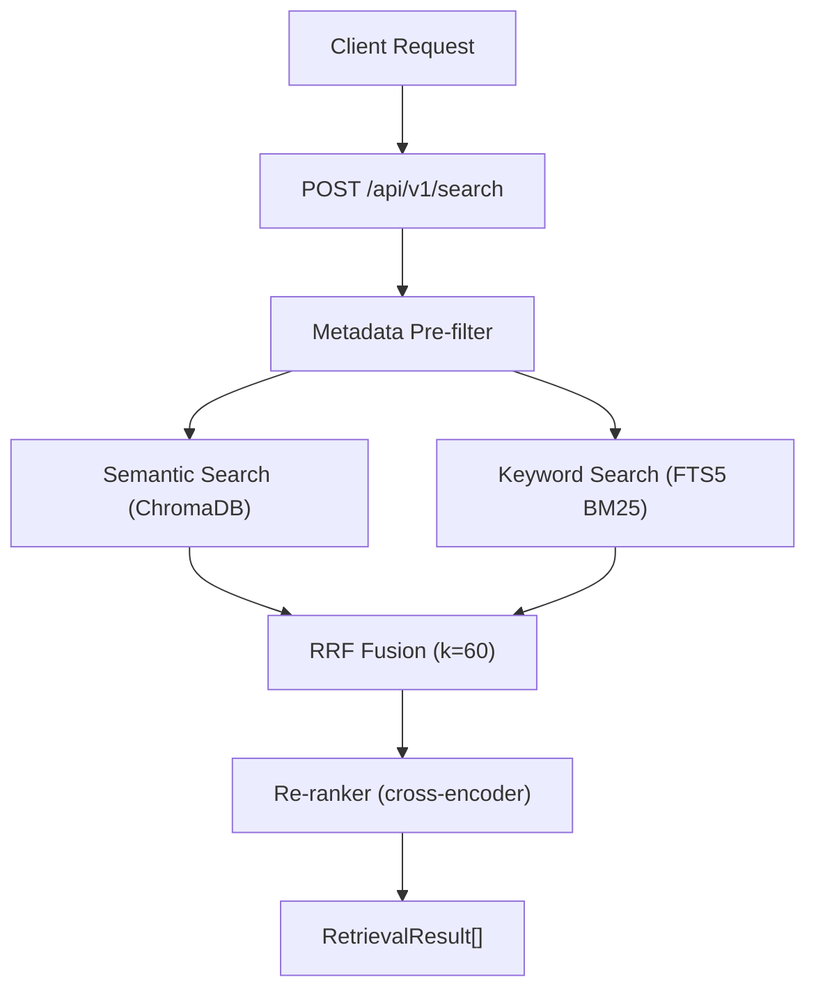

# Epic 5: Retrieval - Implementation Plan

## Current State

The codebase already has solid infrastructure from Epics 3-4:

- **Semantic search**: `POST /api/v1/search/semantic` via ChromaDB (Google `gemini-embedding-001`, 3072 dims)
- **FTSService**: `search_bm25()` method exists in `[fts_service.py](watcher-monolith/backend/app/services/fts_service.py)` but has **no API endpoint**
- **Triple indexing**: ChromaDB + SQLite `chunk_records` + FTS5 (via triggers)
- **ChunkRecord**: Rich metadata (section_type, topic, language, has_tables, has_amounts, entities_json)

All changes will be in a single file: `[watcher-monolith/backend/app/api/v1/endpoints/search.py](watcher-monolith/backend/app/api/v1/endpoints/search.py)`, plus a new service file for the retrieval orchestration logic and the re-ranking service.

## Architecture




## Dependency Chain

```
5.4 (Metadata filters) ─────────────────────┐
5.1 (BM25 endpoint) ──> 5.2 (Hybrid + RRF) ──> 5.5 (Unified endpoint)
                         5.3 (Re-ranking) ───┘
```

Recommended implementation order: **5.1 -> 5.4 -> 5.2 -> 5.3 -> 5.5** (5.4 is independent and should go before 5.2 so hybrid search uses enhanced filters from the start).

---

## Task 5.1: BM25 Search Endpoint

**Notion ticket**: [5.1](https://www.notion.so/303dceed748a81178301fb65a9f81f54) | **Estimation**: 2h

Create `POST /api/v1/search/keyword` that exposes the existing `FTSService.search_bm25()`.

**Key decisions**:

- Reuse existing `FTSService` from `[fts_service.py](watcher-monolith/backend/app/services/fts_service.py)`
- Need a DB session dependency (FTSService requires `Session`) - add a FastAPI `Depends` for the SQLAlchemy session from `[database.py](watcher-monolith/backend/app/db/database.py)`
- Return results in the **same `SearchResult` format** as `/search/semantic` (score + document + metadata) for fusion compatibility
- Normalize BM25 scores to [0, 1] range for consistency

**Changes**:

- `[search.py](watcher-monolith/backend/app/api/v1/endpoints/search.py)`: Add `KeywordSearchRequest` model and `POST /search/keyword` endpoint
- Wire up DB session dependency using `get_db` from `app.db.database`

---

## Task 5.4: Enhanced Metadata-Filtered Search

**Notion ticket**: [5.4](https://www.notion.so/303dceed748a8135b2c7ffc3784b51af) | **Estimation**: 2h

Extend `SearchFilters` to support all ChunkRecord fields and AND/OR logic.

**Current filters** (limited):

```python
class SearchFilters(BaseModel):
    year: Optional[str] = None
    month: Optional[str] = None
    section: Optional[str] = None
    jurisdiccion_id: Optional[int] = None
```

**New filters schema**:

```python
class SearchFilters(BaseModel):
    year: Optional[str] = None
    month: Optional[str] = None
    section: Optional[str] = None         # section_type
    jurisdiccion_id: Optional[int] = None
    topic: Optional[str] = None           # NEW
    language: Optional[str] = None        # NEW
    has_tables: Optional[bool] = None     # NEW
    has_amounts: Optional[bool] = None    # NEW
    entities: Optional[List[str]] = None  # NEW - match any entity
    document_id: Optional[str] = None     # NEW
    boletin_id: Optional[int] = None      # NEW
```

**Changes**:

- `[search.py](watcher-monolith/backend/app/api/v1/endpoints/search.py)`: Expand `SearchFilters`, add filter builder utility that generates both ChromaDB `where` clauses and SQLAlchemy/FTS5 `WHERE` clauses
- `[fts_service.py](watcher-monolith/backend/app/services/fts_service.py)`: Extend `search_bm25()` filter support to include all new fields via JOIN with `chunk_records`

---

## Task 5.2: Hybrid Search with RRF

**Notion ticket**: [5.2](https://www.notion.so/303dceed748a8182a929f37f5f270526) | **Estimation**: 2-3h

Create `POST /api/v1/search/hybrid` that runs semantic + keyword in parallel and fuses with RRF.

**RRF algorithm**:

```python
def reciprocal_rank_fusion(rankings: List[List[str]], k: int = 60) -> Dict[str, float]:
    scores = {}
    for ranking in rankings:
        for rank, doc_id in enumerate(ranking):
            scores[doc_id] = scores.get(doc_id, 0) + 1.0 / (k + rank + 1)
    return dict(sorted(scores.items(), key=lambda x: -x[1]))
```

**Key decisions**:

- Use `asyncio.gather` to run semantic and BM25 in parallel
- The chunk `id` (from ChunkRecord) or `document_id + chunk_index` serves as the dedup/merge key
- RRF constant `k=60` (standard default)
- Retrieve top 20 from each method, fuse, return top_k (default 10)

**New file**: `watcher-monolith/backend/app/services/retrieval_service.py`

- `RetrievalService` class with methods: `semantic_search()`, `keyword_search()`, `hybrid_search()`, `rrf_fusion()`
- Encapsulates all search logic, keeps endpoints thin

**Changes**:

- New: `[retrieval_service.py](watcher-monolith/backend/app/services/retrieval_service.py)`
- `[search.py](watcher-monolith/backend/app/api/v1/endpoints/search.py)`: Add `POST /search/hybrid` endpoint

---

## Task 5.3: Re-ranking

**Notion ticket**: [5.3](https://www.notion.so/303dceed748a81bdb44ed906123faf9b) | **Estimation**: 2-3h

Apply cross-encoder re-ranking on top-N results from hybrid search.

**Options** (in order of preference):

1. **Google Vertex AI Ranking API** - already have Google API key, no extra dependency
2. **Local cross-encoder** (`cross-encoder/ms-marco-MiniLM-L-6-v2`) - requires `sentence-transformers` (~2GB)
3. **Cohere Rerank API** - requires separate API key

**Recommended approach**: Start with Google Vertex AI (or Gemini-based scoring), with fallback to local cross-encoder if latency/cost allows. Make the re-ranker pluggable.

**New file**: `watcher-monolith/backend/app/services/reranker_service.py`

- `RerankerService` with `rerank(query, results, top_k)` method
- Strategy pattern: `GoogleReranker`, `CrossEncoderReranker`, `NoopReranker`
- Parameter `rerank=true/false` on request, default `false`
- Re-rank top 20, return top 5

**Changes**:

- New: `[reranker_service.py](watcher-monolith/backend/app/services/reranker_service.py)`
- `[requirements.txt](watcher-monolith/backend/requirements.txt)`: Add `sentence-transformers` (only if using local cross-encoder)
- `[retrieval_service.py](watcher-monolith/backend/app/services/retrieval_service.py)`: Integrate reranker as optional post-processing step

---

## Task 5.5: Unified Search Endpoint

**Notion ticket**: [5.5](https://www.notion.so/303dceed748a8185b959e28855b9ad63) | **Estimation**: 2h

Create the single `POST /api/v1/search` endpoint that serves as the default.

**Request schema**:

```python
class UnifiedSearchRequest(BaseModel):
    query: str
    top_k: int = 10
    filters: Optional[SearchFilters] = None
    technique: Literal["semantic", "keyword", "hybrid"] = "hybrid"
    rerank: bool = False
```

**Response schema** (new `RetrievalResult`):

```python
class RetrievalResult(BaseModel):
    chunk_id: str
    text: str
    score: float          # 0.0 - 1.0 normalized
    file_name: Optional[str]
    page_numbers: Optional[List[int]]
    metadata: Dict[str, Any]
    highlight: Optional[str]  # snippet with match highlighted
```

**Changes**:

- `[search.py](watcher-monolith/backend/app/api/v1/endpoints/search.py)`: Add `POST /search` unified endpoint, `RetrievalResult` model, highlight snippet generation
- Keep existing `/search/semantic`, `/search/keyword`, `/search/hybrid` as direct access endpoints

---

## Validation Notebook

Following the pattern of previous epics, create `[notebooks/epic_5_retrieval.ipynb](notebooks/epic_5_retrieval.ipynb)` that validates:

1. BM25 keyword search returns results
2. Semantic search returns results
3. Hybrid search fuses both correctly
4. Re-ranking reorders results
5. Metadata filters reduce result set
6. Unified endpoint works with all techniques
7. Latency benchmarks for each technique

---

## Dependencies to Add

```
sentence-transformers>=2.2.0   # Only if using local cross-encoder (Task 5.3)
```

## Files Modified/Created Summary


| File                               | Action             | Task                    |
| ---------------------------------- | ------------------ | ----------------------- |
| `endpoints/search.py`              | Heavy modification | 5.1, 5.2, 5.3, 5.4, 5.5 |
| `services/retrieval_service.py`    | New file           | 5.2, 5.5                |
| `services/reranker_service.py`     | New file           | 5.3                     |
| `services/fts_service.py`          | Minor modification | 5.4                     |
| `requirements.txt`                 | Modification       | 5.3                     |
| `notebooks/epic_5_retrieval.ipynb` | New file           | All                     |


