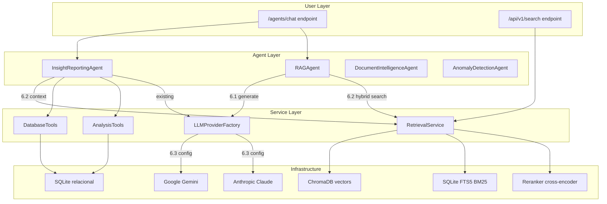

# Plan de Implementacion - Epica 6: Sistema Agentico

## Estado Actual

Las 3 tareas de la Epica 6 estan en estado "Por hacer" (Sprint 4). Sus dependencias ya estan completadas:

- **0.5** Migrar WatcherService a Google Gemini -- **Hecho**
- **5.5** Endpoint unificado de search -- **Hecho**

### Codigo existente relevante

- [agents/raga_agent.py](agents/raga_agent.py) -- RAGAgent con `_generate_answer_from_context()` placeholder (heuristico, sin LLM)
- [agents/tools/database_tools.py](agents/tools/database_tools.py) -- DatabaseTools root-level (SQL directo, sin search semantico)
- [watcher-monolith/backend/app/services/llm_provider.py](watcher-monolith/backend/app/services/llm_provider.py) -- **Ya existe** LLMProviderFactory completo (Google Gemini + Anthropic)
- [watcher-monolith/backend/app/services/retrieval_service.py](watcher-monolith/backend/app/services/retrieval_service.py) -- RetrievalService con semantic/keyword/hybrid + reranking
- [watcher-monolith/backend/agents/insight_reporting/agent.py](watcher-monolith/backend/agents/insight_reporting/agent.py) -- InsightReportingAgent que usa SQL directo, no search semantico
- [watcher-monolith/backend/agents/tools/database_tools.py](watcher-monolith/backend/agents/tools/database_tools.py) -- DatabaseTools monolith (SQL, sin retrieval)
- [watcher-monolith/backend/app/core/agent_config.py](watcher-monolith/backend/app/core/agent_config.py) -- Config con `use_vector_db: False`

---

## Orden de Implementacion

El orden optimo es **6.3 -> 6.1 -> 6.2** porque la factory LLM es base para la generacion, y la generacion necesita funcionar antes de mejorar el retrieval.

---

## Tarea 6.3 - LLMProviderFactory (verificar/completar)

**Estado:** El archivo `llm_provider.py` ya existe con implementacion completa. Esta tarea se reduce a verificar integracion y agregar configuracion faltante.

**Acciones:**

1. **Verificar que `llm_provider.py` cumple con la spec del ticket**: interfaz `generate(prompt, system_prompt, temperature, max_tokens) -> str` -- ya la tiene como `generate_text()`
2. **Agregar variables .env faltantes** en `watcher-monolith/backend/.env`:
  - `LLM_PROVIDER=google` (ya soportado en `create_from_env()`)
  - `LLM_MODEL=gemini-2.0-flash` (agregar soporte para env var de modelo)
3. **Modificar `LLMProviderFactory.create_from_env()**` para leer tambien `LLM_MODEL` desde env:

```python
model = os.getenv("LLM_MODEL", None)  # None = use provider default
return LLMProviderFactory.create_provider(provider_type, model=model)
```

1. **Agregar test basico** en notebook/script para validar que la factory funciona

**Estimacion:** ~30 min (la mayor parte ya esta hecha)

---

## Tarea 6.1 - Generacion real de respuestas en RAGAgent

**Archivo principal:** [agents/raga_agent.py](agents/raga_agent.py)

**Problema actual:** El metodo `_generate_answer_from_context()` (lineas 255-279) usa heuristicas simples (busca "cuanto", "quien" en la pregunta y devuelve strings template). No usa ningun LLM.

**Acciones:**

1. **Agregar `LLMProvider` al constructor** del RAGAgent:

```python
def __init__(self, config=None):
    # ... existing init ...
    try:
        from app.services.llm_provider import get_llm_provider
        self.llm_provider = get_llm_provider()
        logger.info("LLM provider initialized for RAG")
    except Exception as e:
        logger.warning(f"Could not initialize LLM provider: {e}")
        self.llm_provider = None
```

1. **Reescribir `_generate_answer_from_context()**` para usar LLM con system prompt RAG:

```python
async def _generate_answer_from_context(self, question: str, context: str) -> str:
    if not self.llm_provider:
        return self._fallback_heuristic_answer(question, context)

    system_prompt = (
        "Eres un asistente experto en analisis de documentos oficiales del Boletin Oficial argentino. "
        "Responde UNICAMENTE basandote en el contexto proporcionado. "
        "Si la informacion no esta en el contexto, indica que no tienes datos suficientes. "
        "Cita las fuentes usando [Documento N] cuando referencie informacion especifica."
    )

    prompt = f"CONTEXTO:\n{context}\n\nPREGUNTA: {question}\n\nRESPUESTA:"

    return await self.llm_provider.generate_text(
        prompt=prompt,
        system_prompt=system_prompt,
        temperature=0.3,
        max_tokens=1500
    )
```

1. **Mover heuristicas a `_fallback_heuristic_answer()**` como fallback si el LLM no esta disponible
2. **Hacer `_answer_question()` async-compatible** -- ya es async, pero `_generate_answer_from_context()` debe pasar a ser async
3. **Actualizar tambien `_summarize_topic()**` (lineas 281-348) para usar LLM en la generacion del resumen en lugar de solo agregar entidades

**Estimacion:** ~2-3 horas

---

## Tarea 6.2 - Conectar agentes al pipeline de retrieval mejorado

**Archivos afectados:**

- [agents/raga_agent.py](agents/raga_agent.py) -- `_semantic_search()` usa `embedding_service.search()` directo
- [agents/tools/database_tools.py](agents/tools/database_tools.py) -- root-level tools sin search
- [watcher-monolith/backend/agents/tools/database_tools.py](watcher-monolith/backend/agents/tools/database_tools.py) -- monolith tools sin search
- [watcher-monolith/backend/agents/insight_reporting/agent.py](watcher-monolith/backend/agents/insight_reporting/agent.py) -- `query_with_data()` usa SQL directo

**Problema actual:** Los agentes usan `embedding_service.search()` que solo hace busqueda semantica por ChromaDB. El pipeline mejorado (Epic 5) ofrece hybrid search (semantic + BM25 + RRF) con reranking opcional via `RetrievalService`, pero los agentes no lo usan.

**Acciones:**

1. **Agregar `RetrievalService` al constructor** del RAGAgent:

```python
try:
    from app.services.retrieval_service import get_retrieval_service
    self.retrieval_service = get_retrieval_service()
    logger.info("Retrieval service (hybrid) initialized for RAG")
except Exception as e:
    logger.warning(f"Could not init retrieval service: {e}")
    self.retrieval_service = None
```

1. **Reescribir `_semantic_search()**` en `raga_agent.py` para usar hybrid search:

```python
async def _semantic_search(self, parameters: Dict) -> Dict[str, Any]:
    query = parameters.get('query', '')
    limit = parameters.get('limit', 10)
    filters = parameters.get('filters')
    technique = parameters.get('technique', 'hybrid')  # semantic|keyword|hybrid
    rerank = parameters.get('rerank', True)

    if self.retrieval_service:
        if technique == 'hybrid':
            results = await self.retrieval_service.hybrid_search(
                query=query, top_k=limit, rerank=rerank
            )
        elif technique == 'keyword':
            results = await self.retrieval_service.keyword_search(
                query=query, top_k=limit, filters=filters
            )
        else:
            results = await self.retrieval_service.semantic_search(
                query=query, top_k=limit, filters=filters
            )
        # Convert SearchResult objects to dicts
        return { 'status': 'completed', 'results': { ... } }
    # ... fallback to old embedding_service.search() ...
```

1. **Agregar metodo `hybrid_search()` a DatabaseTools** (monolith version):

```python
@staticmethod
def search_documents(query: str, technique: str = "hybrid", top_k: int = 10, 
                     rerank: bool = True) -> List[Dict]:
    """Search using RetrievalService (hybrid/semantic/keyword)"""
    from app.services.retrieval_service import get_retrieval_service
    service = get_retrieval_service()
    # Delegate to appropriate method and return results as dicts
```

1. **Actualizar `InsightReportingAgent.query_with_data()**` para usar retrieval como contexto adicional al responder queries de lenguaje natural. Cuando detecte un query que se beneficiaria de busqueda semantica, usar `RetrievalService` ademas de los `DatabaseTools`/`AnalysisTools` SQL:

```python
async def query_with_data(self, query: str) -> Dict[str, Any]:
    # ... existing intent detection ...
    
    # NEW: Add semantic context for natural language queries
    if self.retrieval_service:
        search_results = await self.retrieval_service.hybrid_search(
            query=query, top_k=5, rerank=True
        )
        context_parts.append(self._format_search_results(search_results))
    
    # ... existing AI response generation ...
```

1. **Actualizar `agent_config.py**`: cambiar `use_vector_db: bool = False` a `True` y agregar config de retrieval:

```python
class InsightReportingConfig(BaseModel):
    use_vector_db: bool = True
    default_search_technique: str = "hybrid"
    enable_reranking: bool = True
```

1. **Sync root-level `agents/tools/database_tools.py**` con la version monolith para que el RAGAgent root-level tambien tenga acceso al nuevo metodo de search

**Estimacion:** ~3-4 horas

---

## Diagrama de Arquitectura Resultante




---

## Resumen de Esfuerzo


| Tarea                        | Estimacion     | Dependencia                         |
| ---------------------------- | -------------- | ----------------------------------- |
| 6.3 LLMProviderFactory       | ~30 min        | Ya existe, solo verificar/completar |
| 6.1 Generacion LLM en RAG    | ~2-3 horas     | 6.3                                 |
| 6.2 Hybrid search en agentes | ~3-4 horas     | 6.1, Epic 5 completada              |
| **Total**                    | **~6-7 horas** |                                     |


## Riesgos y Consideraciones

- **El RAGAgent root-level** (`agents/raga_agent.py`) manipula `sys.path` para importar del monolith. Evaluar si conviene migrar la logica al monolith directamente o mantener la estructura actual.
- **Rate limits de Gemini**: agregar retry con backoff exponencial en las llamadas LLM del RAGAgent
- **Tamano del contexto**: el context window de Gemini Flash es amplio (1M tokens), pero conviene limitar el contexto a los top 5-10 chunks mas relevantes para mantener calidad y costos bajos
- **Testing**: cada tarea debe validarse con el notebook `epic_6_sistema_agentico.ipynb` (a crear) que demuestre las capacidades end-to-end

