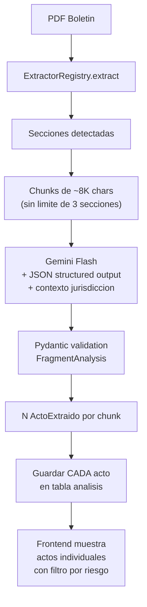

# Refactor del Analisis con Gemini - Phase A

## Diagnostico: Problemas actuales

El pipeline actual en `[watcher_service.py](watcher-backend/app/services/watcher_service.py)` y `[batch_processor.py](watcher-backend/app/services/batch_processor.py)` tiene problemas fundamentales:

### 1. Analisis superficial - Solo ve ~5% del documento

- `content_limited = section["content"][:2000]` trunca a 2000 chars por seccion
- `sections[:3]` limita a solo 3 secciones
- Un boletin de 100+ paginas queda analizado con ~6000 chars totales
- Gemini Flash soporta **1M tokens** de contexto, estamos usando ~1700

### 2. Prompt sesgado y poco estructurado

- Asume que todo es irregularidad ("tipo_curro" = tipo de curro/estafa)
- Solo 5 categorias cerradas, ninguna cubre actos normales
- No da contexto: ni jurisdiccion, ni tipo de seccion, ni marco legal
- No distingue entre un decreto rutinario y una licitacion millonaria

### 3. Consolidacion destructiva

- `consolidate_fragment_results()` colapsa N fragmentos en UN solo resultado
- Pierde actos individuales, entidades, montos - solo queda el "peor caso"
- Resultado: 3 analisis identicos diciendo "Riesgo MEDIO, $50M" cuando el doc tiene decenas de actos distintos

### 4. Sin structured output ni validacion

- Free-text JSON parsing propenso a errores
- Sin Pydantic validation
- Sin uso de `response_mime_type: "application/json"` de Gemini

### 5. Desconectado de modelos ricos que ya existen

- `ActoAdministrativo`, `EntidadExtraida`, `RelacionEntidad`, `ChunkRecord` no se pueblan
- El analisis vive aislado en tabla `analisis` sin conexion al knowledge graph

---

## Phase A: Prompt + Structured Output + Mayor Cobertura

### A.1 - Nuevo prompt multi-acto con contexto

Reemplazar el prompt actual por uno que:

- Reciba **contexto** (jurisdiccion, seccion, tipo de boletin)
- Extraiga **multiples actos** del fragmento (no solo un resultado)
- Distinga entre actos normales y potencialmente irregulares
- Use un schema de salida bien definido

Nuevo schema de salida (por fragmento):

```python
class ActoExtraido(BaseModel):
    tipo_acto: Literal["decreto", "resolucion", "licitacion", "designacion", "subsidio", "transferencia", "otro"]
    numero: Optional[str]  # "Resolución N° 1813"
    organismo: str
    beneficiarios: list[str]  # Personas/empresas mencionadas
    montos: list[str]  # Todos los montos mencionados
    descripcion: str  # Resumen breve del acto (max 200 chars)
    riesgo: Literal["alto", "medio", "bajo", "informativo"]  # "informativo" para actos normales
    motivo_riesgo: Optional[str]  # Solo si riesgo > informativo
    accion_sugerida: Optional[str]  # Solo si riesgo > informativo

class FragmentAnalysis(BaseModel):
    actos: list[ActoExtraido]
    resumen_general: str  # Resumen del fragmento completo
```

En `[watcher_service.py](watcher-backend/app/services/watcher_service.py)` lines 50-60.

### A.2 - Usar Gemini Structured Output (JSON mode)

Reemplazar el parsing manual de JSON por `response_mime_type="application/json"` + `response_schema` de Gemini:

```python
generation_config = genai.types.GenerationConfig(
    temperature=0.1,
    max_output_tokens=2000,  # Mas tokens para multiples actos
    response_mime_type="application/json",
    response_schema=FragmentAnalysis,  # Schema de Pydantic
)
```

En `[watcher_service.py](watcher-backend/app/services/watcher_service.py)` lines 182-188.

### A.3 - Aumentar cobertura del documento

En `[batch_processor.py](watcher-backend/app/services/batch_processor.py)` lines 280-283:

- Eliminar el limite arbitrario de `sections[:3]`
- Eliminar el truncado de `[:2000]` chars
- Usar el limite real de Gemini Flash (~800K tokens utiles)
- Estrategia: analizar TODAS las secciones, con chunks de ~8000 chars (para que quepan multiples actos por llamada)

### A.4 - Guardar actos individuales, no consolidados

Cambiar la logica de guardado:

- Cada `ActoExtraido` se guarda como un registro individual en la tabla `analisis`
- Eliminar `consolidate_fragment_results()` - ya no necesitamos consolidar
- Cada analisis queda vinculado al boletin con su fragmento, tipo, y riesgo individual
- Esto corrige el problema de "3 resultados identicos"

En `[batch_processor.py](watcher-backend/app/services/batch_processor.py)` lines 289-295 y `[watcher_service.py](watcher-backend/app/services/watcher_service.py)` lines 244-291.

### A.5 - Actualizar schema de DB y mapeo de campos

En `[models.py](watcher-backend/app/db/models.py)` tabla `Analisis` (lines 61-79):

- Renombrar `tipo_curro` -> `tipo_acto` (semantica correcta)
- Agregar `numero_acto` (String, nullable)
- Agregar `motivo_riesgo` (Text, nullable)
- Mapear `entidad_beneficiaria` a la lista de beneficiarios del nuevo schema
- Valor de riesgo "informativo" para actos sin irregularidades

### A.6 - Actualizar frontend para nuevo schema

En `[boletin-detail.tsx](watcher-frontend/src/pages/documentos/boletin-detail.tsx)`:

- Mostrar `tipo_acto` y `numero_acto` en los resultados
- Filtrar por nivel de riesgo (mostrar solo alto/medio, o todos)
- Badge diferenciado para riesgo "informativo" vs alertas reales

---

## Phase B (Futura, no en este ticket)

- Segmentacion de actos pre-LLM usando regex (los boletines tienen formato muy consistente)
- Poblar `ActoAdministrativo` desde los resultados
- Poblar `EntidadExtraida` + `RelacionEntidad` (knowledge graph)
- Conectar con `ChunkRecord` y embeddings
- Multi-stage analysis: extraer -> evaluar riesgo -> cross-reference

---

## Diagrama del flujo propuesto (Phase A)




