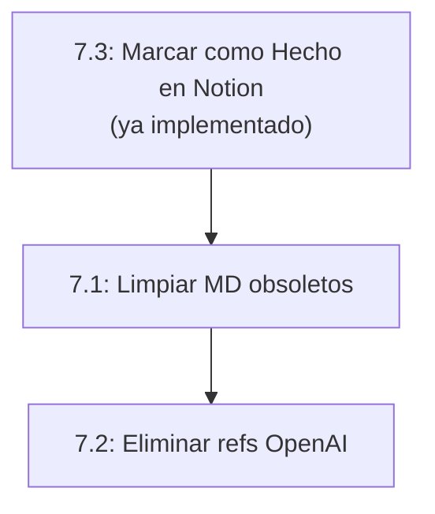

# Implementacion Epica 7: Deuda Tecnica

## Estado actual de las tareas


| Tarea | Estado actual | Complejidad |
| ----- | ------------- | ----------- |


- **7.1** Limpiar archivos MD de documentacion obsoleta -- Por hacer -- Media
- **7.2** Eliminar dependencia openai del requirements.txt -- Por hacer -- Baja
- **7.3** Agregar embedding_model_version a ChunkRecord -- **YA IMPLEMENTADO** -- N/A

---

## 7.3 - Ya completado (marcar como Hecho en Notion)

Los campos `embedding_model`, `embedding_dimensions` e `indexed_at` ya existen en el modelo `ChunkRecord` en [models.py](watcher-monolith/backend/app/db/models.py) (lineas 1194-1197):

```python
embedding_model = Column(String(100), nullable=True)
embedding_dimensions = Column(Integer, nullable=True)
indexed_at = Column(DateTime, nullable=True, index=True)
```

Ademas, `indexing_service.py` ya los establece al crear chunks. Solo falta actualizar el estado en Notion a "Hecho".

---

## 7.1 - Limpiar archivos MD de documentacion obsoleta

### Diagnostico

Se identificaron **~40 archivos de session logs/summaries** vs **~33 archivos de documentacion real** del proyecto.

### Accion: Eliminar session logs del root (~19 archivos)

Archivos a **eliminar** del root:

- `ARQUITECTURA_REFACTOR_COMPLETADA.md`
- `COMPLIANCE_SYSTEM_IMPLEMENTED.md`
- `DB_LIMPIEZA_COMPLETADA.md`
- `DOCUMENT_TRACKING_IMPLEMENTADO.md`
- `EPIC_0_MIGRATION_COMPLETED.md`
- `EPIC_2_EXTRACCION_COMPLETADO.md`
- `EPIC_3_FEATURE_ENGINEERING_COMPLETADO.md`
- `EPIC_4_INDEXACION_COMPLETADO.md`
- `EPIC_5_CHROMADB_FILTER_FIX.md`
- `EPIC_6_IMPLEMENTATION_SUMMARY.md`
- `FASE3_EXTRACCION_MENCIONES_EN_PROGRESO.md`
- `FIXES_INVENTARIO_DOCUMENTOS.md`
- `IMPLEMENTACION_TRACKING_DOCUMENTOS_COMPLETA.md`
- `IMPLEMENTATION_SUMMARY.md`
- `PIPELINE_PROCESAMIENTO_IMPLEMENTADO.md`
- `PROCESAMIENTO_INDIVIDUAL_COMPLIANCE.md`
- `SPRINT_0_SUMMARY.md`
- `TESTING_EXECUTIVE_SUMMARY.md`
- `TESTING_SUITE_IMPLEMENTED.md`
- `TEST_IMPLEMENTATION_COMPLETE.md`
- `WATCHER_NOTION.md`

### Accion: Limpiar session logs en docs/ (~4 archivos)

- `docs/IMPLEMENTACION_COMPLETADA.md`
- `docs/RESUMEN_SESION_COMPLETA.md`
- `docs/RESUMEN_UI.md`
- `docs/TEST_IMPROVEMENTS.md`

### Accion: Eliminar docs/archive/ completo

La carpeta `docs/archive/` contiene 17 session logs archivados que ya estan marcados como "D" (deleted) en git status. Confirmar eliminacion.

### Accion: Limpiar session logs en watcher-monolith/

- `watcher-monolith/backend/SOLUCION_TOKENS.md`
- `watcher-monolith/backend/SISTEMA_BATCH_RESUMEN.md`

### Accion: Evaluar archivos root para mover a docs/

Archivos utiles que deberian quedarse (en root o mover a `docs/`):

- `README.md` -- mantener en root
- `AGENTS.md` -- mantener en root (referenciado por Cursor rules)
- `GPT-portal.MD` -- evaluar si mover a `docs/`
- `ENV_SETUP.md` -- mover a `docs/`
- `INSTALLATION_TROUBLESHOOTING.md` -- mover a `docs/`
- `QUICK_START_NUEVA_ARQUITECTURA.md` -- mover a `docs/`
- `PYTHON_39_LIMITATION.md` -- mover a `docs/`
- `PIPELINE_WATCHER_ACTUAL.md` -- mover a `docs/`

### Accion: Actualizar .gitignore

Agregar patrones para evitar que session logs se trackeen en el futuro.

---

## 7.2 - Eliminar dependencia openai (post-migracion)

### Diagnostico

- `requirements.txt` ya **no tiene** `openai` ni `langchain-openai` (ya fue removido)
- Quedan referencias residuales en codigo:

### Archivos a limpiar

1. **[config.py](watcher-monolith/backend/app/core/config.py)** (linea 20-21): Eliminar `OPENAI_API_KEY` deprecated
2. **[agent_config.py](watcher-monolith/backend/app/core/agent_config.py)** (linea 103): Eliminar campo `openai_api_key`
3. **[check_config.py](watcher-monolith/backend/check_config.py)**: Eliminar checks de OpenAI
4. **[test_sistema_final.py](watcher-monolith/backend/test_sistema_final.py)**: Eliminar referencias OpenAI en tests
5. **[watcher_agent_processor.py](watcher_agent_processor.py)** (root): Este script legacy usa `openai` directamente. Opciones:
  - Eliminar si ya no se usa (el monolith tiene su propio pipeline)
  - Migrar a Google Gemini si aun se necesita

### Verificacion final

Ejecutar grep exhaustivo por `openai`, `OPENAI`, `from openai`, `import openai` para confirmar limpieza completa.

---

## Orden de ejecucion recomendado




1. **7.3** primero: solo actualizar Notion (0 minutos de codigo)
2. **7.1** segundo: limpieza de archivos (no afecta codigo funcional)
3. **7.2** tercero: limpieza de codigo (mas delicada, requiere verificacion)

