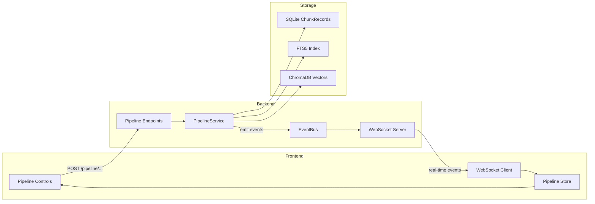
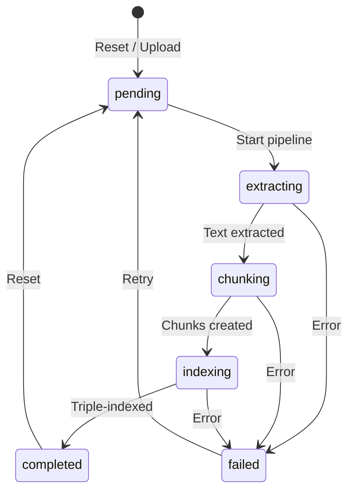
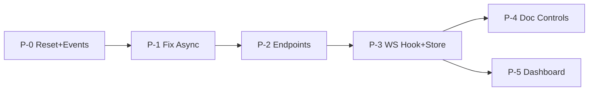

# Sprint: Pipeline UI con Estado Completo

## Contexto Actual

- **1,311 boletines** en DB marcados como `status: completed` pero sin indexar
- **1,264 .txt** extraidos en `data/processed/` (deben eliminarse en el reset)
- **Solo 4 chunk_records** en SQLite, **sin ChromaDB** persistente
- **Busqueda semantica vacia** (sin embeddings)
- El `PipelineService` existe pero tiene **sync/async mismatch** critico
- El **WebSocket** (`/ws`) y el **EventBus** ya existen y funcionan
- El **upload de PDFs** ya existe en `[upload.py](watcher-backend/app/api/v1/endpoints/upload.py)` con SHA256 dedup

## Arquitectura del Pipeline




## Flujo de Estado por Documento




---

## Tickets

### P-0: Backend - Reset endpoints y nuevos EventTypes

**Objetivo:** Endpoints para limpiar datos procesados (total y por documento) con confirmacion extra, y nuevos EventTypes para pipeline.

**Archivos a modificar:**

- `[watcher-backend/app/core/events.py](watcher-backend/app/core/events.py)` - Agregar EventTypes para pipeline
- `[watcher-backend/app/api/v1/endpoints/pipeline.py](watcher-backend/app/api/v1/endpoints/pipeline.py)` - Nuevos endpoints

**Cambios:**

1. Agregar a `EventType`:

```python
# Pipeline events
PIPELINE_RESET = "pipeline.reset"
PIPELINE_RESET_DOCUMENT = "pipeline.reset.document"
PIPELINE_STARTED = "pipeline.started"
PIPELINE_DOCUMENT_STARTED = "pipeline.document.started"
PIPELINE_DOCUMENT_STAGE = "pipeline.document.stage"
PIPELINE_DOCUMENT_COMPLETED = "pipeline.document.completed"
PIPELINE_DOCUMENT_FAILED = "pipeline.document.failed"
PIPELINE_COMPLETED = "pipeline.completed"
```

1. Crear `POST /api/v1/pipeline/reset` - Reset total con doble confirmacion:
  - Requiere header `X-Confirm-Reset: RESET_ALL_DATA` como validacion extra
  - Sin el header, retorna 400 con mensaje explicando el peligro y como confirmar
  - Eliminar todos los `chunk_records` de SQLite
  - Limpiar collection de ChromaDB
  - Eliminar archivos `.txt` de `data/processed/`
  - Reset todos los boletines a `status = "pending"`
  - Emitir `PIPELINE_RESET` via EventBus
  - Retornar conteo de items limpiados
2. Crear `POST /api/v1/pipeline/reset/{boletin_id}` - Reset individual:
  - Eliminar `chunk_records` asociados a ese `boletin_id`
  - Eliminar embeddings correspondientes de ChromaDB (por `document_id`)
  - Eliminar archivo `.txt` de `data/processed/` (si existe)
  - Reset `boletin.status = "pending"`
  - Emitir `PIPELINE_RESET_DOCUMENT` via EventBus
  - Retornar detalle de lo limpiado (chunks eliminados, etc.)
  - Util para reprocesar un documento con diferentes configuraciones

**Esfuerzo estimado:** 1.5 horas

---

### P-1: Backend - Migrar PipelineService a async

**Objetivo:** Corregir el mismatch sync/async que impide el funcionamiento del pipeline.

**Archivos a modificar:**

- `[watcher-backend/app/services/pipeline_service.py](watcher-backend/app/services/pipeline_service.py)` - Migrar a AsyncSession
- `[watcher-backend/app/services/indexing_service.py](watcher-backend/app/services/indexing_service.py)` - Migrar a AsyncSession

**Cambios:**

1. `PipelineService.__init__` - Aceptar `AsyncSession`
2. Reemplazar `self.db.query(...)` por `await self.db.execute(select(...))`
3. Reemplazar `self.db.add(...)` / `self.db.commit()` por versiones async
4. Implementar `_get_file_path()`:
  - Consultar boletin por ID
  - Construir path: `data/processed/{filename.replace('.pdf', '.txt')}`
  - Si no existe .txt, usar PDF path: `data/uploaded_documents/{filename}` para extraccion
5. Lo mismo para `IndexingService` - migrar queries sync a async
6. Actualizar `get_pipeline_service()` factory para recibir AsyncSession

**Referencia clave - Metodo a migrar en `[pipeline_service.py](watcher-backend/app/services/pipeline_service.py)`:**

```python
# ANTES (sync - no funciona):
self.db.query(Boletin).filter(...)
self.db.add(record)
self.db.commit()

# DESPUES (async):
result = await self.db.execute(select(Boletin).where(...))
self.db.add(record)
await self.db.commit()
```

**Esfuerzo estimado:** 2 horas

---

### P-2: Backend - Endpoints de pipeline con WebSocket events y configuracion

**Objetivo:** Endpoints para procesar documentos individual y batch con configuracion tecnica por stage, emitiendo eventos via EventBus para WebSocket.

**Archivos a modificar:**

- `[watcher-backend/app/api/v1/endpoints/pipeline.py](watcher-backend/app/api/v1/endpoints/pipeline.py)` - Nuevos endpoints
- `[watcher-backend/app/schemas/pipeline.py](watcher-backend/app/schemas/pipeline.py)` - Extender PipelineOptions

**Nuevo schema `PipelineConfig` (extiende `PipelineOptions`):**

Basado en las opciones reales que ya existen en cada servicio del backend:

```python
class ExtractionConfig(BaseModel):
    """Opciones de extraccion de texto desde PDF."""
    extractor: str = "pdfplumber"  # "pdfplumber" | "pypdf2"
    # pdfplumber: mejor calidad, mas lento
    # pypdf2: mas rapido, menor calidad

class CleaningConfig(BaseModel):
    """Opciones de limpieza de texto."""
    enabled: bool = True                # skip_cleaning = !enabled
    fix_encoding: bool = True           # ftfy mojibake fix
    normalize_unicode: bool = True      # NFKC normalization
    normalize_whitespace: bool = True   # whitespace cleanup
    remove_artifacts: bool = True       # PDF artifact removal
    normalize_legal_text: bool = True   # legal text normalization

class ChunkingConfig(BaseModel):
    """Opciones de chunking."""
    chunk_size: int = 1000         # 100-5000 chars
    chunk_overlap: int = 200       # 0-1000 chars
    min_chunk_size: int = 100      # 50-500 chars
    strategy: str = "recursive"    # "recursive" (unico por ahora)

class EnrichmentConfig(BaseModel):
    """Opciones de enriquecimiento de metadata."""
    enabled: bool = True           # skip_enrichment = !enabled
    detect_section_type: bool = True
    detect_amounts: bool = True
    detect_tables: bool = True
    extract_entities: bool = True

class IndexingConfig(BaseModel):
    """Opciones de indexacion."""
    use_sqlite: bool = True        # ChunkRecord en SQLite
    use_fts5: bool = True          # Full-text search index
    use_chromadb: bool = True      # Vector embeddings
    embedding_model: str = "gemini-embedding-001"  # unico modelo por ahora

class PipelineConfig(BaseModel):
    """Configuracion completa del pipeline."""
    extraction: ExtractionConfig = ExtractionConfig()
    cleaning: CleaningConfig = CleaningConfig()
    chunking: ChunkingConfig = ChunkingConfig()
    enrichment: EnrichmentConfig = EnrichmentConfig()
    indexing: IndexingConfig = IndexingConfig()
```

**Nuevos endpoints:**

1. `POST /api/v1/pipeline/process/{boletin_id}` - Procesar un documento individual
  - Body: `PipelineConfig` (opcional, usa defaults si no se envia)
  - Buscar boletin en DB
  - Si tiene .txt y no se cambio extractor: Clean -> Chunk -> Enrich -> Index
  - Si solo tiene PDF o se quiere re-extraer: Extract -> Clean -> Chunk -> Enrich -> Index
  - Emitir `PIPELINE_DOCUMENT_STAGE` en cada transicion
  - Emitir `PIPELINE_DOCUMENT_COMPLETED` o `PIPELINE_DOCUMENT_FAILED`
  - Actualizar `boletin.status` en cada paso
2. `POST /api/v1/pipeline/process-all` - Procesar todos los pendientes
  - Body: `PipelineConfig` (opcional, aplica a todos)
  - Query boletines con `status != "completed"`
  - Generar `session_id` para tracking
  - BackgroundTask que procesa secuencialmente
  - Emitir `PIPELINE_STARTED` con total + config usada
  - Para cada doc: emitir stage events
  - Emitir `PIPELINE_COMPLETED` al final
  - Retornar `session_id` + total inmediatamente
3. `GET /api/v1/pipeline/status` - Estado actual del pipeline
  - Documentos por estado (pending/extracting/chunking/indexing/completed/failed)
  - Total chunks creados
  - Total embeddings indexados
  - Session activa (si hay una corriendo) + config usada
  - Ultimo error
4. `GET /api/v1/pipeline/config/defaults` - Retorna la config default
  - Util para que el frontend pre-popule el formulario

**Formato de eventos WebSocket:**

```json
{
  "type": "event",
  "event_type": "pipeline.document.stage",
  "data": {
    "session_id": "abc123",
    "boletin_id": 42,
    "filename": "20251103_1_Secc.pdf",
    "stage": "chunking",
    "progress": { "current": 5, "total": 1311 },
    "config_used": { "chunking": { "chunk_size": 1000, "chunk_overlap": 200 } },
    "details": { "chunks_created": 15 }
  }
}
```

**Esfuerzo estimado:** 3 horas

---

### P-3: Frontend - WebSocket hook + Pipeline Zustand store

**Objetivo:** Infraestructura frontend para recibir eventos en real-time y mantener estado del pipeline.

**Archivos a crear:**

- `watcher-ui-v2/src/lib/ws/use-websocket.ts` - Hook reutilizable de WebSocket
- `watcher-ui-v2/src/lib/store/pipeline-store.ts` - Zustand store para pipeline
- `watcher-ui-v2/src/lib/api/hooks/use-pipeline.ts` - Hooks REST para pipeline

**WebSocket Hook (`use-websocket.ts`):**

```typescript
function useWebSocket(eventTypes: string[]) {
  // Conectar a ws://localhost:8001/ws
  // Enviar subscribe con eventTypes
  // Retornar: { lastEvent, isConnected, events[] }
}
```

**Pipeline Store (`pipeline-store.ts`):**

```typescript
interface PipelineStore {
  isProcessing: boolean
  sessionId: string | null
  progress: { current: number; total: number }
  documentStates: Map<number, PipelineDocumentState>
  errors: PipelineError[]
  stats: PipelineStats | null
  // Actions
  setProcessing(sessionId: string, total: number): void
  updateDocumentState(boletinId: number, stage: string): void
  setCompleted(): void
  setError(boletinId: number, error: string): void
  reset(): void
}
```

**Pipeline Hooks (`use-pipeline.ts`):**

- `usePipelineResetAll()` - mutation para POST /pipeline/reset (con header de confirmacion)
- `usePipelineResetOne(boletinId)` - mutation para POST /pipeline/reset/{id}
- `usePipelineProcessAll(config)` - mutation para POST /pipeline/process-all con PipelineConfig
- `usePipelineProcessOne(boletinId, config)` - mutation para POST /pipeline/process/{id} con PipelineConfig
- `usePipelineStatus()` - query para GET /pipeline/status (refetch 5s)
- `usePipelineDefaults()` - query para GET /pipeline/config/defaults

**Esfuerzo estimado:** 2 horas

---

### P-4: Frontend - Pipeline Controls, Config Panel, y Documents Hub

**Objetivo:** Controles de pipeline con panel de configuracion tecnica, integrados en la vista de documentos con progreso en tiempo real.

**Archivos a modificar:**

- `[watcher-ui-v2/src/pages/documentos/index.tsx](watcher-ui-v2/src/pages/documentos/index.tsx)` - Agregar controles

**Archivos a crear:**

- `watcher-ui-v2/src/components/features/pipeline-controls.tsx` - Componente principal
- `watcher-ui-v2/src/components/features/pipeline-config-panel.tsx` - Panel de configuracion tecnica
- `watcher-ui-v2/src/components/features/pipeline-progress.tsx` - Barra de progreso
- `watcher-ui-v2/src/components/features/document-status-badge.tsx` - Badge de estado

**Componente `PipelineControls`:**

- Boton "Procesar Todos" que abre el config panel antes de ejecutar
- Boton "Reset Total" con Dialog de doble confirmacion:
  - Primera: Dialog explicando que se borrara todo
  - Segunda: Input que requiere escribir "RESET" para confirmar
  - Solo entonces envia con header `X-Confirm-Reset: RESET_ALL_DATA`
- Progress bar global con porcentaje y documento actual
- Indicador de conexion WebSocket (verde/rojo)

**Componente `PipelineConfigPanel` (Dialog/Sheet):**

Panel que se abre antes de ejecutar el pipeline. Muestra las opciones por stage en tabs o accordion:

```
+-------------------------------------------------------+
|  Configuracion del Pipeline                    [Defaults] |
+-------------------------------------------------------+
|                                                       |
|  1. EXTRACCION                                        |
|  [v] pdfplumber  [ ] pypdf2                          |
|                                                       |
|  2. LIMPIEZA                                          |
|  [x] Habilitada                                       |
|  [x] Fix encoding   [x] Normalize unicode            |
|  [x] Remove artifacts  [x] Normalize legal text       |
|                                                       |
|  3. CHUNKING                                          |
|  Chunk size:    [====|======] 1000 chars              |
|  Overlap:       [==|========] 200 chars               |
|  Min chunk:     [=|=========] 100 chars               |
|                                                       |
|  4. ENRIQUECIMIENTO                                   |
|  [x] Habilitado                                       |
|  [x] Detectar tipo de seccion                         |
|  [x] Detectar montos   [x] Detectar tablas           |
|  [x] Extraer entidades                               |
|                                                       |
|  5. INDEXACION                                        |
|  [x] SQLite (chunk records)                           |
|  [x] FTS5 (full-text search)                          |
|  [x] ChromaDB (vector embeddings)                     |
|  Modelo: gemini-embedding-001                         |
|                                                       |
|  [Cancelar]                    [Ejecutar Pipeline ->] |
+-------------------------------------------------------+
```

- Carga defaults desde `GET /pipeline/config/defaults`
- Sliders para valores numericos con rangos validados
- Switches para booleans
- Radio buttons para opciones mutuamente excluyentes (extractor)
- Boton "Restaurar Defaults" para resetear todo
- Al clickear "Ejecutar", envia la config al endpoint correspondiente

**Componente `PipelineProgress`:**

- Barra de progreso animated
- Texto: "Procesando 42/1311 - 20251103_1_Secc.pdf (chunking)"
- Tiempo estimado restante
- Config usada visible (colapsable)

**Componente `DocumentStatusBadge`:**

- pending: gris
- extracting: azul pulsante
- chunking: amarillo pulsante
- indexing: naranja pulsante
- completed: verde
- failed: rojo con tooltip de error

**En cada card de documento:**

- Badge de estado con animacion
- Boton "Procesar" individual (abre mini config panel)
- Boton "Reset" individual (limpia y vuelve a pending)
- Indicador de progreso inline si esta procesando

**Esfuerzo estimado:** 3.5 horas

---

### P-5: Frontend - Pipeline Status Dashboard

**Objetivo:** Dashboard dedicado con metricas del pipeline y log de errores.

**Archivos a crear:**

- `watcher-ui-v2/src/pages/analisis/pipeline-status.tsx`

**Archivos a modificar:**

- `[watcher-ui-v2/src/router.tsx](watcher-ui-v2/src/router.tsx)` - Nueva ruta `/analisis/pipeline`
- `[watcher-ui-v2/src/pages/analisis/index.tsx](watcher-ui-v2/src/pages/analisis/index.tsx)` - Card de navegacion

**Contenido del dashboard:**

- **Metricas Grid** (4 cards):
  - Total documentos / procesados
  - Total chunks generados
  - Total embeddings indexados
  - Tiempo promedio por documento
- **Pipeline State** (visual):
  - Grafico de barras: documentos por estado (pending/completed/failed)
  - Progress bar global si hay sesion activa
- **Error Log** (tabla):
  - Documento, stage, error, timestamp
  - Filtrable por severidad
  - Boton "Reintentar" individual
- **Recent Activity** (timeline):
  - Ultimos eventos del EventBus
  - Real-time via WebSocket

**Esfuerzo estimado:** 2 horas

---

## Resumen del Sprint

- P-0: Backend - Reset total (con doble confirm) + Reset individual + EventTypes -- 1.5h
- P-1: Backend - Fix PipelineService async -- 2h
- P-2: Backend - Endpoints + WebSocket events + PipelineConfig schema -- 3h
- P-3: Frontend - WebSocket hook + Store -- 2h
- P-4: Frontend - Pipeline Controls + Config Panel + Doc Controls -- 3.5h
- P-5: Frontend - Pipeline Dashboard -- 2h
- **Total: 14h**


## Orden de Ejecucion




P-0 a P-2 son secuenciales (backend). P-4 y P-5 pueden hacerse en paralelo despues de P-3.

## Dependencias Externas

- **Google API Key** (`GOOGLE_API_KEY`): Necesario para generar embeddings con `gemini-embedding-001`. Sin esta key, el stage de indexing fallara en la parte de embeddings.
- **ChromaDB**: Se inicializa automaticamente en `~/.watcher/chromadb`. No requiere setup manual.

## Riesgos

- **PipelineService sync/async migration** (P-1): El service usa SQLAlchemy sync patterns extensivamente. La migracion puede revelar bugs ocultos.
- **Tiempo de procesamiento**: 1,311 documentos con chunking + embedding puede tomar 30-60 minutos dependiendo de rate limits de Google API.
- **Google API rate limits**: El embedding service hace una llamada por chunk. Con ~15 chunks/doc y 1,311 docs = ~20,000 API calls. Puede requerir throttling.

