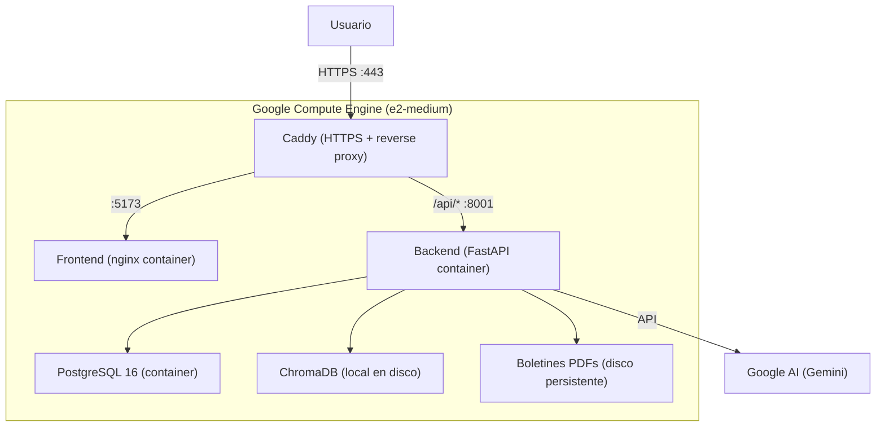

# Plan de Produccion Watcher - Google Cloud Platform

## Arquitectura Target




**Costo estimado: ~$15-25/mes** (e2-medium $25/mes, pero con committed use discount baja a ~$15)

---

## Dia 1: Containerizacion + Migracion PostgreSQL (7-8h)

### Paso 1: Instalar gcloud CLI (30min)

Ejecutar en tu terminal:

```bash
# macOS con Homebrew
brew install google-cloud-sdk

# Verificar instalacion
gcloud version

# Autenticar con tu cuenta de Google
gcloud auth login

# Configurar tu proyecto existente (reemplazar con tu project ID)
gcloud config set project TU_PROJECT_ID

# Verificar
gcloud config list
```

Si no tenes Homebrew: descargar desde [https://cloud.google.com/sdk/docs/install](https://cloud.google.com/sdk/docs/install)

### Paso 2: Commitear trabajo en progreso (15min)

Hay +795 lineas sin commitear. Commitear antes de empezar la refactorizacion.

### Paso 3: Crear Dockerfiles (1.5h)

**3a. Backend Dockerfile** - `[watcher-backend/Dockerfile](watcher-backend/Dockerfile)`

```dockerfile
FROM python:3.10-slim

WORKDIR /app

# System deps for pdfplumber, psycopg2
RUN apt-get update && apt-get install -y --no-install-recommends \
    build-essential libpq-dev \
    && rm -rf /var/lib/apt/lists/*

COPY requirements.txt .
RUN pip install --no-cache-dir -r requirements.txt

COPY . .

# Crear directorios de datos
RUN mkdir -p data/uploads data/results

EXPOSE 8001

CMD ["uvicorn", "app.main:app", "--host", "0.0.0.0", "--port", "8001", "--workers", "2"]
```

**3b. Frontend Dockerfile** - `[watcher-frontend/Dockerfile](watcher-frontend/Dockerfile)`

Multi-stage build: Node para compilar, nginx para servir.

```dockerfile
FROM node:18-alpine AS build
WORKDIR /app
COPY package*.json ./
RUN npm ci
COPY . .
ARG VITE_API_URL=/api/v1
ARG VITE_WS_URL=/api/v1/ws
RUN npm run build

FROM nginx:alpine
COPY --from=build /app/dist /usr/share/nginx/html
COPY nginx.conf /etc/nginx/conf.d/default.conf
EXPOSE 80
```

**3c. Frontend nginx.conf** - `[watcher-frontend/nginx.conf](watcher-frontend/nginx.conf)`

```nginx
server {
    listen 80;
    root /usr/share/nginx/html;
    index index.html;

    location / {
        try_files $uri $uri/ /index.html;
    }

    location /assets/ {
        expires 1y;
        add_header Cache-Control "public, immutable";
    }
}
```

**3d. .dockerignore** - `[.dockerignore](.dockerignore)` (en root y en cada subdirectorio)

```
node_modules/
dist/
__pycache__/
*.pyc
.env
sqlite.db
chroma_data/
.git/
```

### Paso 4: Migrar de SQLite a PostgreSQL (3h)

Esto es el bloque mas importante. 4 archivos principales a modificar:

**4a. Agregar dependencias PostgreSQL** - `[watcher-backend/requirements.txt](watcher-backend/requirements.txt)`

Reemplazar `aiosqlite` por drivers PostgreSQL:

```
# Remover:  aiosqlite>=0.19.0
# Agregar:
asyncpg>=0.30.0
psycopg2-binary>=2.9.9
```

**4b. Actualizar database.py** - `[watcher-backend/app/db/database.py](watcher-backend/app/db/database.py)`

Cambios principales:

- URL de conexion: `sqlite+aiosqlite:///...` -> `postgresql+asyncpg://...`
- Remover PRAGMAs de SQLite (WAL, busy_timeout)
- Remover `NullPool` (PostgreSQL usa pool real)
- Remover `check_same_thread`
- Agregar `DATABASE_URL` configurable via env var

**4c. Actualizar config.py** - `[watcher-backend/app/core/config.py](watcher-backend/app/core/config.py)`

Agregar:

- `DATABASE_URL`: env var para conexion PostgreSQL
- `ENVIRONMENT`: `development` | `production`
- `ALLOWED_ORIGINS`: lista de origenes CORS

**4d. Reescribir FTS5 Service** - `[watcher-backend/app/services/fts_service.py](watcher-backend/app/services/fts_service.py)`

Reemplazar queries SQLite FTS5 por PostgreSQL full-text search:

- `MATCH :query` -> `to_tsquery('spanish', :query)`
- `bm25()` -> `ts_rank()`
- `chunk_records_fts` (tabla virtual FTS5) -> columna `search_vector tsvector` en `chunk_records`
- `rebuild` command -> `UPDATE chunk_records SET search_vector = to_tsvector('spanish', text)`
- Crear GIN index sobre la columna `search_vector`

**4e. Actualizar modelos** - `[watcher-backend/app/db/models.py](watcher-backend/app/db/models.py)`

- Agregar columna `search_vector` tipo `TSVector` a `ChunkRecord`
- Verificar que Boolean/Integer types sean compatibles (lo son con SQLAlchemy)
- Revisar que no haya `sqlite_master` references en queries

**4f. Actualizar sync_session.py** - `[watcher-backend/app/db/sync_session.py](watcher-backend/app/db/sync_session.py)`

Cambiar URL de `sqlite:///...` a `postgresql://...` (psycopg2 sync driver)

### Paso 5: docker-compose.yml (45min)

Crear `[docker-compose.yml](docker-compose.yml)` en la raiz del proyecto:

```yaml
services:
  db:
    image: postgres:16-alpine
    environment:
      POSTGRES_DB: watcher
      POSTGRES_USER: watcher
      POSTGRES_PASSWORD: ${DB_PASSWORD:-watcher_dev_2026}
    volumes:
      - pgdata:/var/lib/postgresql/data
    ports:
      - "5432:5432"
    healthcheck:
      test: ["CMD-SHELL", "pg_isready -U watcher"]
      interval: 5s
      timeout: 5s
      retries: 5

  backend:
    build: ./watcher-backend
    env_file: .env.production
    environment:
      DATABASE_URL: postgresql+asyncpg://watcher:${DB_PASSWORD:-watcher_dev_2026}@db:5432/watcher
      SYNC_DATABASE_URL: postgresql://watcher:${DB_PASSWORD:-watcher_dev_2026}@db:5432/watcher
    volumes:
      - chromadata:/root/.watcher/chromadb
      - boletines:/app/boletines
      - uploads:/app/data/uploads
    ports:
      - "8001:8001"
    depends_on:
      db:
        condition: service_healthy

  frontend:
    build:
      context: ./watcher-frontend
      args:
        VITE_API_URL: /api/v1
    ports:
      - "5173:80"

volumes:
  pgdata:
  chromadata:
  boletines:
  uploads:
```

### Paso 6: Health check + CORS + Logging (1h)

**6a. Health check endpoint** - nuevo archivo `watcher-backend/app/api/v1/endpoints/health.py`

```python
@router.get("/health")
async def health_check(db: AsyncSession = Depends(get_db)):
    # Verificar PostgreSQL
    await db.execute(text("SELECT 1"))
    # Verificar ChromaDB
    ...
    return {"status": "healthy", "db": "ok", "chromadb": "ok"}
```

**6b. CORS parametrizado** en `[watcher-backend/app/main.py](watcher-backend/app/main.py)`

Cambiar `allow_origins=["*"]` a leer de `settings.ALLOWED_ORIGINS` (env var).

**6c. Request logging middleware** en `main.py`

Middleware que loguee: method, path, status_code, duration_ms.

### Paso 7: Probar localmente (1h)

```bash
# Levantar todo
docker-compose up --build

# Verificar
curl http://localhost:8001/api/v1/health
curl http://localhost:5173  # frontend
```

---

## Dia 2: Deploy a GCP + SSL (5-6h)

### Paso 8: Crear VM en Compute Engine (1h)

```bash
# Habilitar API de Compute Engine
gcloud services enable compute.googleapis.com

# Crear la VM (e2-medium: 2 vCPU, 4 GB RAM, ~$25/mes)
gcloud compute instances create watcher-prod \
  --zone=us-central1-a \
  --machine-type=e2-medium \
  --boot-disk-size=30GB \
  --boot-disk-type=pd-balanced \
  --image-family=ubuntu-2204-lts \
  --image-project=ubuntu-os-cloud \
  --tags=http-server,https-server

# Abrir puertos HTTP/HTTPS
gcloud compute firewall-rules create allow-http \
  --allow tcp:80 --target-tags http-server

gcloud compute firewall-rules create allow-https \
  --allow tcp:443 --target-tags https-server

# Conectarse por SSH
gcloud compute ssh watcher-prod --zone=us-central1-a
```

### Paso 9: Instalar Docker en la VM (30min)

Una vez conectado por SSH a la VM:

```bash
# Instalar Docker
sudo apt-get update
sudo apt-get install -y docker.io docker-compose-v2
sudo usermod -aG docker $USER
# Cerrar y reconectar SSH para que el grupo surta efecto
exit
```

### Paso 10: Subir codigo a la VM (30min)

Opcion A (recomendada): Clonar desde GitHub

```bash
gcloud compute ssh watcher-prod --zone=us-central1-a
git clone https://github.com/TU_USUARIO/watcher.git
cd watcher
```

Opcion B: Copiar archivos con gcloud scp

```bash
# Desde tu maquina local
gcloud compute scp --recurse ./watcher watcher-prod:~/watcher --zone=us-central1-a
```

### Paso 11: Configurar variables de entorno (15min)

En la VM, crear `.env.production`:

```bash
cd ~/watcher
cat > .env.production << 'EOF'
# Database
DB_PASSWORD=UNA_PASSWORD_SEGURA_AQUI
DATABASE_URL=postgresql+asyncpg://watcher:UNA_PASSWORD_SEGURA_AQUI@db:5432/watcher
SYNC_DATABASE_URL=postgresql://watcher:UNA_PASSWORD_SEGURA_AQUI@db:5432/watcher

# Google AI
GOOGLE_API_KEY=tu_google_api_key_aqui

# LLM
LLM_PROVIDER=google
LLM_MODEL=gemini-2.0-flash

# App
ENVIRONMENT=production
ALLOWED_ORIGINS=https://TU_IP_EXTERNA
EOF
```

### Paso 12: Agregar Caddy como reverse proxy (30min)

Agregar servicio Caddy al `docker-compose.yml` de produccion:

```yaml
  caddy:
    image: caddy:2-alpine
    ports:
      - "80:80"
      - "443:443"
    volumes:
      - ./Caddyfile:/etc/caddy/Caddyfile
      - caddy_data:/data
      - caddy_config:/config
    depends_on:
      - backend
      - frontend
```

Crear `Caddyfile` en root:

```
# Usar IP publica (sin dominio por ahora, Caddy genera cert self-signed)
:443 {
    tls internal

    handle /api/* {
        reverse_proxy backend:8001
    }

    handle /ws/* {
        reverse_proxy backend:8001
    }

    handle {
        reverse_proxy frontend:80
    }
}
```

Cuando tengas dominio, simplemente cambiar `:443` por `watcher.tudominio.com` y Caddy genera certificados Let's Encrypt automaticamente.

### Paso 13: Deploy (30min)

```bash
cd ~/watcher
docker compose up --build -d

# Verificar que todo levanto
docker compose ps
docker compose logs backend --tail 50
docker compose logs db --tail 20

# Obtener IP publica
gcloud compute instances describe watcher-prod \
  --zone=us-central1-a \
  --format='get(networkInterfaces[0].accessConfigs[0].natIP)'
```

### Paso 14: Smoke test (30min)

```bash
# Desde tu maquina local, reemplazar IP
export WATCHER_URL=https://TU_IP_EXTERNA

# Health check
curl -k $WATCHER_URL/api/v1/health

# API docs
curl -k $WATCHER_URL/api/v1/docs

# Frontend (abrir en browser)
open $WATCHER_URL
```

Verificar:

- Dashboard carga con estadisticas
- Se puede subir un PDF
- Pipeline procesa el documento
- Busqueda semantica/hibrida funciona
- Knowledge graph muestra datos

### Paso 15 (opcional): Secret Manager para API keys (30min)

```bash
# Habilitar API
gcloud services enable secretmanager.googleapis.com

# Crear secreto
echo -n "tu_google_api_key" | gcloud secrets create google-api-key \
  --data-file=- --replication-policy=automatic

# Leer secreto (para verificar)
gcloud secrets versions access latest --secret=google-api-key
```

Esto es educational - para produccion real, se accede al secreto desde el codigo usando la libreria `google-cloud-secret-manager`.

---

## Migracion de datos SQLite -> PostgreSQL

Si ya tenes datos en SQLite que queres conservar:

```bash
# 1. Exportar datos de SQLite a CSV
sqlite3 watcher-backend/sqlite.db ".mode csv" ".headers on" ".output boletines.csv" "SELECT * FROM boletines;"

# 2. Importar a PostgreSQL (una vez levantado el compose)
docker compose exec db psql -U watcher -d watcher -c "\COPY boletines FROM '/tmp/boletines.csv' CSV HEADER"
```

Alternativamente, simplemente re-procesar los boletines via el pipeline (mas limpio para un MVP).

---

## Que queda fuera (proximos sprints)

- **Autenticacion/autorizacion** (agregar cuando sea necesario)
- **Cloud SQL gestionado** (upgrade desde PostgreSQL en Docker cuando necesites backups automaticos)
- **Cloud Run** (migrar desde GCE cuando necesites auto-scaling)
- **Cloud Storage** (migrar PDFs del disco local cuando crezcan)
- **CI/CD deploy automatico** (GitHub Actions -> deploy a GCE)
- **Monitoring con Cloud Monitoring** (metricas, alertas)
- **pgvector** (reemplazar ChromaDB por extension PostgreSQL - simplifica arquitectura)

---

## Resumen de archivos

**Nuevos:**

- `watcher-backend/Dockerfile`
- `watcher-frontend/Dockerfile`
- `watcher-frontend/nginx.conf`
- `docker-compose.yml`
- `Caddyfile`
- `.dockerignore`
- `.env.production.example`
- `watcher-backend/app/api/v1/endpoints/health.py`

**Modificados:**

- `watcher-backend/requirements.txt` (asyncpg + psycopg2-binary, remover aiosqlite)
- `watcher-backend/app/db/database.py` (PostgreSQL connection)
- `watcher-backend/app/db/sync_session.py` (PostgreSQL sync connection)
- `watcher-backend/app/db/models.py` (search_vector column)
- `watcher-backend/app/core/config.py` (DATABASE_URL, ENVIRONMENT, ALLOWED_ORIGINS)
- `watcher-backend/app/main.py` (CORS parametrizado, logging middleware, health router)
- `watcher-backend/app/services/fts_service.py` (FTS5 -> PostgreSQL tsvector)
- `watcher-backend/app/api/v1/api.py` (registrar health router)

