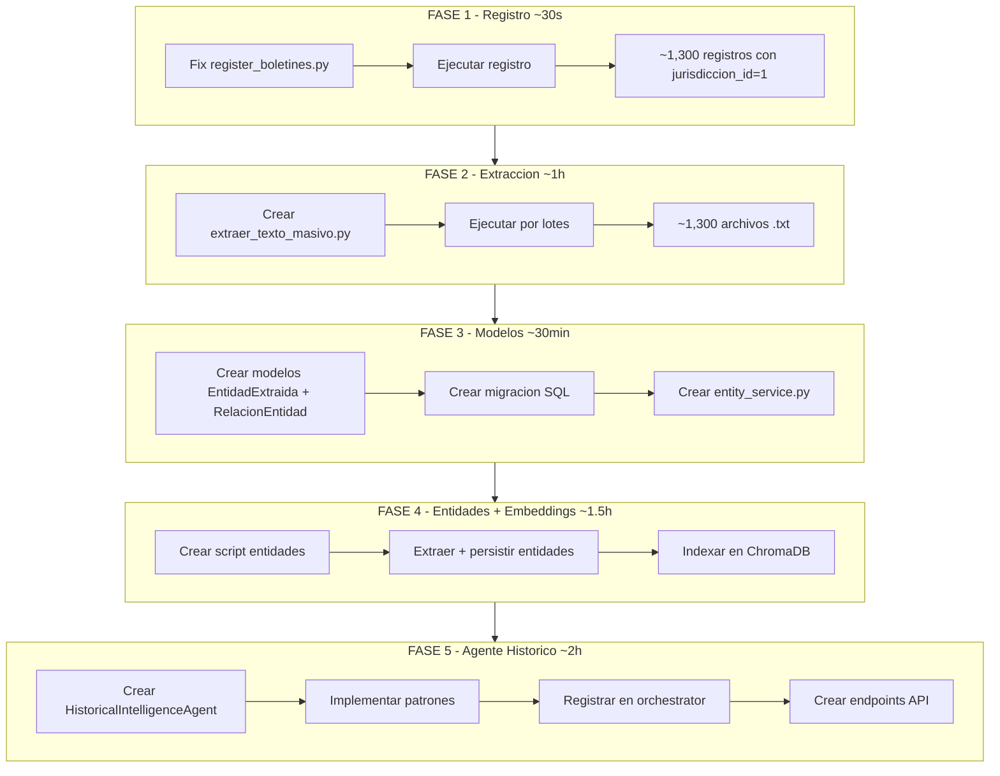

# Procesamiento y Persistencia Masiva de Boletines

## Diagnostico Actual

**PDFs en disco:** ~1,300 archivos en `boletines/` (2025 completo + 2026 parcial, no hay 2024)

**Formato:** `YYYYMMDD_N_Secc.pdf` (5 secciones/dia)

**DB Models existentes:** 21 modelos. `Boletin` ya tiene `jurisdiccion_id` (FK) y `fuente`, pero `register_boletines.py` **no setea** `jurisdiccion_id`.

**Bug detectado:** `mencion_processor.py:196` llama a `content_extractor.extract_text()` que no existe.

**Entidades:** Hay 3 implementaciones duplicadas de entity extraction (en `document_intelligence/agent.py`, `dslab_analyzer.py`, `watcher_ds_lab/entity_extractor.py`) pero ninguna persiste entidades como registros independientes.

**Texto extraido:** Se guarda en `watcher-monolith/backend/data/processed/{stem}.txt`

---

## FASE 1: Registro con Jerarquia Jurisdiccional

**Objetivo:** Registrar todos los PDFs en DB con `jurisdiccion_id=1` (Provincia de Cordoba)

**Archivo a modificar:** [scripts/register_boletines.py](scripts/register_boletines.py)

Cambio clave (linea 76):

```python
# ANTES
boletin = Boletin(
    filename=filename,
    date=date_str,
    section=section_names.get(section_num, f'Seccion {section_num}'),
    status='pending',
    fuente=FuenteBoletin.PROVINCIAL
)

# DESPUES
boletin = Boletin(
    filename=filename,
    date=date_str,
    section=section_names.get(section_num, f'Seccion {section_num}'),
    status='pending',
    fuente=FuenteBoletin.PROVINCIAL,
    jurisdiccion_id=1,
    seccion_nombre=section_names.get(section_num)
)
```

Tambien agregar: actualizar boletines ya existentes que tengan `jurisdiccion_id=NULL`:

```python
# Despues del registro, fix masivo
await db.execute(
    update(Boletin)
    .where(Boletin.jurisdiccion_id == None)
    .where(Boletin.fuente == 'provincial')
    .values(jurisdiccion_id=1)
)
```

**Ejecucion:** `python scripts/register_boletines.py`

**Tiempo:** ~30 segundos

---

## FASE 2: Extraccion de Texto (PyPDF2 Local)

**Objetivo:** Extraer texto de todos los PDFs y guardarlo en `.txt`

**Servicio existente:** [watcher-monolith/backend/app/services/pdf_service.py](watcher-monolith/backend/app/services/pdf_service.py) - `PDFProcessor.process_pdf()`

**Texto destino:** `watcher-monolith/backend/data/processed/{stem}.txt`

**Crear nuevo script:** `scripts/extraer_texto_masivo.py`

Logica:

1. Consultar DB: boletines con `status='pending'`
2. Por cada boletin, construir path: `boletines/{YYYY}/{MM}/{filename}`
3. Llamar `PDFProcessor.process_pdf(pdf_path)` -> genera `.txt`
4. Actualizar `boletin.status = 'completed'`
5. Procesar en lotes de 50 con checkpointing (commit cada lote)
6. Log de progreso con contadores

Consideraciones:

- Si el `.txt` ya existe, saltar (idempotente)
- PDFs corruptos -> `status='failed'`, continuar
- Guardar tiempo de procesamiento por archivo

**Ejecucion por lotes:**

```bash
# Todo de una vez (con checkpointing interno)
python scripts/extraer_texto_masivo.py

# O por ano si se quiere control manual
python scripts/extraer_texto_masivo.py --year 2025
python scripts/extraer_texto_masivo.py --year 2026
```

**Tiempo estimado:** ~1 hora para ~1,300 PDFs (a ~3 seg/PDF)

---

## FASE 3: Nuevos Modelos - Knowledge Graph de Entidades

**Objetivo:** Crear infraestructura para persistir entidades extraidas y sus relaciones

### 3.1 Nuevos modelos en [watcher-monolith/backend/app/db/models.py](watcher-monolith/backend/app/db/models.py)

```python
class EntidadExtraida(Base):
    __tablename__ = "entidades_extraidas"
    
    id = Column(Integer, primary_key=True)
    tipo = Column(String(50), index=True)  # persona, organismo, empresa, contrato, monto
    nombre_normalizado = Column(String(255), unique=True, index=True)
    nombre_display = Column(String(255))
    variantes = Column(JSON)  # ["Juan Perez", "PEREZ, Juan"]
    primera_aparicion = Column(Date)
    ultima_aparicion = Column(Date)
    total_menciones = Column(Integer, default=0)
    metadata_extra = Column(JSON, nullable=True)
    created_at = Column(DateTime, default=datetime.utcnow)
    updated_at = Column(DateTime, default=datetime.utcnow, onupdate=datetime.utcnow)
    
    # Relaciones
    menciones = relationship("MencionEntidad", back_populates="entidad")
    relaciones_origen = relationship("RelacionEntidad",
        foreign_keys="RelacionEntidad.entidad_origen_id", back_populates="origen")
    relaciones_destino = relationship("RelacionEntidad",
        foreign_keys="RelacionEntidad.entidad_destino_id", back_populates="destino")


class MencionEntidad(Base):
    """Cada aparicion de una entidad en un boletin"""
    __tablename__ = "menciones_entidades"
    
    id = Column(Integer, primary_key=True)
    entidad_id = Column(Integer, ForeignKey("entidades_extraidas.id"), index=True)
    boletin_id = Column(Integer, ForeignKey("boletines.id"), index=True)
    fragmento = Column(Text)  # Contexto donde aparece
    pagina = Column(Integer, nullable=True)
    confianza = Column(Float, default=1.0)
    created_at = Column(DateTime, default=datetime.utcnow)
    
    entidad = relationship("EntidadExtraida", back_populates="menciones")
    boletin = relationship("Boletin")


class RelacionEntidad(Base):
    """Relacion detectada entre dos entidades"""
    __tablename__ = "relaciones_entidades"
    
    id = Column(Integer, primary_key=True)
    entidad_origen_id = Column(Integer, ForeignKey("entidades_extraidas.id"), index=True)
    entidad_destino_id = Column(Integer, ForeignKey("entidades_extraidas.id"), index=True)
    tipo_relacion = Column(String(100), index=True)  # contrata, designa, recibe_subsidio, firma, adjudica
    boletin_id = Column(Integer, ForeignKey("boletines.id"))
    fecha_relacion = Column(Date)
    contexto = Column(Text)
    confianza = Column(Float, default=1.0)
    metadata_extra = Column(JSON, nullable=True)
    created_at = Column(DateTime, default=datetime.utcnow)
    
    origen = relationship("EntidadExtraida", foreign_keys=[entidad_origen_id])
    destino = relationship("EntidadExtraida", foreign_keys=[entidad_destino_id])
    boletin = relationship("Boletin")
```

### 3.2 Migracion SQL

Crear archivo `watcher-monolith/backend/migrations/add_knowledge_graph.sql` con CREATE TABLE statements y indices.

### 3.3 Servicio Unificado de Extraccion

Crear `watcher-monolith/backend/app/services/entity_service.py` que unifique la logica duplicada de:

- `agents/document_intelligence/agent.py` -> `_extract_entities()`
- `app/services/acto_parser.py` -> `ActoAdministrativoParser`
- `watcher_ds_lab/src/extractors/entity_extractor.py`

Metodos del servicio:

- `extract_entities(text) -> List[EntityResult]` - Extrae entidades de texto crudo
- `normalize_entity(name, tipo) -> str` - Normaliza nombre para dedup
- `persist_entities(entities, boletin_id, db)` - Guarda/actualiza en DB
- `detect_relationships(entities, text) -> List[Relationship]` - Detecta relaciones
- `persist_relationships(relationships, boletin_id, db)` - Guarda relaciones

Tipos de entidades a extraer:

- **Persona**: Patron `SR\./SRA\. ...`, `A FAVOR DE ...`, `DESIGNAR A ...`
- **Organismo**: `MINISTERIO DE ...`, `SECRETARIA DE ...`, `DIRECCION DE ...`
- **Empresa**: `S\.A\.`, `S\.R\.L\.`, `UTE`, `CONSTRUCTORA`
- **Contrato/Licitacion**: `LICITACION N° ...`, `EXPEDIENTE N° ...`
- **Monto**: Patrones de $ existentes en `acto_parser.py`

Tipos de relaciones a detectar:

- `contrata`: Organismo <-> Empresa (en contexto de licitacion/contratacion)
- `designa`: Organismo -> Persona (en contexto de designacion)
- `recibe_subsidio`: Persona/Empresa <- Organismo
- `adjudica`: Organismo -> Empresa (adjudicacion)
- `firma`: Persona -> Contrato/Licitacion

---

## FASE 4: Extraccion Masiva de Entidades y Embeddings

### 4.1 Script de extraccion de entidades

Crear `scripts/extraer_entidades_masivo.py`:

1. Leer `.txt` de cada boletin con `status='completed'`
2. Ejecutar `entity_service.extract_entities()`
3. Normalizar y deduplicar contra entidades existentes en DB
4. Persistir entidades y menciones
5. Detectar y persistir relaciones

### 4.2 Indexacion en ChromaDB

Crear `scripts/indexar_embeddings.py`:

1. Leer `.txt` de cada boletin completado
2. Usar `EmbeddingService.add_document()` ya existente
3. Metadata: `date`, `section`, `jurisdiccion_id=1`, `filename`

**Tiempo estimado:** ~1 hora para entidades + ~30 min para embeddings

---

## FASE 5: Historical Intelligence Agent

**Objetivo:** Nuevo agente que analiza documentos en contexto historico

### 5.1 Estructura

Crear `watcher-monolith/backend/agents/historical_intelligence/`:

```
historical_intelligence/
  __init__.py
  agent.py
  patterns.py
```

### 5.2 Agent: `HistoricalIntelligenceAgent`

Capacidades:

- **Entity Lookup:** Al procesar un nuevo boletin, busca cada entidad extraida en la DB historica
- **Timeline Builder:** Construye timeline de apariciones de una entidad
- **Pattern Detection:** Detecta patrones sospechosos predefinidos
- **Relationship Graph:** Muestra red de relaciones de una entidad

### 5.3 Patrones a implementar en `patterns.py`

```python
PATRONES = {
    "concentracion_contratos": {
        # Empresa recibe 5+ contratos en 30 dias
        "query": "menciones_entidades JOIN relaciones WHERE tipo='adjudica' GROUP BY empresa HAVING count > 5",
        "severidad": "ALTA"
    },
    "monto_anomalo": {
        # Monto supera 3x promedio historico del tipo de operacion
        "query": "comparar monto actual vs AVG(historico) por tipo_acto",
        "severidad": "ALTA"
    },
    "designacion_contrato_rapido": {
        # Persona designada firma/aparece en contrato < 60 dias
        "query": "relaciones WHERE persona en designa AND misma persona en contrata, diff < 60 dias",
        "severidad": "MEDIA"
    },
    "proveedor_unico": {
        # Mismo proveedor > 80% contratos de un area en periodo
        "query": "GROUP BY organismo, empresa HAVING porcentaje > 80%",
        "severidad": "MEDIA"
    },
    "fragmentacion_sospechosa": {
        # Multiples contratos justo debajo del umbral de licitacion
        "query": "contratos por empresa en 30 dias, todos < umbral, suma total > umbral",
        "severidad": "ALTA"
    }
}
```

### 5.4 Registro en Orchestrator

Agregar en `agents/orchestrator/state.py`:

```python
class AgentType(str, Enum):
    # ... existentes ...
    HISTORICAL_INTELLIGENCE = "historical_intelligence"
```

Registrar handler en `app/api/v1/endpoints/agents.py` siguiendo el patron existente.

### 5.5 Endpoint dedicado

Agregar endpoint en la API para consultas historicas:

```
GET /api/v1/entidades/ - Listar entidades con filtros
GET /api/v1/entidades/{id}/timeline - Timeline de apariciones
GET /api/v1/entidades/{id}/relaciones - Grafo de relaciones
GET /api/v1/entidades/patrones - Patrones detectados
POST /api/v1/agents/historical-analysis - Ejecutar analisis historico
```

---

## Fix de Bug Detectado

En [watcher-monolith/backend/app/services/mencion_processor.py](watcher-monolith/backend/app/services/mencion_processor.py) linea 196:

```python
# ANTES (bug - metodo no existe)
texto_completo = self.content_extractor.extract_text(str(pdf_encontrado))

# DESPUES (usar PDFProcessor que si extrae texto)
from app.services.pdf_service import PDFProcessor
pdf_processor = PDFProcessor()
txt_text = pdf_processor._extract_text_from_pdf(pdf_encontrado)
```

---

## Orden de Ejecucion




**Tiempo total estimado de desarrollo:** ~6-8 horas  
**Tiempo total de ejecucion de procesamiento:** ~3 horas