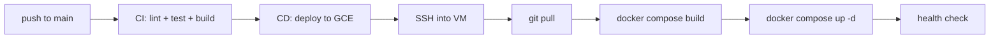

# Hardening de Produccion - Watcher GCP

## Estado actual

- VM `watcher-prod` corriendo en `35.232.141.48` (4 containers up 12h)
- Git remote: `https://github.com/germanevangelisti/watcher.git`
- GCP project: `gen-lang-client-0306718397`
- Secret Manager API: **no habilitada**
- Caddy sirve HTTP en :80 (auto_https off)
- Boletines locales disponibles en `boletines/2024/`, `2025/`, `2026/` (formato `YYYYMMDD_N_Secc.pdf`)

---

## Bloque A: Smoke Test E2E (~30min)

Probar la cadena completa contra la instancia de produccion en `http://35.232.141.48`.

### A1. Subir un PDF local

El backend en la VM usa volumes Docker, asi que el directorio `boletines/` local no esta montado. Necesitamos subir el PDF via la API:

```bash
# Desde la maquina local, subir un PDF existente
curl -X POST http://35.232.141.48/api/v1/upload/files \
  -F "files=@boletines/2025/03/20250327_2_Secc.pdf"
```

Luego verificar que aparezca en la lista de boletines y procesar:

```bash
# Listar boletines (deberia mostrar el recien subido como "pending")
curl -s http://35.232.141.48/api/v1/boletines | python3 -m json.tool | head -30

# Procesar todos los pendientes
curl -X POST http://35.232.141.48/api/v1/pipeline/process-all
```

### A2. Descargar boletin de hoy (todas las secciones)

Usar el endpoint de sync que descarga y opcionalmente procesa:

```bash
# Opcion 1: Sync to today (detecta ultima fecha descargada, baja todo lo faltante)
curl -X POST http://35.232.141.48/api/v1/sync/start \
  -H "Content-Type: application/json" \
  -d '{"process_after_download": false}'

# Opcion 2: Descargar solo hoy explicitamente (secciones 1-5)
curl -X POST http://35.232.141.48/api/v1/downloader/download/start \
  -H "Content-Type: application/json" \
  -d '{"start_date": "2026-02-20", "end_date": "2026-02-20", "sections": [1,2,3,4,5]}'

# Verificar estado
curl -s http://35.232.141.48/api/v1/sync/status | python3 -m json.tool
```

### A3. Verificar pipeline + search

```bash
# Procesar lo descargado
curl -X POST http://35.232.141.48/api/v1/pipeline/process-all

# Health check (ahora chromadb deberia inicializarse)
curl -s http://35.232.141.48/api/v1/health | python3 -m json.tool

# Abrir frontend en browser
open http://35.232.141.48
```

---

## Bloque B: Secret Manager (~45min)

### B1. Habilitar API y crear secretos

Los secretos a crear en GCP Secret Manager:

**Produccion:**

- `watcher-prod-google-api-key` - GOOGLE_API_KEY
- `watcher-prod-db-password` - DB_PASSWORD

**Staging/Test (para futuro, estructura preparada):**

- `watcher-staging-google-api-key`
- `watcher-staging-db-password`

**Dev no necesita Secret Manager** - usa `.env` local directamente.

Comandos:

```bash
# Habilitar API
gcloud services enable secretmanager.googleapis.com

# Crear secretos de produccion
--

echo -n "watcher_prod_S3cur3_2026" | \
  gcloud secrets create watcher-prod-db-password --data-file=- --replication-policy=automatic

# Verificar
gcloud secrets list
gcloud secrets versions access latest --secret=watcher-prod-google-api-key
```

### B2. Dar permisos a la VM para leer secretos

La VM necesita un service account con rol `secretmanager.secretAccessor`:

```bash
# Obtener el service account de la VM
gcloud compute instances describe watcher-prod --zone=us-central1-a \
  --format='get(serviceAccounts[0].email)'

# Dar permiso (reemplazar SA_EMAIL)
gcloud secrets add-iam-policy-binding watcher-prod-google-api-key \
  --member="serviceAccount:SA_EMAIL" --role="roles/secretmanager.secretAccessor"

gcloud secrets add-iam-policy-binding watcher-prod-db-password \
  --member="serviceAccount:SA_EMAIL" --role="roles/secretmanager.secretAccessor"
```

### B3. Crear script de deploy que lea secretos

Crear `[scripts/deploy.sh](scripts/deploy.sh)` que la VM ejecuta para leer secretos y levantar compose:

```bash
#!/bin/bash
# Lee secretos de Secret Manager y genera .env.production
GOOGLE_API_KEY=$(gcloud secrets versions access latest --secret=watcher-prod-google-api-key)
DB_PASSWORD=$(gcloud secrets versions access latest --secret=watcher-prod-db-password)

cat > .env.production << EOF
DB_PASSWORD=${DB_PASSWORD}
DATABASE_URL=postgresql+asyncpg://watcher:${DB_PASSWORD}@db:5432/watcher
SYNC_DATABASE_URL=postgresql://watcher:${DB_PASSWORD}@db:5432/watcher
GOOGLE_API_KEY=${GOOGLE_API_KEY}
LLM_PROVIDER=google
LLM_MODEL=gemini-2.0-flash
ENVIRONMENT=production
ALLOWED_ORIGINS=http://35.232.141.48
EOF

docker compose down
docker compose up --build -d
```

### B4. Documentar env vars por ambiente

Actualizar `[.env.production.example](.env.production.example)` con comentarios indicando que valores van en Secret Manager vs en el archivo.

**Tabla resumen de secretos por ambiente:**

- **dev** (local): Todo en `watcher-backend/.env`, sin Secret Manager
- **staging** (futuro): `watcher-staging-`* en Secret Manager, `.env.staging` generado por script
- **prod** (GCE): `watcher-prod-`* en Secret Manager, `.env.production` generado por `scripts/deploy.sh`

---

## Bloque C: GitHub Actions CD (~1.5h)

### C1. Crear workflow de deploy

Nuevo archivo `[.github/workflows/deploy.yml](.github/workflows/deploy.yml)` que se ejecuta en push a `main` despues de que CI pasa.

**Flujo:**




**Estrategia:** SSH directo a la VM usando `google-github-actions/ssh-compute@v1`. Es la mas simple para un solo servidor.

**Contenido del workflow:**

```yaml
name: Deploy to GCE

on:
  workflow_run:
    workflows: ["CI - Watcher Agent"]
    branches: [main]
    types: [completed]

jobs:
  deploy:
    if: ${{ github.event.workflow_run.conclusion == 'success' }}
    runs-on: ubuntu-latest
    permissions:
      contents: read
      id-token: write

    steps:
      - name: Authenticate to GCP
        uses: google-github-actions/auth@v2
        with:
          workload_identity_provider: ${{ secrets.GCP_WORKLOAD_IDENTITY_PROVIDER }}
          service_account: ${{ secrets.GCP_SERVICE_ACCOUNT }}

      - name: Set up gcloud
        uses: google-github-actions/setup-gcloud@v2

      - name: Deploy via SSH
        run: |
          gcloud compute ssh watcher-prod --zone=us-central1-a --command="
            cd ~/watcher &&
            git pull origin main &&
            bash scripts/deploy.sh
          "

      - name: Health check
        run: |
          sleep 30
          curl -sf http://35.232.141.48/api/v1/health || exit 1
```

### C2. Configurar Workload Identity Federation (WIF)

WIF es el metodo recomendado por Google para autenticar GitHub Actions sin usar JSON keys. Requiere:

1. Crear un Workload Identity Pool en GCP
2. Crear un Provider que confie en GitHub Actions OIDC
3. Crear/usar un Service Account con permisos de Compute SSH
4. Vincular el Service Account al pool

Comandos completos:

```bash
# Habilitar APIs necesarias
gcloud services enable iamcredentials.googleapis.com iam.googleapis.com

# Crear service account para deploy
gcloud iam service-accounts create watcher-deployer \
  --display-name="Watcher GitHub Actions Deployer"

# Dar permisos: SSH + Compute
gcloud projects add-iam-policy-binding gen-lang-client-0306718397 \
  --member="serviceAccount:watcher-deployer@gen-lang-client-0306718397.iam.gserviceaccount.com" \
  --role="roles/compute.instanceAdmin.v1"

gcloud projects add-iam-policy-binding gen-lang-client-0306718397 \
  --member="serviceAccount:watcher-deployer@gen-lang-client-0306718397.iam.gserviceaccount.com" \
  --role="roles/iap.tunnelResourceAccessor"

# Crear Workload Identity Pool
gcloud iam workload-identity-pools create github-pool \
  --location=global \
  --display-name="GitHub Actions Pool"

# Crear Provider
gcloud iam workload-identity-pools providers create-oidc github-provider \
  --location=global \
  --workload-identity-pool=github-pool \
  --issuer-uri="https://token.actions.githubusercontent.com" \
  --attribute-mapping="google.subject=assertion.sub,attribute.repository=assertion.repository" \
  --attribute-condition="assertion.repository=='germanevangelisti/watcher'"

# Vincular SA al pool
gcloud iam service-accounts add-iam-policy-binding \
  watcher-deployer@gen-lang-client-0306718397.iam.gserviceaccount.com \
  --member="principalSet://iam.googleapis.com/projects/651954771722/locations/global/workloadIdentityPools/github-pool/attribute.repository/germanevangelisti/watcher" \
  --role="roles/iam.workloadIdentityUser"
```

### C3. Agregar GitHub Secrets

En `github.com/germanevangelisti/watcher/settings/secrets/actions`, agregar:

- `GCP_WORKLOAD_IDENTITY_PROVIDER`: `projects/651954771722/locations/global/workloadIdentityPools/github-pool/providers/github-provider`
- `GCP_SERVICE_ACCOUNT`: `watcher-deployer@gen-lang-client-0306718397.iam.gserviceaccount.com`

### C4. Clonar repo en la VM

Para que `git pull` funcione en deploy, el repo debe estar clonado (actualmente se subio via tarball):

```bash
gcloud compute ssh watcher-prod --zone=us-central1-a --command="
  cd ~ &&
  rm -rf watcher &&
  git clone https://github.com/germanevangelisti/watcher.git &&
  cd watcher &&
  bash scripts/deploy.sh
"
```

---

## Bloque D: Preparar Caddy para HTTPS + Dominio (~15min)

### D1. Actualizar Caddyfile para dominio futuro

Modificar `[Caddyfile](Caddyfile)` para que cuando se agregue un dominio, solo haya que cambiar una linea:

```caddyfile
# Para usar con dominio: reemplazar ":80" por "watcher.tudominio.com"
# Caddy obtiene certificados Let's Encrypt automaticamente
{$CADDY_DOMAIN::80} {
    handle /api/* {
        reverse_proxy backend:8001
    }
    handle /ws/* {
        reverse_proxy backend:8001
    }
    handle /docs {
        reverse_proxy backend:8001
    }
    handle /openapi.json {
        reverse_proxy backend:8001
    }
    handle {
        reverse_proxy frontend:80
    }
}
```

Y en `docker-compose.yml`, agregar variable de entorno para Caddy:

```yaml
caddy:
    image: caddy:2-alpine
    environment:
      CADDY_DOMAIN: ${CADDY_DOMAIN:-:80}
```

Cuando tengas dominio, solo agregar `CADDY_DOMAIN=watcher.midominio.com` a `.env.production` y Caddy hace el resto (ACME + Let's Encrypt automatico).

### D2. Documentar pasos para cuando tengas dominio

Agregar seccion al `.env.production.example` explicando:

1. Registrar dominio (Google Domains, Namecheap, etc.)
2. Crear registro DNS tipo A apuntando a `35.232.141.48`
3. Agregar `CADDY_DOMAIN=watcher.midominio.com` a `.env.production`
4. Agregar el dominio a `ALLOWED_ORIGINS`
5. `docker compose restart caddy`
6. Caddy obtiene certificado SSL automaticamente

---

## Resumen de archivos

**Nuevos:**

- `scripts/deploy.sh` - Script de deploy que lee secretos de Secret Manager
- `.github/workflows/deploy.yml` - GitHub Actions CD workflow

**Modificados:**

- `Caddyfile` - Variable de entorno para dominio
- `docker-compose.yml` - Variable `CADDY_DOMAIN` para Caddy
- `.env.production.example` - Documentacion de secretos por ambiente + dominio

