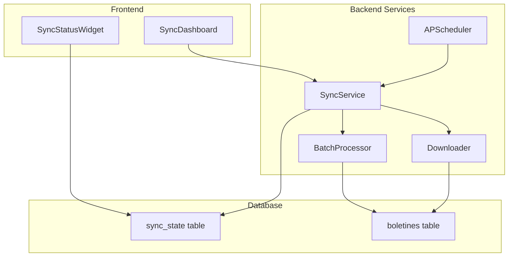
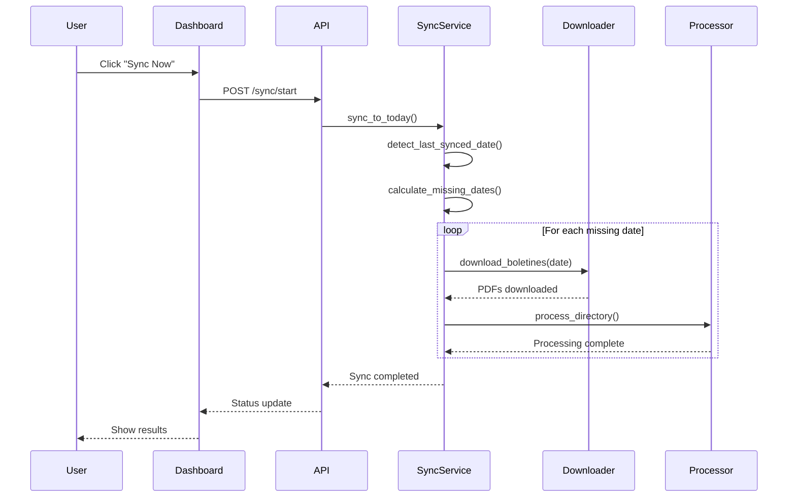

# Feature: Sincronización Automatica de Boletines ("Sync to Today")

## Contexto Actual

- Ultimo boletin descargado: **17 de noviembre de 2025** (`boletines/2025/11/20251117_5_Secc.pdf`)
- Boletines faltantes: ~2.5 meses (Dic 2025, Enero-Febrero 2026)
- Infraestructura existente:
  - API de descarga en [`downloader.py`](watcher-monolith/backend/app/api/v1/endpoints/downloader.py)
  - Procesamiento batch en [`batch_processor.py`](watcher-monolith/backend/app/services/batch_processor.py)
  - Frontend `DownloadManager` manual

## Arquitectura Propuesta



## Implementacion

### 1. Backend: Modelo de Estado de Sincronizacion

Nuevo modelo en [`models.py`](watcher-monolith/backend/app/db/models.py):

```python
class SyncState(Base):
    __tablename__ = "sync_state"
    id = Column(Integer, primary_key=True)
    last_synced_date = Column(Date)           # Ultima fecha sincronizada
    last_sync_timestamp = Column(DateTime)    # Cuando se ejecuto
    next_scheduled_sync = Column(DateTime)    # Proxima ejecucion
    status = Column(String)                   # idle, syncing, error
    boletines_pending = Column(Integer)       # Pendientes de descargar
    boletines_downloaded = Column(Integer)    # Descargados en ultima sync
    boletines_processed = Column(Integer)     # Procesados en ultima sync
    error_message = Column(Text, nullable=True)
```

### 2. Backend: Servicio de Sincronizacion

Nuevo archivo `watcher-monolith/backend/app/services/sync_service.py`:

- `detect_last_synced_date()`: Escanea `boletines/` para encontrar el ultimo PDF
- `calculate_missing_dates()`: Genera lista de fechas faltantes hasta hoy (excluyendo fines de semana)
- `sync_to_today()`: Orquesta descarga + procesamiento
- `get_sync_status()`: Retorna estado actual

### 3. Backend: Endpoints de Sincronizacion

Nuevo router `watcher-monolith/backend/app/api/v1/endpoints/sync.py`:

| Endpoint | Metodo | Descripcion |
|----------|--------|-------------|
| `/sync/status` | GET | Estado actual de sincronizacion |
| `/sync/start` | POST | Inicia sync manual |
| `/sync/stop` | POST | Cancela sync en progreso |
| `/sync/schedule` | PUT | Configura scheduler (frecuencia) |

### 4. Backend: Scheduler Automatico

Usar **APScheduler** (ligero, ya compatible con FastAPI):

```python
# En app/core/scheduler.py
from apscheduler.schedulers.asyncio import AsyncIOScheduler

scheduler = AsyncIOScheduler()

@scheduler.scheduled_job('cron', hour=6, minute=0)  # Diario a las 6 AM
async def daily_sync():
    await sync_service.sync_to_today()
```

### 5. Frontend: Dashboard de Sincronizacion

Nuevo componente `watcher-monolith/frontend/src/components/sync/SyncDashboard.tsx`:

- **Status Card**: Estado actual (Syncing/Idle/Error), fecha del ultimo sync
- **Progress Section**: Barra de progreso durante sync activa
- **Stats Cards**: Boletines pendientes, descargados hoy, procesados
- **Schedule Config**: Toggle para scheduler, selector de frecuencia
- **Action Buttons**: "Sync Now", "Stop Sync"
- **Timeline**: Historial de ultimas sincronizaciones

### 6. Frontend: Widget de Estado Compacto

Componente `SyncStatusWidget.tsx` para mostrar en el header/sidebar:
- Indicador verde/amarillo/rojo
- "Actualizado al 3 Feb 2026" o "5 boletines pendientes"

## Flujo de Sincronizacion



## Archivos a Crear/Modificar

| Archivo | Accion |
|---------|--------|
| `backend/app/db/models.py` | Agregar `SyncState` |
| `backend/app/services/sync_service.py` | **Nuevo** |
| `backend/app/api/v1/endpoints/sync.py` | **Nuevo** |
| `backend/app/core/scheduler.py` | **Nuevo** |
| `backend/app/main.py` | Registrar scheduler |
| `backend/requirements.txt` | Agregar `apscheduler` |
| `frontend/src/components/sync/SyncDashboard.tsx` | **Nuevo** |
| `frontend/src/components/sync/SyncStatusWidget.tsx` | **Nuevo** |
| `frontend/src/pages/SettingsPage.tsx` | Agregar tab de sync |
| `frontend/src/services/api.ts` | Agregar endpoints sync |

## Dependencias Nuevas

- **Backend**: `apscheduler>=3.10.0`
- **Frontend**: Ninguna (usa Mantine existente)

## Estimacion de Esfuerzo

- Backend (modelo + servicio + endpoints + scheduler): ~4-5 horas
- Frontend (dashboard + widget): ~3-4 horas
- Testing e integracion: ~2 horas
- **Total estimado**: ~10 horas