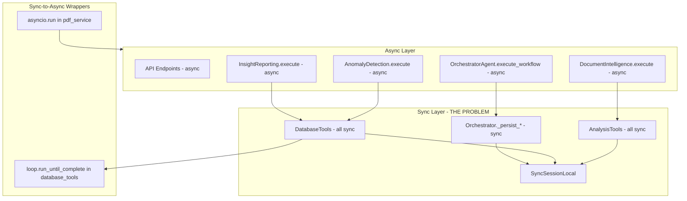
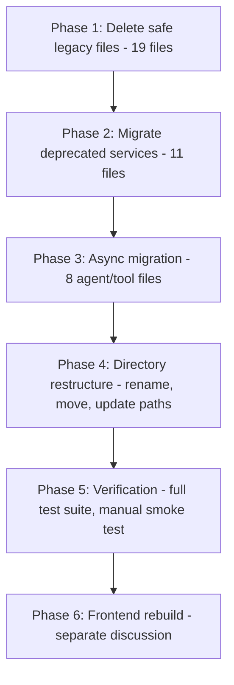

# Watcher MVP v1.1 - Restructuring and Legacy Cleanup Plan

## 1. Repository Analysis Summary

The current repository has **~300+ Python files**, **~90 TSX files**, **14 plan files** from epics 0-7, and significant accumulated technical debt. The epics 0-7 built a functional pipeline (ingesta, extraction, chunking, indexing, retrieval, agentic system) but left behind duplicated code, deprecated services, backup files, and sync/async inconsistencies.

### Current Structure (problematic)

```
watcher-agent/
  agents/              <-- DUPLICATE of monolith agents (legacy)
  watcher-monolith/
    backend/           <-- 1400+ files, mixed clean/legacy
    frontend/          <-- 90+ TSX files, tightly coupled to monolith
  watcher-lab/         <-- Data science lab (loosely coupled)
  watcher-doc/         <-- Budget analysis data (standalone)
  scripts/             <-- 28 utility scripts (mixed useful/obsolete)
  tests/               <-- Test suite (references 4-layer architecture)
  notebooks/           <-- 7 epic validation notebooks
  docs/                <-- 20+ documentation files
```

**Key problems:**

- `agents/` at root duplicates `watcher-monolith/backend/agents/` (root versions are legacy)
- The "monolith" name is misleading; backend and frontend should be separated
- 7 `.bak`/`.bak2` files in endpoints
- 9 ad-hoc test files in backend root
- 3 deprecated services still referenced
- Sync database tools called from async agents
- Root-level scripts and tests reference backend internals via `sys.path` hacks

---

## 2. Proposed New Directory Structure

```
watcher-agent/
  watcher-backend/          <-- FastAPI backend (clean, async-first)
    agents/                 <-- Agent system (orchestrator, DI, insight, etc.)
    app/
      api/v1/endpoints/     <-- API routes
      core/                 <-- Config, events, observability
      db/                   <-- Database layer (async-only)
      schemas/              <-- Pydantic models
      scrapers/             <-- Web scrapers
      services/             <-- Business logic
      adapters/             <-- Data source adapters
    config/                 <-- JSON config files
    migrations/             <-- DB migrations
    scripts/                <-- Backend-specific scripts
    tests/                  <-- All tests (unit, integration, e2e)
    requirements.txt
    .env

  watcher-frontend/         <-- React app (rebuilt from scratch, later phase)
    src/
    package.json

  watcher-lab/              <-- Data science lab (untouched for now)
    watcher_ds_lab/
    requirements.txt

  watcher-doc/              <-- Documentation and budget data (untouched)

  docs/                     <-- Project documentation
  notebooks/                <-- Epic validation notebooks
  .cursor/plans/            <-- Preserved epic plans (0-7)
  Makefile
  README.md
  AGENTS.md
  pytest.ini
```

**Why this is better:**

- Clear separation: backend, frontend, lab, docs are independent
- No more "monolith" naming; each piece can evolve independently
- Tests live inside the backend project (no more `sys.path` hacks)
- Scripts are colocated with the code they operate on
- Frontend can be rebuilt from scratch without touching backend

---

## 3. Legacy Code Elimination Inventory

### Category A: Safe to delete immediately (zero risk, no dependencies)

**Backup files (7 files):**

- `watcher-monolith/backend/app/api/v1/endpoints/dslab_configs.py.bak`
- `watcher-monolith/backend/app/api/v1/endpoints/dslab_documents.py.bak`
- `watcher-monolith/backend/app/api/v1/endpoints/dslab_documents.py.bak2`
- `watcher-monolith/backend/app/api/v1/endpoints/dslab_executions.py.bak`
- `watcher-monolith/backend/app/api/v1/endpoints/dslab_executions.py.bak2`
- `watcher-monolith/backend/app/api/v1/endpoints/dslab_results.py.bak`
- `watcher-monolith/backend/app/api/v1/endpoints/dslab_results.py.bak2`

**Root-level legacy files (2 files):**

- `dowload-boletins.py` (typo in name, standalone, unused)
- `ejemplos_concretos_watcher.json` (example data, not referenced)

**Ad-hoc backend test/example files (9 files):**

- `watcher-monolith/backend/test_endpoints.py`
- `watcher-monolith/backend/test_mock.py`
- `watcher-monolith/backend/test_single.py`
- `watcher-monolith/backend/test_sistema_final.py`
- `watcher-monolith/backend/test_simple.py`
- `watcher-monolith/backend/test_api_routes.py`
- `watcher-monolith/backend/agent_example.py`
- `watcher-monolith/backend/example_agent_workflow.py`
- `watcher-monolith/backend/explain_flow.py`

**Database backup file:**

- `watcher-monolith/backend/sqlite.db.backup_20251117_011054`

**Total: ~19 files, zero effort, zero risk.**

### Category B: Delete after migrating usages (low risk)

**Root `agents/` directory (7 files):**

- `agents/anomaly_detection.py`
- `agents/document_intelligence.py`
- `agents/insight_reporting.py`
- `agents/kba_agent.py`
- `agents/raga_agent.py`
- `agents/tools/database_tools.py`
- `agents/tools/analysis_tools.py`

These are older versions of the monolith agents. The monolith versions are canonical (they integrate with the orchestrator and have workflow persistence). The root versions use `sys.path` hacks to import from the monolith. **Action:** Verify no production code depends on them, then delete.

**Deprecated services (3 files, requires migration):**

- `content_extractor.py` -- Used by `batch_processor.py`, `mencion_processor.py`. Migrate to `ExtractorRegistry`.
- `document_processor.py` -- Used by `compliance.py` endpoint (3 calls). Migrate to `ChunkingService` + `ExtractorRegistry`.
- `mock_watcher_service.py` -- Used by `batch_processor.py`, `watcher.py` endpoint, example scripts. Remove mock endpoint, update batch processor.

**Sync session (1 file):**

- `sync_session.py` -- After async migration, this becomes unnecessary. Delete after all agents use async sessions.

**Total: ~11 files, medium effort (need to update ~8 importing files).**

### Category C: Code cleanup within files (medium effort)

- `**embedding_service.py**`: Remove ~6 legacy fallback code paths (lines with "legacy mode", "fallback to legacy chunking")
- `**search.py` endpoint**: Remove "legacy filter" path
- `**raga_agent.py**` (if kept): Remove legacy embedding fallbacks

### Effort Summary


| Category            | Files  | Effort         | Risk    |
| ------------------- | ------ | -------------- | ------- |
| A: Safe delete      | 19     | 15 min         | None    |
| B: Migrate + delete | 11     | 4-6 hours      | Low     |
| C: Code cleanup     | 3      | 2-3 hours      | Low     |
| **Total**           | **33** | **~7-9 hours** | **Low** |


---

## 4. Async Migration Plan

### Current State of Sync/Async Mixing




### Migration Steps (ordered by dependency)

**Step 1: Convert DatabaseTools to async**

File: `watcher-monolith/backend/agents/tools/database_tools.py`

- Replace `SyncSessionLocal` with `AsyncSessionLocal`
- Convert all 8 `@staticmethod` methods to `async`
- Remove `loop.run_until_complete()` wrapper in `search_documents()`
- Change all `db.query(...)` to `await db.execute(select(...))` patterns

**Step 2: Convert AnalysisTools to async**

File: `watcher-monolith/backend/agents/tools/analysis_tools.py`

- Convert all 7 `@staticmethod` methods to `async`
- Same SQLAlchemy async pattern as DatabaseTools

**Step 3: Convert Orchestrator persistence to async**

File: `watcher-monolith/backend/agents/orchestrator/agent.py`

- Convert 5 `_persist_*` methods to `async`
- Replace `get_sync_db()` with async session context manager
- Update callers (`execute_workflow`, `_execute_task`, `approve_task`, `reject_task`)

**Step 4: Update all agents to use async tools**

Files affected:

- `insight_reporting/agent.py` (lines 370, 507, 557): `db = DatabaseTools.get_db()` -> `async with get_async_db() as db:`
- `document_intelligence/agent.py` (line 402): same pattern
- `anomaly_detection/agent.py` (line 388): same pattern

**Step 5: Remove asyncio.run() wrappers**

- `pdf_service.py` (line 124): Make the calling method async, use `await`
- `document_processor.py` (line 61): Same, or delete entirely (deprecated)

**Step 6: Delete sync_session.py**

After all agents use async sessions, remove `sync_session.py` and `get_sync_db()`.

**Step 7: Script entry points**

Scripts in `scripts/` that use `asyncio.run()` at the top level are fine -- that is the correct pattern for CLI entry points. No changes needed there.

### Estimated Effort: 6-8 hours

---

## 5. Directory Restructuring Steps

### Phase 1: Rename and move (1-2 hours)

1. Rename `watcher-monolith/backend/` to `watcher-backend/`
2. Rename `watcher-monolith/frontend/` to `watcher-frontend/`
3. Move `watcher-monolith/docs/` to `docs/architecture/`
4. Delete empty `watcher-monolith/` directory
5. Move root `scripts/` into `watcher-backend/scripts/`
6. Move root `tests/` into `watcher-backend/tests/`
7. Delete root `agents/` (after verifying no production deps)

### Phase 2: Update all import paths and configs (2-3 hours)

1. Update `Makefile` paths (backend/frontend start/test commands)
2. Update `pytest.ini` test paths and coverage sources
3. Update `.github/workflows/ci.yml` if exists
4. Update `scripts/dev.sh` paths
5. Update any `sys.path` manipulations in remaining scripts
6. Update `.cursor/rules/notion-sync.mdc` file references
7. Update `AGENTS.md` directory references
8. Update `README.md` with new structure

### Phase 3: Clean internal references (1-2 hours)

1. Update imports in scripts that referenced `watcher-monolith/backend/...`
2. Verify all `from app.` imports still work (they should, since `app/` is within `watcher-backend/`)
3. Run full test suite to verify nothing broke

---

## 6. Epic Plans Preservation

All 14 plan files in `.cursor/plans/` will be preserved as-is. They document the journey from epic 0 through 7 and serve as architectural decision records:

- `epic_0_migration_plan_32ac3386.plan.md` -- OpenAI to Google Gemini migration
- `epic_1_ingesta_implementation_e1773ab7.plan.md` -- SHA256 dedup, batch upload, URL download
- `epic_2_extraction_plan_514934d8.plan.md` -- PDF extraction with ExtractorRegistry
- `epic_3_feature_engineering_d1455554.plan.md` -- Chunking, enrichment, text cleaning
- `epic_4_indexacion_plan_60d0822a.plan.md` -- Triple indexing (ChromaDB + SQLite + FTS5)
- `epic_5_retrieval_7006ae93.plan.md` -- Hybrid search with RRF and reranking
- `epic_6_sistema_agentico_9843363d.plan.md` -- Agent-retrieval integration, LLM factory
- `implementar_epica_7_2230507c.plan.md` -- Technical debt cleanup

These collectively define what MVP v1.1 IS.

---

## 7. Execution Order




**Total estimated effort: 18-24 hours of implementation across phases 1-5.**

Phase 6 (frontend) is intentionally deferred to a separate discussion as requested.

---

## 8. Frontend Discussion (for later)

The current frontend (Mantine + React Router + Vite) has 90+ TSX files, 20+ routes, and many features built during the epic sprints. Rebuilding from scratch makes sense because:

- The current UI grew organically without a cohesive UX vision
- Many pages are feature-specific (DSLab, compliance, presupuesto) vs. the unified "workflow automation platform" vision
- A clean frontend in its own `watcher-frontend/` directory is easier to develop independently
- Modern UI frameworks (Next.js App Router, or Vite + TanStack Router) would be a better foundation

This will be a separate planning session after the backend restructuring is complete.