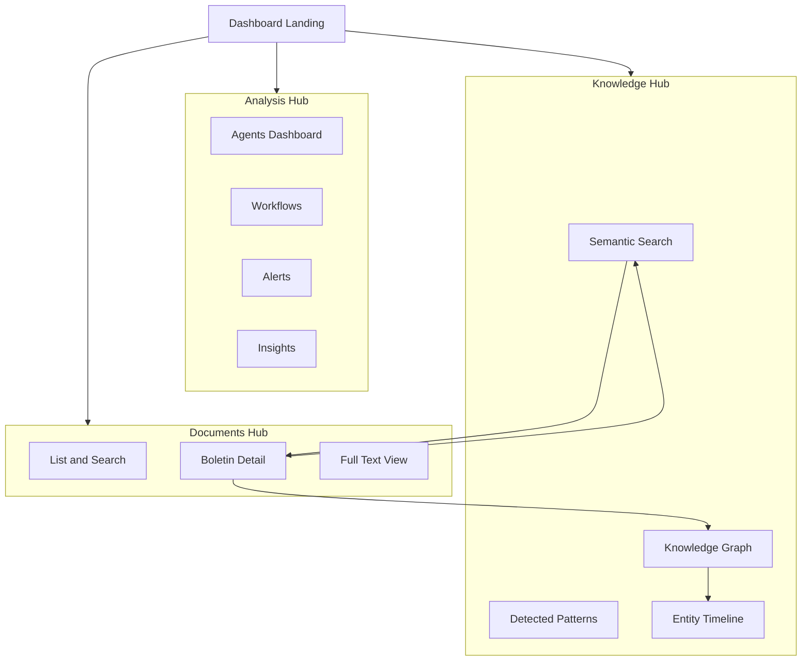

# Watcher v1.1 UI Refactor Plan

## Executive Summary

Hybrid migration to create `watcher-ui-v2/` in parallel with existing `watcher-frontend/`, using modern stack (Vite + React 18 + shadcn/ui + TanStack Router + TanStack Query + Zustand). Remove Ciudadano/Auditor dual-mode system. Implement dark mode minimalist design. Timeline: 6-8 weeks.

## Architecture Overview

### Current State (v1)

```
watcher-frontend/
├── src/
│   ├── components/      # 50+ Mantine components
│   ├── pages/          # 20+ feature-specific pages
│   ├── contexts/       # UserModeContext
│   ├── services/       # Axios API client
│   └── types/          # TypeScript definitions
└── package.json        # Mantine + React Router 6
```

### Target State (v2)

```
watcher-ui-v2/
├── src/
│   ├── components/
│   │   ├── ui/         # shadcn/ui primitives
│   │   ├── layout/     # Shell, Nav, Header
│   │   └── features/   # Domain components
│   ├── app/            # User-journey pages
│   │   ├── _layout.tsx
│   │   ├── index.tsx   # Dashboard
│   │   ├── documentos/ # Documents hub
│   │   ├── analisis/   # Analysis hub
│   │   └── conocimiento/ # Knowledge hub
│   ├── lib/
│   │   ├── api/        # TanStack Query hooks
│   │   ├── store/      # Zustand stores
│   │   └── utils/      # Helpers
│   └── types/          # Migrated types
└── package.json        # shadcn + TanStack
```

### User Journey Architecture




## Technology Stack

### Core Framework

- **Vite 5** - Build tool (keep existing)
- **React 18** - UI library (keep existing)
- **TypeScript 5** - Type safety (keep existing)
- **TanStack Router** - Type-safe routing (NEW)

### UI Layer

- **shadcn/ui** - Component library (NEW)
- **Tailwind CSS** - Styling (NEW)
- **Radix UI** - Primitives (NEW via shadcn)
- **lucide-react** - Icons (NEW)

### State Management

- **TanStack Query v5** - Server state (NEW)
- **Zustand** - Client state (NEW)

### Data Fetching

- **Axios** - HTTP client (keep, wrap in TanStack Query)

### Visualization

- **Recharts** - Charts (keep if needed)
- **vis-network** or **react-force-graph** - Knowledge graph (evaluate)

## Design System

### Theme: Dark Minimalist "Watcher"

**Core Principles:**

- Surveillance aesthetic (monospace fonts, grid patterns)
- High contrast for clarity
- Minimal chrome, content-first
- Professional, not playful

**Color Palette:**

```css
/* Dark base */
--background: 0 0% 8%;        /* #141414 */
--surface: 0 0% 12%;          /* #1f1f1f */
--surface-elevated: 0 0% 16%; /* #292929 */

/* Primary accent (surveillance blue) */
--primary: 210 100% 50%;      /* #0080ff */
--primary-hover: 210 100% 60%;

/* Status colors */
--success: 142 76% 36%;       /* #16a34a */
--warning: 38 92% 50%;        /* #f59e0b */
--danger: 0 84% 60%;          /* #ef4444 */

/* Text */
--foreground: 0 0% 98%;       /* #fafafa */
--muted: 0 0% 60%;            /* #999999 */
```

**Typography:**

- Heading: `Inter` (weight 600-700)
- Body: `Inter` (weight 400-500)
- Mono: `JetBrains Mono` (code, IDs, dates)

**Components:**

- Rounded corners: 4px (sharp, technical)
- Borders: 1px solid with subtle glow on hover
- Shadows: Minimal, only for elevated surfaces
- Spacing: 8px base unit

## Phase 1: Foundation (Week 1-2)

### 1.1 Project Setup

**Create new project:**

```bash
# At repo root
npm create vite@latest watcher-ui-v2 -- --template react-ts
cd watcher-ui-v2
```

**Install dependencies:**

```bash
# Core
npm install @tanstack/react-router@latest
npm install @tanstack/react-query@latest
npm install zustand axios dayjs

# UI
npm install -D tailwindcss postcss autoprefixer
npx tailwindcss init -p
npm install class-variance-authority clsx tailwind-merge
npm install lucide-react

# shadcn/ui (init)
npx shadcn-ui@latest init
```

**shadcn config (`components.json`):**

```json
{
  "style": "default",
  "rsc": false,
  "tsx": true,
  "tailwind": {
    "config": "tailwind.config.js",
    "css": "src/index.css",
    "baseColor": "slate",
    "cssVariables": true
  },
  "aliases": {
    "components": "@/components",
    "utils": "@/lib/utils"
  }
}
```

**Install initial shadcn components:**

```bash
npx shadcn-ui@latest add button
npx shadcn-ui@latest add card
npx shadcn-ui@latest add input
npx shadcn-ui@latest add select
npx shadcn-ui@latest add dialog
npx shadcn-ui@latest add table
npx shadcn-ui@latest add badge
npx shadcn-ui@latest add tabs
npx shadcn-ui@latest add skeleton
```

### 1.2 Tailwind Configuration

**Update `[watcher-ui-v2/tailwind.config.js](watcher-ui-v2/tailwind.config.js)`:**

```js
/** @type {import('tailwindcss').Config} */
module.exports = {
  darkMode: ["class"],
  content: [
    './pages/**/*.{ts,tsx}',
    './components/**/*.{ts,tsx}',
    './app/**/*.{ts,tsx}',
    './src/**/*.{ts,tsx}',
  ],
  theme: {
    extend: {
      colors: {
        background: "hsl(0 0% 8%)",
        surface: "hsl(0 0% 12%)",
        "surface-elevated": "hsl(0 0% 16%)",
        primary: {
          DEFAULT: "hsl(210 100% 50%)",
          hover: "hsl(210 100% 60%)",
        },
        success: "hsl(142 76% 36%)",
        warning: "hsl(38 92% 50%)",
        danger: "hsl(0 84% 60%)",
        foreground: "hsl(0 0% 98%)",
        muted: "hsl(0 0% 60%)",
      },
      fontFamily: {
        sans: ['Inter', 'system-ui', 'sans-serif'],
        mono: ['JetBrains Mono', 'monospace'],
      },
      borderRadius: {
        DEFAULT: '4px',
      },
    },
  },
  plugins: [require("tailwindcss-animate")],
}
```

### 1.3 Base Layout

**Create `[watcher-ui-v2/src/components/layout/app-shell.tsx](watcher-ui-v2/src/components/layout/app-shell.tsx)`:**

```tsx
import { Outlet } from '@tanstack/react-router'
import { MainNav } from './main-nav'
import { Header } from './header'

export function AppShell() {
  return (
    <div className="min-h-screen bg-background text-foreground">
      <Header />
      <div className="flex">
        <MainNav />
        <main className="flex-1 p-6">
          <Outlet />
        </main>
      </div>
    </div>
  )
}
```

**Create `[watcher-ui-v2/src/components/layout/main-nav.tsx](watcher-ui-v2/src/components/layout/main-nav.tsx)`:**

```tsx
import { Link } from '@tanstack/react-router'
import { FileText, Search, Network, Activity } from 'lucide-react'

export function MainNav() {
  return (
    <nav className="w-64 border-r border-surface-elevated bg-surface p-4">
      <div className="space-y-2">
        <NavLink to="/" icon={Activity}>Dashboard</NavLink>
        <NavLink to="/documentos" icon={FileText}>Documentos</NavLink>
        <NavLink to="/conocimiento" icon={Network}>Conocimiento</NavLink>
        <NavLink to="/analisis" icon={Search}>Análisis</NavLink>
      </div>
    </nav>
  )
}
```

### 1.4 API Client Layer

**Create `[watcher-ui-v2/src/lib/api/client.ts](watcher-ui-v2/src/lib/api/client.ts)`:**

```typescript
import axios from 'axios'

const API_BASE_URL = import.meta.env.VITE_API_URL || 'http://localhost:8001/api/v1'

export const apiClient = axios.create({
  baseURL: API_BASE_URL,
  headers: {
    'Content-Type': 'application/json',
  },
})

// Response interceptor for error handling
apiClient.interceptors.response.use(
  (response) => response,
  (error) => {
    console.error('API Error:', error)
    return Promise.reject(error)
  }
)
```

**Create `[watcher-ui-v2/src/lib/api/query-client.ts](watcher-ui-v2/src/lib/api/query-client.ts)`:**

```typescript
import { QueryClient } from '@tanstack/react-query'

export const queryClient = new QueryClient({
  defaultOptions: {
    queries: {
      staleTime: 1000 * 60 * 5, // 5 minutes
      retry: 1,
      refetchOnWindowFocus: false,
    },
  },
})
```

### 1.5 TypeScript Types Migration

**Copy and adapt from v1:**

- Copy `[watcher-frontend/src/types/search.ts](watcher-frontend/src/types/search.ts)` → `[watcher-ui-v2/src/types/search.ts](watcher-ui-v2/src/types/search.ts)`
- Copy `[watcher-frontend/src/types/actos.ts](watcher-frontend/src/types/actos.ts)` → `[watcher-ui-v2/src/types/actos.ts](watcher-ui-v2/src/types/actos.ts)`
- Copy `[watcher-frontend/src/types/alertas.ts](watcher-frontend/src/types/alertas.ts)` → `[watcher-ui-v2/src/types/alertas.ts](watcher-ui-v2/src/types/alertas.ts)`
- Copy `[watcher-frontend/src/types/metricas.ts](watcher-frontend/src/types/metricas.ts)` → `[watcher-ui-v2/src/types/metricas.ts](watcher-ui-v2/src/types/metricas.ts)`
- Copy `[watcher-frontend/src/types/presupuesto.ts](watcher-frontend/src/types/presupuesto.ts)` → `[watcher-ui-v2/src/types/presupuesto.ts](watcher-ui-v2/src/types/presupuesto.ts)`

**Update `[watcher-ui-v2/src/types/search.ts](watcher-ui-v2/src/types/search.ts)` to match backend:**

```typescript
// Align with backend UnifiedSearchRequest
export interface SearchRequest {
  query: string
  top_k?: number
  technique?: 'semantic' | 'keyword' | 'hybrid'
  rerank?: boolean
  filters?: {
    year?: string
    month?: string
    section?: string
    has_amounts?: boolean
  }
}
```

### 1.6 Router Setup

**Create `[watcher-ui-v2/src/router.tsx](watcher-ui-v2/src/router.tsx)`:**

```tsx
import { createRouter, createRoute, createRootRoute } from '@tanstack/react-router'
import { AppShell } from './components/layout/app-shell'
import { Dashboard } from './app/index'
import { DocumentosHub } from './app/documentos/index'
import { ConocimientoHub } from './app/conocimiento/index'

const rootRoute = createRootRoute({
  component: AppShell,
})

const indexRoute = createRoute({
  getParentRoute: () => rootRoute,
  path: '/',
  component: Dashboard,
})

const documentosRoute = createRoute({
  getParentRoute: () => rootRoute,
  path: '/documentos',
  component: DocumentosHub,
})

const conocimientoRoute = createRoute({
  getParentRoute: () => rootRoute,
  path: '/conocimiento',
  component: ConocimientoHub,
})

const routeTree = rootRoute.addChildren([
  indexRoute,
  documentosRoute,
  conocimientoRoute,
])

export const router = createRouter({ routeTree })
```

## Phase 2: Core Features (Week 3-4)

### 2.1 Dashboard (Landing Page)

**Create `[watcher-ui-v2/src/app/index.tsx](watcher-ui-v2/src/app/index.tsx)`:**

**Features:**

- Hero section with system status
- Quick stats cards (boletines, análisis, alertas)
- Recent activity timeline
- Quick action buttons

**API hooks:**

```typescript
// src/lib/api/hooks/use-dashboard.ts
export function useDashboardStats() {
  return useQuery({
    queryKey: ['dashboard', 'stats'],
    queryFn: async () => {
      const { data } = await apiClient.get('/dashboard/stats')
      return data
    },
  })
}
```

### 2.2 Documents Hub

**Structure:**

```
app/documentos/
├── index.tsx           # List view with filters
├── [id].tsx           # Detail view with tabs
└── components/
    ├── boletin-card.tsx
    ├── filters.tsx
    └── full-text-modal.tsx
```

**Features:**

- List with filters (year, month, section, status)
- Card view with metadata
- Detail page with tabs:
  - Contenido (text preview)
  - Análisis (IA analysis)
  - Menciones (jurisdictional mentions)
- Full-text modal
- Processing wizard (simplified)

**API hooks:**

```typescript
// src/lib/api/hooks/use-boletines.ts
export function useBoletines(filters: BoletinFilters) {
  return useQuery({
    queryKey: ['boletines', filters],
    queryFn: async () => {
      const { data } = await apiClient.get('/boletines/', { params: filters })
      return data
    },
  })
}

export function useBoletin(id: string) {
  return useQuery({
    queryKey: ['boletines', id],
    queryFn: async () => {
      const { data } = await apiClient.get(`/boletines/${id}`)
      return data
    },
  })
}
```

### 2.3 Knowledge Hub - Search

**Create `[watcher-ui-v2/src/app/conocimiento/busqueda.tsx](watcher-ui-v2/src/app/conocimiento/busqueda.tsx)`:**

**Features:**

- Search bar with technique selector (semantic/keyword/hybrid)
- Advanced filters (collapsible)
- Results list with relevance scores
- Link to document detail

**API hooks:**

```typescript
// src/lib/api/hooks/use-search.ts
export function useSearch(request: SearchRequest) {
  return useQuery({
    queryKey: ['search', request],
    queryFn: async () => {
      const { data } = await apiClient.post('/search/', request)
      return data
    },
    enabled: !!request.query,
  })
}
```

**UI Components:**

```tsx
<div className="space-y-6">
  <SearchBar />
  <SearchFilters />
  <SearchResults results={data.results} />
</div>
```

### 2.4 Knowledge Hub - Graph

**Create `[watcher-ui-v2/src/app/conocimiento/grafo.tsx](watcher-ui-v2/src/app/conocimiento/grafo.tsx)`:**

**Features:**

- Interactive graph visualization (vis-network or react-force-graph)
- Filters (max nodes, min mentions, entity types)
- Node click → Entity detail modal
- Legend with entity types
- Tabs:
  - Visualización (graph)
  - Entidades (table)
  - Patrones (detected patterns)

**API hooks:**

```typescript
// src/lib/api/hooks/use-knowledge-graph.ts
export function useKnowledgeGraph(params: GraphParams) {
  return useQuery({
    queryKey: ['knowledge-graph', params],
    queryFn: async () => {
      const { data } = await apiClient.get('/entidades/graph', { params })
      return data
    },
  })
}

export function useEntityTimeline(id: string) {
  return useQuery({
    queryKey: ['entities', id, 'timeline'],
    queryFn: async () => {
      const { data } = await apiClient.get(`/entidades/${id}/timeline`)
      return data
    },
  })
}
```

**Graph Component:**

```tsx
import ForceGraph2D from 'react-force-graph-2d'

export function KnowledgeGraph({ nodes, links }: GraphData) {
  return (
    <ForceGraph2D
      graphData={{ nodes, links }}
      nodeLabel="name"
      nodeColor={(node) => getColorByType(node.tipo)}
      nodeVal={(node) => node.menciones}
      linkLabel="tipo_relacion"
      linkOpacity={(link) => link.confianza}
      backgroundColor="#141414"
      linkColor={() => '#0080ff'}
    />
  )
}
```

## Phase 3: Analysis Hub (Week 5)

### 3.1 Agents Dashboard

**Create `[watcher-ui-v2/src/app/analisis/agentes.tsx](watcher-ui-v2/src/app/analisis/agentes.tsx)`:**

**Features:**

- Agent health cards
- Chat interface with Insight Agent
- Quick insights (stats, top risk, trends)
- Workflow history

**API hooks:**

```typescript
// src/lib/api/hooks/use-agents.ts
export function useAgentHealth() {
  return useQuery({
    queryKey: ['agents', 'health'],
    queryFn: async () => {
      const { data } = await apiClient.get('/agents/health')
      return data
    },
    refetchInterval: 30000, // Poll every 30s
  })
}

export function useAgentChat() {
  const queryClient = useQueryClient()
  
  return useMutation({
    mutationFn: async (message: string) => {
      const { data } = await apiClient.post('/agents/chat', { message })
      return data
    },
    onSuccess: () => {
      queryClient.invalidateQueries({ queryKey: ['agents', 'chat'] })
    },
  })
}
```

### 3.2 Alerts & Workflows

**Create `[watcher-ui-v2/src/app/analisis/alertas.tsx](watcher-ui-v2/src/app/analisis/alertas.tsx)`:**
**Create `[watcher-ui-v2/src/app/analisis/workflows.tsx](watcher-ui-v2/src/app/analisis/workflows.tsx)`:**

Simplified versions of existing pages, removing Ciudadano/Auditor dual views.

## Phase 4: Polish & Integration (Week 6)

### 4.1 Shared Components Library

**Build reusable components:**

```
src/components/features/
├── boletin-card.tsx
├── search-result-card.tsx
├── entity-card.tsx
├── stat-card.tsx
├── timeline.tsx
└── filters/
    ├── date-range-filter.tsx
    ├── section-filter.tsx
    └── entity-type-filter.tsx
```

### 4.2 State Management

**Create global stores:**

```typescript
// src/lib/store/ui-store.ts
import { create } from 'zustand'

interface UIStore {
  sidebarOpen: boolean
  toggleSidebar: () => void
}

export const useUIStore = create<UIStore>((set) => ({
  sidebarOpen: true,
  toggleSidebar: () => set((state) => ({ sidebarOpen: !state.sidebarOpen })),
}))
```

### 4.3 Error Boundaries & Loading States

**Create `[watcher-ui-v2/src/components/error-boundary.tsx](watcher-ui-v2/src/components/error-boundary.tsx)`:**

```tsx
import { Component, ReactNode } from 'react'

export class ErrorBoundary extends Component<{ children: ReactNode }> {
  state = { hasError: false }

  static getDerivedStateFromError() {
    return { hasError: true }
  }

  render() {
    if (this.state.hasError) {
      return <ErrorFallback />
    }
    return this.props.children
  }
}
```

### 4.4 Testing Setup

**Install testing dependencies:**

```bash
npm install -D vitest @testing-library/react @testing-library/user-event jsdom
```

**Create basic tests for core components and hooks.**

## Phase 5: Deployment & Switchover (Week 7-8)

### 5.1 Build Configuration

**Update `[watcher-ui-v2/vite.config.ts](watcher-ui-v2/vite.config.ts)`:**

```typescript
import { defineConfig } from 'vite'
import react from '@vitejs/plugin-react'
import path from 'path'

export default defineConfig({
  plugins: [react()],
  resolve: {
    alias: {
      '@': path.resolve(__dirname, './src'),
    },
  },
  server: {
    port: 5174, // Different from v1 (5173)
    proxy: {
      '/api': {
        target: 'http://localhost:8001',
        changeOrigin: true,
      },
    },
  },
})
```

### 5.2 Environment Variables

**Create `[watcher-ui-v2/.env.example](watcher-ui-v2/.env.example)`:**

```
VITE_API_URL=http://localhost:8001/api/v1
```

### 5.3 Makefile Integration

**Update `[Makefile](Makefile)` to support both UIs:**

```makefile
start-frontend-v1:
	@echo "Starting frontend v1..."
	cd watcher-frontend && npm run dev

start-frontend-v2:
	@echo "Starting frontend v2..."
	cd watcher-ui-v2 && npm run dev

# Default to v2 once ready
start-frontend: start-frontend-v2
```

### 5.4 Migration Checklist

Before deprecating v1:

- All core features working in v2
- Knowledge graph fully functional
- API client tested with all endpoints
- Error handling and loading states
- Mobile responsive (basic)
- Performance benchmarks acceptable
- Documentation updated

### 5.5 Deprecate v1

Once v2 is stable:

1. Rename `watcher-frontend/` to `watcher-frontend-legacy/`
2. Rename `watcher-ui-v2/` to `watcher-frontend/`
3. Update all docs and README
4. Archive legacy code

## Migration Matrix


| Feature          | Status in v1 | Action for v2           | Priority  |
| ---------------- | ------------ | ----------------------- | --------- |
| Dashboard        | Complete     | Rebuild simplified      | Core      |
| Boletines list   | Complete     | Migrate + simplify      | Core      |
| Boletin detail   | Complete     | Rebuild with new layout | Core      |
| Semantic search  | Complete     | Migrate + enhance       | Core      |
| Knowledge graph  | Complete     | Rebuild with better viz | Core      |
| Entity timeline  | Complete     | Migrate                 | Core      |
| Agents dashboard | Complete     | Rebuild simplified      | Core      |
| Alertas          | Complete     | Defer to Phase 3        | Secondary |
| Actos            | Complete     | Defer                   | Secondary |
| Presupuesto      | Complete     | Defer                   | Secondary |
| Jurisdicciones   | Complete     | Defer                   | Secondary |
| Compliance       | Complete     | Defer                   | Secondary |
| DSLab UI         | Complete     | Defer or deprecate      | Low       |
| Wizard           | Complete     | Simplify or defer       | Low       |


## Success Metrics

- **Performance:** First Contentful Paint < 1.5s
- **Bundle size:** < 500KB gzipped
- **Test coverage:** > 70% for core features
- **Accessibility:** WCAG AA compliance
- **Type safety:** 0 TypeScript errors
- **User feedback:** Positive on simplified UX

## Risks & Mitigation


| Risk                        | Impact | Mitigation                                      |
| --------------------------- | ------ | ----------------------------------------------- |
| Graph library performance   | High   | Evaluate vis-network vs react-force-graph early |
| API contract changes        | Medium | Use TypeScript strict mode, add API tests       |
| Timeline overrun            | Medium | Focus on MVP, defer secondary features          |
| User confusion with two UIs | Low    | No active users currently, clear communication  |


## Documentation

Create these docs in parallel:

- `[watcher-ui-v2/README.md](watcher-ui-v2/README.md)` - Setup and dev guide
- `[watcher-ui-v2/ARCHITECTURE.md](watcher-ui-v2/ARCHITECTURE.md)` - Technical decisions
- `[watcher-ui-v2/MIGRATION.md](watcher-ui-v2/MIGRATION.md)` - Migration notes from v1
- `[watcher-ui-v2/DESIGN_SYSTEM.md](watcher-ui-v2/DESIGN_SYSTEM.md)` - Design tokens and components

## Next Steps

1. Get approval on this plan
2. Set up Notion board with phase-based tasks
3. Begin Phase 1 foundation work
4. Weekly checkpoints to track progress

