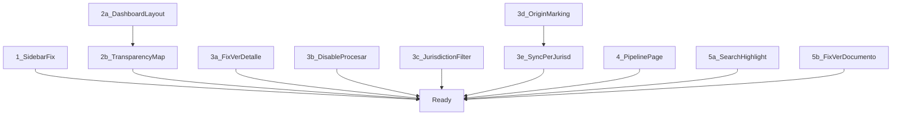

# Watcher v1.1 Phase 2 Improvements

## 1. Sidebar - Fix selected item highlighting

**Problem:** `isActive` in [main-nav.tsx](watcher-frontend/src/components/layout/main-nav.tsx) uses exact match (`currentPath === item.href`), so sub-routes like `/conocimiento/busqueda` or `/analisis/pipeline` never highlight their parent nav item. Dashboard (`/`) stays selected because it's the default.

**Fix:** Change the match logic to use `startsWith` with a special case for `/` (exact match only for root):

```typescript
const isActive = item.href === "/"
  ? currentPath === "/"
  : currentPath.startsWith(item.href)
```

**Files:** `watcher-frontend/src/components/layout/main-nav.tsx`

---

## 2. Dashboard - Reorganize layout + Mapa del Estado

**2a. Layout reorg:**  Keep "Acciones rapidas" and "Estado del sistema" as the first two blocks (already roughly in that position). Remove or move down the "Quick Stats" cards and "Actividad Reciente" so the visual hierarchy is: Acciones Rapidas -> Estado del Sistema -> Mapa del Estado.

**2b. Mapa del Estado (new feature):** A visual component showing document availability across jurisdictions (Nacion, Provincia, Municipio) per the transparency law framework.

- Data source: `required_documents.json` already defines documents per jurisdiction (nacion, provincia, municipalidad_capital) with statuses
- Backend: `GET /compliance/documents` endpoint exists; also `RequiredDocument` model has `status` field (`missing`, `downloaded`, `processed`, `failed`)
- New component: `TransparencyMap` that renders a hierarchical card/tree view (Nacion -> Provincia -> Municipios) showing for each jurisdiction:
  - Total required documents
  - How many are: downloaded (by platform), uploaded (manually), missing (not available)
  - Color-coded status indicators (green/yellow/red)
- The jurisdiction model already exists (`Jurisdiccion` with tipos: provincia, capital, municipalidad, comuna)
- May need a new backend endpoint: `GET /compliance/transparency-overview` that aggregates RequiredDocument status per jurisdiction

**Regarding cloud storage:** This is flagged as a potential future requirement. For Phase 2 we can design the document status model to be storage-agnostic (local path or cloud URL) by adding an optional `storage_url` field to `RequiredDocument`, but defer actual cloud migration to a separate epic.

**Files:**

- New: `watcher-frontend/src/components/features/transparency-map.tsx`
- Edit: `watcher-frontend/src/pages/dashboard/index.tsx`
- Edit or new: backend endpoint for aggregated transparency overview
- Possible new API hook: `use-transparency.ts`

---

## 3. Documentos - Multiple improvements

### 3a. Fix "Ver detalle" button

**Problem:** `DocumentosHub` renders `BoletinCard` but never passes `onView`, so the button and card click do nothing.

**Fix:** In [documentos/index.tsx](watcher-frontend/src/pages/documentos/index.tsx), pass `onView` to `BoletinCard` using TanStack Router navigation:

```typescript
<BoletinCard
  boletin={b}
  onView={(id) => router.navigate({ to: "/documentos/$id", params: { id: String(id) } })}
/>
```

**Files:** `watcher-frontend/src/pages/documentos/index.tsx`

### 3b. Disable "Procesar" button when already processed

**Problem:** Currently `disabled` only checks `isDocProcessing || !hasFile`. A completed document can still be processed again.

**Fix:** In [boletin-card.tsx](watcher-frontend/src/components/features/boletin-card.tsx), add `displayStatus === "completed"` to the disabled condition:

```typescript
disabled={isDocProcessing || !hasFile || displayStatus === "completed"}
```

**Files:** `watcher-frontend/src/components/features/boletin-card.tsx`

### 3c. Add Jurisdiction filter

**Problem:** `BoletinFilters` has year/month/section/status/file filters but no jurisdiction filter.

**Fix:**

- Add a jurisdiction dropdown to `BoletinFilters` using data from `GET /jurisdicciones/`
- Add `jurisdiccion_id` to `BoletinesFilters` type
- Pass through to the backend query

**Files:**

- `watcher-frontend/src/components/features/boletin-filters.tsx`
- `watcher-frontend/src/types/boletines.ts` (add `jurisdiccion_id` to `BoletinesFilters`)
- New hook or extend existing: `use-jurisdicciones.ts`

### 3d. File upload with special type marking

Uploaded files should be distinguishable from auto-downloaded ones.

**Fix:**

- Add `origin` field to `Boletin` model: `"downloaded"`, `"uploaded"`, `"synced"`
- Backend `POST /upload/files` should set `origin = "uploaded"` on creation
- Scrapers/sync set `origin = "downloaded"` or `"synced"`
- Frontend `BoletinCard` shows a small badge indicating origin
- CRUD `create_boletin` needs to accept `origin` parameter

**Files:**

- `watcher-backend/app/db/models.py` (add `origin` column)
- `watcher-backend/app/db/crud.py` (accept `origin`)
- `watcher-backend/app/api/v1/endpoints/upload.py` (set origin)
- `watcher-frontend/src/components/features/boletin-card.tsx` (show origin badge)

### 3e. Sync boletines per jurisdiction

Build on existing scraper/sync infrastructure. Make it configurable per jurisdiction.

**Fix:**

- Extend `Jurisdiccion` model or create a `JurisdiccionConfig` table with: `source_url_template`, `scraper_type`, `sync_enabled`, `last_sync_date`
- New endpoint: `POST /sync/jurisdiction/{id}` to trigger sync for a specific jurisdiction
- Frontend: Add a sync panel/button per jurisdiction in the documents page or a dedicated sync settings section
- Leverage existing scrapers (`pds_prov.py`, `pds_muni.py`, `pds_nat.py`)

**Files:**

- `watcher-backend/app/db/models.py` (new `JurisdiccionConfig` or extend `Jurisdiccion`)
- New or edit: `watcher-backend/app/api/v1/endpoints/sync.py`
- `watcher-frontend/src/pages/documentos/index.tsx` (sync trigger UI)

---

## 4. New Pipeline Workflow Page

**Current state:** Pipeline monitoring exists at `/analisis/pipeline` with basic metrics, status, error log, and activity feed. Pipeline controls live in `PipelineControls` component on the documents page.

**Improvements:**

- **Dedicated route:** Add a new top-level nav item or promote the existing `/analisis/pipeline` route
- **Task detail view:** For each document in the pipeline, show a step-by-step timeline (extract -> chunk -> embed -> index) with status per step, duration, and error details
- **Individual + batch execution:** Move pipeline trigger controls (process one, process all, config panel) into this page with clearer UX
- **Improved notifications:** Use toast notifications for pipeline events (document completed, failed, pipeline finished) - integrate a toast system (e.g. sonner)
- **Real-time progress bar:** Improve `PipelineProgress` to show animated stage transitions, percentage complete, ETA, and current document filename prominently

**Files:**

- Edit: `watcher-frontend/src/pages/analisis/pipeline-status.tsx` (major overhaul)
- Edit: `watcher-frontend/src/components/features/pipeline-progress.tsx`
- New: `watcher-frontend/src/components/features/pipeline-task-detail.tsx`
- Add toast library (sonner) and integrate with WebSocket events
- Edit: `watcher-frontend/src/components/features/pipeline-controls.tsx`
- Consider adding pipeline page to sidebar nav in `main-nav.tsx`

---

## 5. Search - Show fragments + fix "Ver documento"

### 5a. Show matching text fragment with highlight

**Problem:** Backend returns `highlight` field with `<mark>` tags around matching terms, but the frontend ignores it and shows raw `result.document` text.

**Fix:**

- Use `result.highlight` (or fall back to `result.document`/`result.text`) in search results
- Render highlight HTML safely using `dangerouslySetInnerHTML` with sanitization, or parse `<mark>` tags into styled React elements
- Align frontend `SearchResult` type with backend `RetrievalResult` (backend returns `text` + `highlight`, frontend expects `document`)

**Files:**

- `watcher-frontend/src/types/search.ts` (add `highlight` and `text` fields to `SearchResult`)
- `watcher-frontend/src/pages/conocimiento/search.tsx` (render highlight)
- `watcher-frontend/src/lib/api/hooks/use-search.ts` (map backend fields if needed)

### 5b. Fix "Ver documento" - open in new tab

**Problem:** Currently uses `<Link to="/documentos/$id">` which navigates in the same tab. Also `document_id` in metadata may be the filename stem instead of numeric ID.

**Fix:**

- Change the link to open the actual PDF in a new tab: `window.open(pdfUrl, '_blank')` pointing to the backend PDF serve endpoint
- Or if we want to keep navigating to the detail page, use `target="_blank"` on the link
- Fix the `document_id` mapping: backend should return `boletin_id` (numeric) in metadata; update search endpoint to include it
- Add a backend endpoint to serve PDFs: `GET /boletines/{id}/pdf` (may already exist)

**Files:**

- `watcher-frontend/src/pages/conocimiento/search.tsx` (change link behavior)
- `watcher-backend/app/api/v1/endpoints/search.py` (ensure `boletin_id` in metadata)
- `watcher-backend/app/api/v1/endpoints/boletines.py` (verify PDF serve endpoint)

---

## Dependency graph




## Suggested implementation order (by independence and impact)

1. **Quick wins (no dependencies, immediate UX impact):** 1, 3a, 3b, 5b
2. **Medium effort:** 3c, 5a, 2a
3. **Larger features:** 3d, 4, 2b
4. **Complex / cross-cutting:** 3e (sync per jurisdiction)

