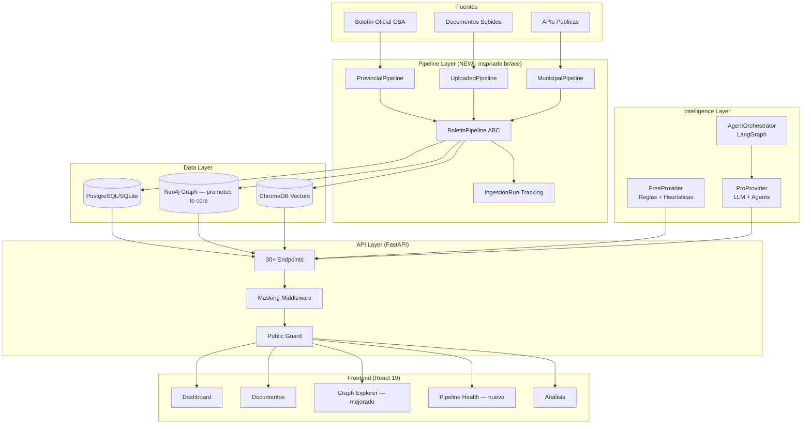

# 🏗️ Blueprint Técnico: Mejoras de br-acc para Watcher Agent

## Resumen Ejecutivo

Tras analizar ambos repositorios en profundidad, este blueprint propone **10 mejoras concretas** para Watcher Agent, inspiradas en patrones arquitectónicos y tecnologías de br/acc. Las mejoras se organizan por prioridad e impacto.

---

## Comparativa de Stacks

| Aspecto | Watcher Agent (actual) | br/acc (referencia) | Recomendación |
|---------|----------------------|---------------------|---------------|
| **Graph DB** | Neo4j (opcional, neo4j_client.py) | Neo4j 5 (core, 40+ nodos) | **Promover Neo4j a core** |
| **Backend** | FastAPI + SQLAlchemy async + SQLite/PG | FastAPI + Neo4j driver async | **Híbrido SQL+Graph** |
| **Frontend** | React 19 + shadcn/ui + TanStack | React 19 + Vite + Zustand | Ya alineados |
| **ETL** | PDFs → services monolíticos | Pipeline ABC (extract→transform→load) | **Adoptar Pipeline ABC** |
| **AI/LLM** | Google Generative AI + LangGraph | No tiene AI | — Watcher lidera aquí |
| **Vectores** | ChromaDB | No tiene | — Watcher lidera aquí |
| **Packaging** | pip + requirements.txt | uv + pyproject.toml | **Migrar a uv** |
| **Query Layer** | SQL inline en services | Cypher externalizados en .cypher | **Externalizar queries** |
| **Tiering** | No tiene | CommunityProvider vs FullProvider | **Adoptar tiering** |
| **Privacy** | No tiene | CPF masking + public_guard | **Adoptar privacy layer** |

---

## Mejoras Propuestas (por prioridad)

---

### 🔴 P0 — Impacto Alto, Esfuerzo Medio

#### 1. Adoptar el Patrón Pipeline ABC para ETL

**Problema actual:** Watcher procesa boletines con servicios monolíticos ([document_processor.py](file:///Users/germanevangelisti/watcher/watcher-backend/app/services/document_processor.py), [batch_processor.py](file:///Users/germanevangelisti/watcher/watcher-backend/app/services/batch_processor.py), [pipeline_service.py](file:///Users/germanevangelisti/watcher/watcher-backend/app/services/pipeline_service.py) — ~47K LOC combinados). No hay contrato claro entre fases.

**Solución de br/acc:** Clase abstracta [Pipeline](file:///Users/germanevangelisti/br-acc/etl/src/bracc_etl/base.py#11-113) con contrato [extract() → transform() → load()](file:///Users/germanevangelisti/br-acc/etl/src/bracc_etl/base.py#37-40) + tracking de ingestion runs.

**Implementación propuesta:**

```python
# watcher-backend/app/pipelines/base.py
from abc import ABC, abstractmethod

class BoletinPipeline(ABC):
    name: str
    source_id: str

    def __init__(self, db_session, config=None):
        self.db = db_session
        self.config = config or {}
        self.rows_in = 0
        self.rows_loaded = 0

    @abstractmethod
    async def extract(self) -> list[dict]:
        """Descarga/lee boletines crudos."""

    @abstractmethod
    async def transform(self, raw_data: list[dict]) -> list[dict]:
        """Limpia, chunking, extrae entidades."""

    @abstractmethod
    async def load(self, transformed: list[dict]) -> None:
        """Persiste en SQL + Graph + Vector store."""

    async def run(self) -> dict:
        """Ejecuta pipeline completo con tracking."""
        run = await self._create_ingestion_run()
        try:
            raw = await self.extract()
            transformed = await self.transform(raw)
            await self.load(transformed)
            await self._complete_run(run, "loaded")
        except Exception as e:
            await self._complete_run(run, "failed", error=str(e))
            raise
        return run
```

**Pipelines a crear:**
- `ProvincialBoletinPipeline` — descarga desde boletinoficial.cba.gov.ar
- `UploadedDocumentPipeline` — documentos subidos manualmente
- `MunicipalBoletinPipeline` — fuentes municipales (futuro)

**Archivos afectados:**
- [NEW] `watcher-backend/app/pipelines/base.py`
- [NEW] `watcher-backend/app/pipelines/provincial.py`
- [NEW] `watcher-backend/app/pipelines/uploaded.py`
- [MODIFY] [watcher-backend/app/services/pipeline_service.py](file:///Users/germanevangelisti/watcher/watcher-backend/app/services/pipeline_service.py) — refactorizar para usar pipelines
- [MODIFY] [watcher-backend/app/services/batch_processor.py](file:///Users/germanevangelisti/watcher/watcher-backend/app/services/batch_processor.py) — delegar a pipelines

---

#### 2. Promover Neo4j a Componente Core (Graph de Entidades)

**Problema actual:** Neo4j está como dependencia opcional con un [neo4j_client.py](file:///Users/germanevangelisti/watcher/watcher-backend/app/db/neo4j_client.py) básico (3.6KB). El [entity_service.py](file:///Users/germanevangelisti/watcher/watcher-backend/app/services/entity_service.py) (35KB) y [graph_service.py](file:///Users/germanevangelisti/watcher/watcher-backend/app/services/graph_service.py) (16KB) operan de forma aislada.

**Solución de br/acc:** 40+ tipos de nodos, schema declarativo en [init.cypher](file:///Users/germanevangelisti/br-acc/infra/neo4j/init.cypher), fulltext search, relaciones tipadas. **Neo4j es el corazón del sistema.**

**Implementación propuesta:**

```cypher
// watcher-backend/graph/init.cypher

// Nodos principales
CREATE CONSTRAINT organismo_unique IF NOT EXISTS
  FOR (o:Organismo) REQUIRE o.organismo_id IS UNIQUE;

CREATE CONSTRAINT persona_unique IF NOT EXISTS
  FOR (p:Persona) REQUIRE p.persona_id IS UNIQUE;

CREATE CONSTRAINT empresa_unique IF NOT EXISTS
  FOR (e:Empresa) REQUIRE e.cuit IS UNIQUE;

CREATE CONSTRAINT boletin_unique IF NOT EXISTS
  FOR (b:Boletin) REQUIRE b.boletin_id IS UNIQUE;

CREATE CONSTRAINT acto_unique IF NOT EXISTS
  FOR (a:Acto) REQUIRE a.acto_id IS UNIQUE;

CREATE CONSTRAINT licitacion_unique IF NOT EXISTS
  FOR (l:Licitacion) REQUIRE l.licitacion_id IS UNIQUE;

CREATE CONSTRAINT alerta_unique IF NOT EXISTS
  FOR (al:Alerta) REQUIRE al.alerta_id IS UNIQUE;

// Fulltext
CREATE FULLTEXT INDEX entity_search_watcher IF NOT EXISTS
  FOR (n:Organismo|Persona|Empresa|Acto|Licitacion|Boletin)
  ON EACH [n.nombre, n.descripcion, n.cuit, n.razon_social];
```

**Relaciones clave:**
- [(Organismo)-[:EMITE]->(Acto)](file:///Users/germanevangelisti/br-acc/etl/src/bracc_etl/base.py#49-76)
- [(Acto)-[:BENEFICIA]->(Persona|Empresa)](file:///Users/germanevangelisti/br-acc/etl/src/bracc_etl/base.py#49-76)
- [(Acto)-[:PUBLICADO_EN]->(Boletin)](file:///Users/germanevangelisti/br-acc/etl/src/bracc_etl/base.py#49-76)
- [(Acto)-[:RELACIONADO_CON]->(Licitacion)](file:///Users/germanevangelisti/br-acc/etl/src/bracc_etl/base.py#49-76)
- [(Persona)-[:FUNCIONA_EN]->(Organismo)](file:///Users/germanevangelisti/br-acc/etl/src/bracc_etl/base.py#49-76)
- [(Alerta)-[:SOBRE]->(Acto)](file:///Users/germanevangelisti/br-acc/etl/src/bracc_etl/base.py#49-76)

**Archivos afectados:**
- [NEW] `watcher-backend/graph/init.cypher`
- [NEW] `watcher-backend/graph/queries/` — directorio para queries externalizados
- [MODIFY] [watcher-backend/app/db/neo4j_client.py](file:///Users/germanevangelisti/watcher/watcher-backend/app/db/neo4j_client.py) — schema init + query loader
- [MODIFY] [watcher-backend/app/services/entity_service.py](file:///Users/germanevangelisti/watcher/watcher-backend/app/services/entity_service.py) — escribir a Neo4j
- [MODIFY] [watcher-backend/app/services/graph_service.py](file:///Users/germanevangelisti/watcher/watcher-backend/app/services/graph_service.py) — usar queries externalizados

---

#### 3. Externalizar Queries en Archivos Separados

**Problema actual:** SQL embebido en los 34 services. Las queries son difíciles de mantener, testear y optimizar.

**Solución de br/acc:** 49 archivos [.cypher](file:///Users/germanevangelisti/br-acc/infra/neo4j/init.cypher) en `api/src/bracc/queries/`, cargados dinámicamente por nombre.

**Implementación propuesta para Watcher:**
- Queries SQL complejas → archivos `.sql` en `watcher-backend/app/queries/`
- Queries Cypher → archivos `.cypher` en `watcher-backend/graph/queries/`
- Query loader que cachea y parametriza

```python
# watcher-backend/app/db/query_loader.py
from pathlib import Path
from functools import lru_cache

QUERIES_DIR = Path(__file__).parent.parent / "queries"

@lru_cache(maxsize=100)
def load_query(name: str, dialect: str = "sql") -> str:
    ext = ".sql" if dialect == "sql" else ".cypher"
    path = QUERIES_DIR / f"{name}{ext}"
    return path.read_text()
```

**Archivos afectados:**
- [NEW] `watcher-backend/app/queries/` — directorio de queries SQL
- [NEW] `watcher-backend/app/db/query_loader.py`
- [MODIFY] Services que tienen SQL inline complejo

---

### 🟡 P1 — Impacto Medio-Alto, Esfuerzo Medio

#### 4. Migrar de requirements.txt a uv + pyproject.toml

**Problema actual:** `requirements.txt` plano sin lockfile. Instalación lenta e impredecible.

**Solución de br/acc:** `pyproject.toml` con `uv` como package manager. Build reproducible con `uv.lock`.

**Implementación propuesta:**

```toml
# watcher-backend/pyproject.toml
[project]
name = "watcher-backend"
version = "1.1.0"
requires-python = ">=3.11"
dependencies = [
    "fastapi>=0.104.1",
    "uvicorn>=0.24.0",
    "sqlalchemy>=2.0.27",
    "aiosqlite>=0.19.0",
    "neo4j>=5.18.0",
    # ... etc
]

[project.optional-dependencies]
ai = ["langchain-core>=0.3.29", "langgraph>=0.2.62", "langchain-google-genai>=2.0.8"]
dev = ["pytest>=8.0", "ruff>=0.9.0", "mypy>=1.14.0"]
```

**Archivos afectados:**
- [NEW] `watcher-backend/pyproject.toml`
- [DELETE] `watcher-backend/requirements.txt`
- [DELETE] `watcher-backend/requirements-minimal.txt`
- [MODIFY] `Makefile` — usar `uv run` en lugar de `pip`
- [MODIFY] `watcher-backend/Dockerfile`

---

#### 5. Implementar Intelligence Provider con Tiering

**Problema actual:** Los servicios de análisis (`watcher_service.py`, `aiu_service.py`, `compliance_engine.py`) no tienen un patrón de abstracción. Todo el análisis asume acceso completo.

**Solución de br/acc:** Protocolo `IntelligenceProvider` con tiers `community` vs `full`. Cada tier define qué patrones y análisis están disponibles.

**Implementación propuesta para Watcher:**

```python
# watcher-backend/app/services/intelligence_provider.py
from typing import Protocol

class IntelligenceProvider(Protocol):
    tier: str  # "free", "pro", "investigator"

    async def analyze_boletin(self, boletin_id: int) -> AnalysisResult: ...
    async def detect_patterns(self, entity_id: str) -> list[PatternResult]: ...
    async def generate_alerts(self, scope: str) -> list[Alert]: ...
    def available_analyses(self) -> list[str]: ...

class FreeProvider:
    """Sin LLM — solo reglas y heurísticas."""
    tier = "free"

class ProProvider:
    """Con LLM — análisis completo."""
    tier = "pro"
```

**Beneficio:** Permite ofrecer funcionalidad básica sin API keys de LLM y escalar a análisis avanzados con suscripción.

---

#### 6. Adoptar IngestionRun Tracking (Observabilidad de Pipelines)

**Problema actual:** `ProcesamientoBatch` existe pero es básico. No hay tracking granular por fuente/pipeline.

**Solución de br/acc:** Nodos `IngestionRun` en Neo4j + `SourceDocument` para trazabilidad completa. Cada pipeline persiste automáticamente su estado.

**Implementación propuesta:**
- Modelo SQL `IngestionRun` + modelo Neo4j equivalente
- Cada pipeline hereda tracking automático de `BoletinPipeline.run()`
- Dashboard de salud de pipelines en frontend

**Archivos afectados:**
- [MODIFY] `watcher-backend/app/db/models.py` — agregar `IngestionRun`
- [MODIFY] `watcher-backend/app/pipelines/base.py` — integrar tracking
- [NEW] `watcher-frontend/src/pages/pipeline/health.tsx`

---

### 🟢 P2 — Impacto Medio, Esfuerzo Bajo-Medio

#### 7. Implementar Privacy/Masking Middleware

**Problema actual:** No hay protección de datos sensibles en responses de API.

**Solución de br/acc:** `CPFMaskingMiddleware` + `SecurityHeadersMiddleware` + `public_guard.py`.

**Implementación propuesta:**

```python
# watcher-backend/app/middleware/masking.py
class CUITMaskingMiddleware:
    """Enmascara CUITs/CUILs en responses de API pública."""
    CUIT_PATTERN = re.compile(r'\b\d{2}-\d{8}-\d\b')

    async def __call__(self, request, call_next):
        response = await call_next(request)
        if self._is_public_route(request):
            # Mask CUITs in response body
            ...
```

---

#### 8. Adoptar Schema de Validación con Pandera (ETL)

**Problema actual:** No hay validación formal de datos extraídos de PDFs antes de persistir.

**Solución de br/acc:** Pandera schemas para validar DataFrames antes del load.

**Implementación propuesta:**
- Schemas para validar estructura de actos extraídos
- Validar antes de escribir a DB
- Rechazar rows inválidas con logging

---

#### 9. Implementar Source Registry (Registro de Fuentes)

**Problema actual:** Las fuentes de datos están hardcodeadas. No hay registry centralizado.

**Solución de br/acc:** CSV-driven source registry con estado por fuente (loaded/partial/stale/blocked).

**Implementación propuesta:**
- `watcher-backend/config/source_registry.yml` — YAML con todas las fuentes
- Incluye URL template, frecuencia, última sync, estado
- Endpoint `/api/v1/sources/health` para dashboard de salud

---

#### 10. Mejorar Graph Visualization con react-force-graph-2d

**Problema actual:** Watcher ya tiene `react-force-graph-2d` en `package.json` pero la implementación del grafo es básica.

**Solución de br/acc:** Visualización de subgrafos empresariales con expansión de nodos, colores por tipo, y filtros.

**Implementación propuesta:**
- Integrar patrón de br/acc: fetch subgraph centrado en entidad
- Nodos coloreados por tipo (Organismo, Persona, Empresa, Acto)
- Click para expandir relaciones
- Panel lateral con detalles del nodo seleccionado

---

## Arquitectura Propuesta (Post-Blueprint)



---

## Roadmap de Implementación

| Fase | Mejoras | Esfuerzo | Prioridad |
|------|---------|----------|-----------|
| **Fase 1** (1-2 semanas) | #1 Pipeline ABC, #3 Query Externalization | Medio | P0 |
| **Fase 2** (1-2 semanas) | #2 Neo4j Core + Schema, #6 IngestionRun | Medio | P0 |
| **Fase 3** (1 semana) | #4 Migrar a uv, #7 Privacy Middleware | Bajo | P1 |
| **Fase 4** (1-2 semanas) | #5 Intelligence Tiering, #8 Pandera | Medio | P1 |
| **Fase 5** (1 semana) | #9 Source Registry, #10 Graph Viz | Bajo | P2 |

---

## Lo que Watcher ya hace mejor que br/acc

> [!TIP]
> 🏆 Watcher no solo recibe; también lidera en varias áreas que br/acc no tiene.

| Capacidad | Watcher ✅ | br/acc ❌ |
|-----------|-----------|----------|
| **Agentes AI** (LangGraph, orchestrator, verification) | ✅ 8 agentes con persistencia | ❌ Sin AI |
| **Vector Search** (ChromaDB + embeddings) | ✅ Búsqueda semántica | ❌ Solo fulltext |
| **LLM Analysis** (GPT-4/Gemini) | ✅ NER, clasificación, alertas | ❌ Sin LLM |
| **Anomaly Detection** (Isolation Forest) | ✅ ML pipeline | ❌ Solo reglas Cypher |
| **WebSocket/Polling** para real-time | ✅ Pipeline monitoring | ❌ Sin real-time |
| **Budget Tracking** (ejecución presupuestaria) | ✅ Full stack | ❌ Sin presupuesto |
| **DS Lab** (Jupyter, sklearn) | ✅ Experimentación | ❌ Sin lab |
| **Geolocalización** (jurisdicciones, lat/lng) | ✅ 26 jurisdicciones | ❌ Sin geo |

---

## Resumen de Decisiones

1. **Pipeline ABC** → Máxima prioridad. Ordena todo el flujo de ingesta.
2. **Neo4j como core** → Ya tenés la dependencia. Falta schema y queries externalizados.
3. **uv + pyproject.toml** → Quick win. Build reproducible.
4. **Intelligence Tiering** → Permite escalar sin forzar API keys.
5. **Privacy Middleware** → Fundamental si el sistema va a producción pública.

> [!IMPORTANT]
> Este blueprint no requiere reescribir Watcher. Es una **inyección de patrones** de br/acc que mejoran la arquitectura existente sin romper funcionalidad.
