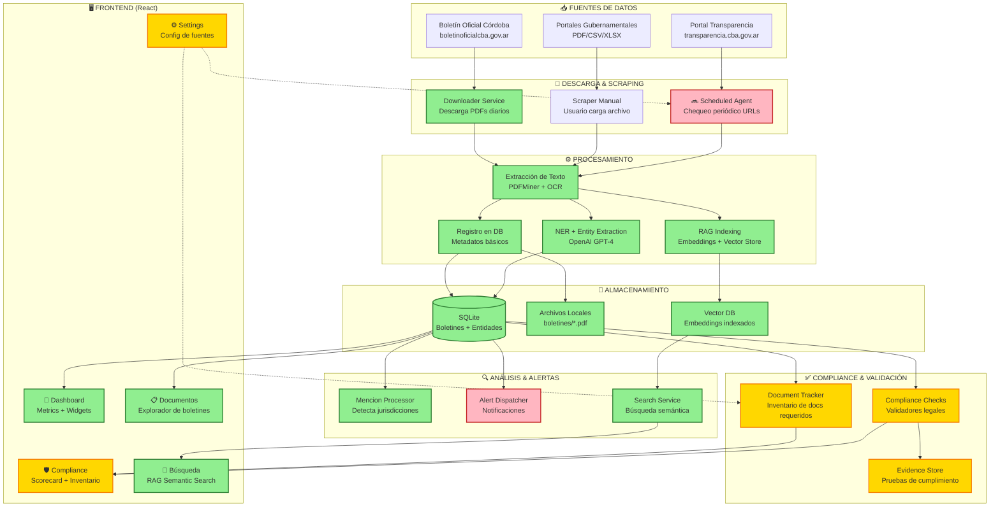

# 🔄 Pipeline Watcher - Estado Actual (Feb 2026)

## Diagrama del Flujo Principal



---

## 📊 Leyenda del Estado

- 🟢 **Verde** (Implementado): Funcional y en uso
- 🟡 **Amarillo** (Parcial): Implementado pero necesita completarse
- 🔴 **Rosa** (Pendiente): Diseñado pero no implementado

---

## 🔄 Flujo Detallado por Fase

### FASE 1: INGESTA DE DATOS 📥

**Estado Actual:**
- ✅ **Downloader Service**: Descarga automática de boletines oficiales (XML → PDF)
- ✅ **Upload Manual**: Usuario puede subir PDFs desde la UI
- 🔜 **Scheduled Agent**: Chequeo periódico de URLs gubernamentales (PENDIENTE)

**Próximos Pasos:**
- Agregar UI para gestionar URLs de documentos
- Implementar scheduler con APScheduler o Celery
- Agent que visita URLs periódicamente y descarga si hay cambios

---

### FASE 2: PROCESAMIENTO ⚙️

**Estado Actual:**
- ✅ **Extracción de Texto**: PDFMiner extrae texto de PDFs
- ✅ **Entity Extraction**: OpenAI GPT-4 detecta entidades (personas, organizaciones, lugares)
- ✅ **RAG Indexing**: Embeddings con `text-embedding-3-small`, almacenados en DB
- ✅ **Menciones**: Detecta referencias a jurisdicciones (provincias, municipios)

**Scripts Disponibles:**
```bash
scripts/extraer_texto_masivo.py          # Extrae texto de todos los PDFs
scripts/extraer_entidades_masivo.py      # NER con GPT-4
scripts/indexar_embeddings.py            # Genera embeddings para RAG
scripts/procesar_boletines_pendientes.py # Pipeline completo
```

---

### FASE 3: ALMACENAMIENTO 💾

**Estado Actual:**
- ✅ **SQLite Database**: 
  - Boletines (metadata)
  - Entidades (personas, organizaciones, lugares)
  - Menciones (jurisdicciones referenciadas)
  - Compliance Checks (definiciones de checks legales)
  - Required Documents (inventario de documentos obligatorios)
  - Embeddings (vectores para RAG)
  
- ✅ **File Storage**: PDFs guardados en `boletines/`
- ✅ **Vector Store**: Embeddings en SQLite (tabla `boletines`)

**Modelos de Datos:**
- `Boletin`: Metadata de boletines oficiales
- `Entidad`: Personas, organizaciones, lugares extraídos
- `Mencion`: Referencias a jurisdicciones
- `ComplianceCheck`: Definiciones de obligaciones legales
- `CheckResult`: Resultados de evaluaciones
- `RequiredDocument`: Inventario de documentos requeridos

---

### FASE 4: COMPLIANCE & VALIDACIÓN ✅

**Estado Actual:**
- 🟡 **Document Tracker**: 
  - ✅ Backend implementado
  - ✅ Frontend con inventario visual
  - 🔜 Falta: UI para editar URLs
  - 🔜 Falta: Agent que chequea URLs periódicamente

- 🟡 **Compliance Checks**:
  - ✅ 5 checks definidos (Presupuesto, Ejecución, Deuda, Servicios, Empleo)
  - ✅ Scoring ponderado
  - 🔜 Falta: Validadores automáticos (actualmente retornan UNKNOWN)

- 🟡 **Evidence Store**:
  - ✅ Modelo de datos
  - ✅ API endpoints
  - ✅ Frontend con EvidenceTrail component
  - 🔜 Falta: Recolección automática de evidencia

**Documentos Rastreados:**
- 23 documentos requeridos por ley (Nación, Provincia, Ciudad)
- Estados: Missing → Downloaded → Processed → Failed
- Cobertura actual: 0% (ninguno descargado aún)

---

### FASE 5: ANÁLISIS & ALERTAS 🔍

**Estado Actual:**
- ✅ **Mencion Processor**: Detecta referencias a jurisdicciones en texto
- ✅ **Search Service**: Búsqueda semántica con embeddings + RAG
- 🔜 **Alert Dispatcher**: Sistema de alertas (diseñado pero no activo)

**Funcionalidades de Búsqueda:**
- Búsqueda por texto libre (semantic search)
- Filtros por fecha, jurisdicción, entidad
- Ranking por relevancia (cosine similarity)
- Preview de contexto (snippets)

---

### FASE 6: FRONTEND (UI) 🖥️

**Estado Actual:**
- ✅ **Dashboard**: 
  - Métricas de boletines procesados
  - Gráficos de tendencias
  - Widget de compliance
  - Últimos boletines

- ✅ **Documentos**:
  - Explorador de boletines
  - Filtros por fecha/jurisdicción
  - Viewer de PDFs (iframe)
  - Selector de jurisdicciones

- 🟡 **Compliance**:
  - Tab 1: Scorecard de checks legales
  - Tab 2: Inventario de documentos
  - 🔜 Falta: UI para editar URLs de documentos
  - 🔜 Falta: Workflow de descarga/procesamiento

- ✅ **Búsqueda**:
  - Semantic search con RAG
  - Filtros avanzados
  - Vista de resultados con snippets

- 🔜 **Settings**:
  - 🔜 Configuración de fuentes de datos
  - 🔜 URLs de portales gubernamentales
  - 🔜 Frecuencia de chequeos

---

## 🎯 Estado de Componentes Clave

| Componente | Estado | Completitud | Notas |
|---|---|---|---|
| **Downloader Service** | ✅ | 100% | Funciona automáticamente |
| **Text Extraction** | ✅ | 100% | PDFMiner + OCR |
| **Entity Extraction (NER)** | ✅ | 100% | GPT-4 + prompt engineering |
| **RAG Indexing** | ✅ | 100% | Embeddings indexados |
| **Semantic Search** | ✅ | 100% | Búsqueda funcional |
| **Dashboard** | ✅ | 90% | Falta integrar más widgets |
| **Document Tracker** | 🟡 | 60% | Backend OK, falta UI edición |
| **Compliance Checks** | 🟡 | 40% | Estructura OK, validadores pendientes |
| **Scheduled Agent** | 🔜 | 0% | Por implementar |
| **Alert System** | 🔜 | 10% | Modelo creado, no activo |
| **Settings UI** | 🔜 | 0% | Por implementar |

---

## 🚀 Próximas Implementaciones Prioritarias

### 1. UI para Gestión de URLs de Documentos
**Objetivo:** Permitir al usuario agregar/editar URLs donde están los documentos obligatorios.

**Implementación:**
- Componente `DocumentEditor` con formulario de URL
- Botón "Editar" en cada documento del inventario
- Actualizar `expected_url` vía API PATCH

### 2. Scheduled Agent para Chequeo Periódico
**Objetivo:** Agent que visita URLs periódicamente y descarga si hay cambios.

**Implementación:**
```python
# backend/app/services/document_scheduler.py
from apscheduler.schedulers.asyncio import AsyncIOScheduler

class DocumentCheckScheduler:
    def check_document_url(self, doc_id):
        # 1. Leer expected_url de la DB
        # 2. Hacer HTTP GET
        # 3. Calcular hash del archivo remoto
        # 4. Comparar con file_hash en DB
        # 5. Si cambió, descargar y marcar como "downloaded"
        # 6. Disparar procesamiento automático
    
    def schedule_checks(self):
        # Chequear diariamente a las 6am
        scheduler.add_job(self.check_all_documents, 'cron', hour=6)
```

### 3. Validadores Automáticos de Compliance
**Objetivo:** Que `execute_check()` realmente valide si el documento existe y es válido.

**Implementación:**
```python
# Para RF_25917_PRESUPUESTO_ANUAL:
def validate_presupuesto_anual(jurisdiccion_id):
    # 1. Buscar documento tipo "presupuesto_anual" con period=2025
    # 2. Si status == "processed" → PASS
    # 3. Si status == "downloaded" → WARN (descargado pero no procesado)
    # 4. Si status == "missing" → FAIL
    # 5. Si last_checked > 90 días → WARN (desactualizado)
```

---

## 📈 Métricas de Avance del Sistema

**Pipeline de Procesamiento:**
- 🟢 **Ingesta**: 80% completo
- 🟢 **Extracción**: 100% completo
- 🟢 **Indexing**: 100% completo
- 🟡 **Validación**: 50% completo
- 🟢 **Búsqueda**: 100% completo

**Funcionalidades del Usuario:**
- 🟢 **Consulta de boletines**: 100%
- 🟢 **Búsqueda semántica**: 100%
- 🟡 **Compliance monitoring**: 60%
- 🔴 **Gestión de fuentes**: 20%
- 🔴 **Sistema de alertas**: 10%

**Cobertura de Datos:**
- ✅ Boletines históricos procesados
- ✅ Entidades extraídas
- ✅ Embeddings indexados
- 🔜 Documentos obligatorios por descargar (0/23)

---

## 🎬 Resumen: Pipeline en 3 Fases

```
┌─────────────────┐
│  1. INGESTA     │  ← Usuario carga PDF o Agent descarga automático
└────────┬────────┘
         │
         ▼
┌─────────────────┐
│ 2. PROCESAMIENTO│  ← Extracción + NER + Embeddings + Compliance Check
└────────┬────────┘
         │
         ▼
┌─────────────────┐
│  3. CONSUMO     │  ← Dashboard + Búsqueda + Alertas + Compliance UI
└─────────────────┘
```

---

**Última actualización:** 2026-02-09  
**Próxima revisión:** Después de implementar Scheduled Agent
