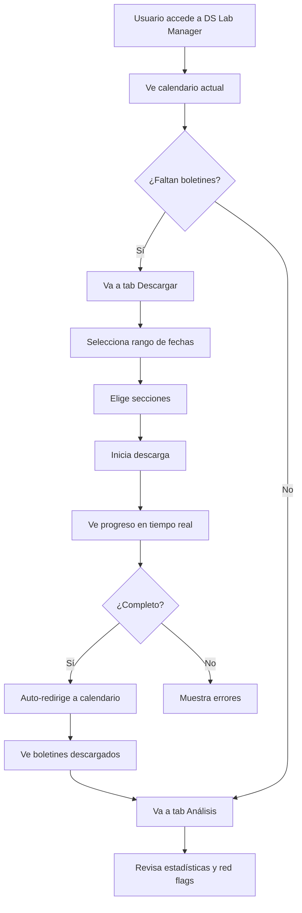

# 🔬 Watcher DS Lab Manager - Guía Completa

## 📖 Descripción General

El **DS Lab Manager** es una interfaz completa para gestionar la descarga y análisis automatizado de boletines oficiales de la Provincia de Córdoba. Integra funcionalidades de descarga masiva, calendario visual interactivo, y análisis con red flags del Watcher DS Lab.

---

## ✨ Características Principales

### 1. 📅 **Calendario Visual de Boletines**
- Vista mensual con código de colores
- Indicadores de estado:
  - 🟢 **Verde**: Todas las secciones descargadas
  - 🟡 **Amarillo**: Descarga parcial
  - 🔴 **Rojo**: No descargado
  - ⚪ **Gris**: Fin de semana (no hay boletines)
- Estadísticas en tiempo real:
  - Porcentaje de completitud
  - Total disponible vs descargado
  - Tamaño total en MB

### 2. 📥 **Sistema de Descarga Inteligente**
- **Descarga por rango de fechas**: Selecciona inicio y fin
- **Selección de secciones**: Elige qué secciones descargar (1-5)
- **Omitir fines de semana**: Automáticamente excluye sábados y domingos
- **Progreso en tiempo real**:
  - Barra de progreso animada
  - Contador de archivos descargados/fallidos
  - Nombre del archivo actual
- **Manejo de errores**: Lista detallada de archivos no disponibles
- **Control de descarga**: Pausar/cancelar en cualquier momento

### 3. 📊 **Dashboard de Análisis**
- **Estadísticas generales**:
  - Total de archivos descargados
  - Tamaño total en MB
  - Distribución por mes
  - Distribución por sección
- **Red Flags Detection** (integración con DS Lab):
  - Contador de red flags detectadas
  - Distribución por severidad (Crítico/Alto/Medio)
  - Lista detallada de red flags
  - Confianza del análisis

---

## 🚀 Cómo Usar

### Acceso
1. Inicia el backend: `cd backend && uvicorn app.main:app --reload`
2. Inicia el frontend: `cd frontend && npm run dev`
3. Navega a: `http://localhost:5173/dslab`

### Descargar Boletines

#### Opción 1: Descarga Simple (Mes Completo)
1. Ve a la pestaña **"Descargar Boletines"**
2. Selecciona fecha de inicio: `01/09/2025`
3. Selecciona fecha de fin: `30/09/2025`
4. Deja todas las secciones seleccionadas
5. Click en **"Iniciar Descarga"**
6. Espera a que complete (verás progreso en tiempo real)

#### Opción 2: Descarga Selectiva
1. Elige un rango específico (ej: 01/09 - 15/09)
2. Deselecciona secciones que no necesites
3. Marca/desmarca "Omitir fines de semana"
4. Inicia descarga

### Ver Calendario
1. Ve a la pestaña **"Calendario de Boletines"**
2. Observa el calendario mensual con código de colores
3. Hover sobre cada día para ver detalles
4. Click en un día para ver información detallada (próximamente)

### Analizar Datos
1. Ve a la pestaña **"Análisis y Estadísticas"**
2. Revisa estadísticas generales
3. Explora la distribución por sección y mes
4. Revisa red flags detectadas (si hay análisis disponible)

---

## 🏗️ Arquitectura Técnica

### Backend (FastAPI)

#### Nuevo Endpoint: `/api/v1/downloader`

##### `POST /downloader/download/start`
Inicia descarga de boletines en background.

**Request Body:**
```json
{
  "start_date": "2025-09-01",
  "end_date": "2025-09-30",
  "sections": [1, 2, 3, 4, 5],
  "skip_weekends": true
}
```

**Response:**
```json
{
  "task_id": "download_2025-09-01_2025-09-30",
  "message": "Descarga iniciada",
  "start_date": "2025-09-01",
  "end_date": "2025-09-30",
  "sections": [1, 2, 3, 4, 5]
}
```

##### `GET /downloader/download/status/{task_id}`
Obtiene progreso de una descarga en curso.

**Response:**
```json
{
  "total_files": 100,
  "downloaded": 45,
  "failed": 3,
  "current_file": "20250915_2_Secc.pdf",
  "status": "downloading",
  "errors": [
    "20250901_3_Secc.pdf: HTTP 404"
  ]
}
```

##### `GET /downloader/calendar?year=2025&month=9`
Obtiene calendario de disponibilidad de boletines.

**Response:**
```json
{
  "year": 2025,
  "month": 9,
  "days": [
    {
      "date": "2025-09-01",
      "is_weekend": false,
      "sections_available": [1, 2, 3, 4, 5],
      "sections_downloaded": [1, 2, 3],
      "sections_analyzed": [],
      "total_size_mb": 12.5
    }
  ],
  "stats": {
    "total_available": 100,
    "total_downloaded": 75,
    "total_size_mb": 450.2,
    "completion_percentage": 75.0
  }
}
```

##### `GET /downloader/download/summary`
Resumen general de todos los boletines descargados.

**Response:**
```json
{
  "total_files": 450,
  "total_size_mb": 2450.5,
  "by_month": {
    "202508": 99,
    "202509": 100
  },
  "by_section": {
    "1": 90,
    "2": 90,
    "3": 90,
    "4": 90,
    "5": 90
  }
}
```

##### `DELETE /downloader/download/{task_id}`
Cancela una descarga en progreso.

---

### Frontend (React + TypeScript)

#### Nuevos Componentes

##### 1. `DSLabManagerPage.tsx`
Página principal que integra todos los componentes.

**Características:**
- Sistema de tabs (Calendario/Descarga/Análisis)
- Manejo de estado global
- Auto-refresh después de descarga
- Alertas y mensajes informativos

##### 2. `BoletinesCalendar.tsx`
Componente de calendario visual mensual.

**Props:**
```typescript
interface BoletinesCalendarProps {
  year: number;
  month: number;
  days: CalendarDay[];
  stats: CalendarStats;
  onDayClick?: (date: string) => void;
}
```

**Características:**
- Código de colores por estado
- Tooltips con información detallada
- Leyenda explicativa
- Ring progress para completitud
- Responsive design

##### 3. `DownloadManager.tsx`
Componente para gestionar descargas.

**Props:**
```typescript
interface DownloadManagerProps {
  onDownloadComplete?: () => void;
}
```

**Características:**
- Selector de rango de fechas
- Multi-select de secciones
- Switch para omitir fines de semana
- Polling automático de progreso (cada 2s)
- Barra de progreso animada
- Timeline de errores
- Botones de control (Iniciar/Cancelar/Nueva descarga)

##### 4. `DSLabDashboard.tsx`
Dashboard de estadísticas y análisis.

**Props:**
```typescript
interface DSLabDashboardProps {
  stats: DSLabStats | null;
  redFlags?: RedFlag[];
}
```

**Características:**
- Cards de métricas principales
- Ring progress de red flags por severidad
- Tabla de red flags detectadas
- Distribución por sección y mes
- Scroll area para listas largas

---

## 📁 Estructura de Archivos

```
watcher-monolith/
├── backend/
│   └── app/
│       └── api/
│           └── v1/
│               └── endpoints/
│                   └── downloader.py ✨ NUEVO
│
└── frontend/
    └── src/
        ├── components/
        │   └── dslab/ ✨ NUEVO
        │       ├── BoletinesCalendar.tsx
        │       ├── DownloadManager.tsx
        │       └── DSLabDashboard.tsx
        │
        ├── pages/
        │   └── DSLabManagerPage.tsx ✨ NUEVO
        │
        ├── routes/
        │   └── index.tsx (actualizado)
        │
        └── components/
            └── layout/
                └── MainNavbar.tsx (actualizado)
```

---

## 🎨 Experiencia de Usuario

### Flujo de Trabajo Completo



---

## 🔧 Configuración

### Variables de Entorno (Backend)

```env
# Ya configuradas en el sistema
BOLETINES_DIR=/Users/germanevangelisti/watcher-agent/boletines
```

### Base URL de Boletines

Configurada en `downloader.py`:
```python
BASE_URL = "https://boletinoficial.cba.gov.ar/wp-content/4p96humuzp/{year}/{month:02d}/{section}_Secc_{day:02d}{month:02d}{y_short}.pdf"
```

---

## 🚨 Manejo de Errores

### Errores Comunes

#### 1. **Boletín No Disponible (404)**
- **Causa**: El boletín no fue publicado ese día
- **Solución**: Normal, se marca como "no disponible"
- **No requiere acción**

#### 2. **Error de Red (Timeout)**
- **Causa**: Conexión lenta o servidor no responde
- **Solución**: Reintentar descarga
- **Acción**: Click en "Nueva Descarga" y reintenta

#### 3. **Descarga Incompleta**
- **Causa**: Cancelación o error durante descarga
- **Solución**: Continuar desde donde quedó
- **Acción**: Selecciona solo las fechas faltantes

---

## 📊 Casos de Uso

### Caso 1: Descargar Mes Completo
**Objetivo**: Tener todos los boletines de septiembre 2025

1. Accede a `/dslab`
2. Tab "Descargar Boletines"
3. Inicio: `01/09/2025`
4. Fin: `30/09/2025`
5. Todas las secciones seleccionadas
6. Omitir fines de semana: ✅
7. Click "Iniciar Descarga"
8. Espera ~10-15 minutos (dependiendo de conexión)
9. Revisa calendario para confirmar

### Caso 2: Actualización Diaria
**Objetivo**: Descargar solo el boletín de hoy

1. Accede a `/dslab`
2. Tab "Descargar Boletines"
3. Inicio y Fin: Fecha de hoy
4. Todas las secciones
5. Descarga (toma ~2 minutos)

### Caso 3: Análisis de Red Flags
**Objetivo**: Identificar documentos con irregularidades

1. Descarga boletines (Caso 1 o 2)
2. Tab "Análisis y Estadísticas"
3. Revisa contador de red flags
4. Busca casos "CRÍTICO" en tabla
5. Click en documento para ver detalles (próximamente)

---

## 🔮 Roadmap / Próximas Funcionalidades

### En Desarrollo
- [ ] Análisis automático post-descarga con DS Lab
- [ ] Vista detallada de día en calendario
- [ ] Filtros avanzados en dashboard
- [ ] Exportación de reportes (PDF/Excel)
- [ ] Notificaciones push cuando descarga completa
- [ ] Comparación mes a mes
- [ ] Gráficos avanzados (Charts.js)

### Planeado
- [ ] Descarga programada (cron jobs)
- [ ] Sistema de caché para análisis
- [ ] API pública para terceros
- [ ] Integración con webhooks
- [ ] Dashboard mobile responsive
- [ ] Análisis predictivo con ML

---

## 🤝 Integración con DS Lab

### Análisis Automático

El sistema está preparado para integrar automáticamente con el **Watcher DS Lab** después de cada descarga:

```python
# En el futuro, después de descargar:
from watcher_ds_lab.agents import WatcherDetectionAgent

agent = WatcherDetectionAgent()
for boletin in boletines_descargados:
    red_flags = agent.analyze_document(boletin)
    guardar_red_flags_en_db(red_flags)
```

### Red Flags Disponibles

El DS Lab puede detectar:
- **ANOMALIA_ML**: Patrones detectados por machine learning
- **TRANSPARENCIA_CRITICA**: Score de transparencia < 30
- **INCONSISTENCIA_CLASIFICACION**: Clasificación incorrecta
- **MONTO_IRREGULAR**: Montos sospechosos
- **Y más...**

---

## 🛡️ Seguridad y Privacidad

### Rate Limiting
- Delay aleatorio entre descargas (1-2 segundos)
- Evita saturar el servidor de boletines oficiales

### Headers
```python
headers = {
    "User-Agent": "Mozilla/5.0 (X11; Linux x86_64) AppleWebKit/537.36",
    "Accept": "application/pdf",
}
```

### Almacenamiento
- Los boletines se guardan localmente en `/boletines`
- No se suben a servidores externos
- Acceso controlado por permisos de filesystem

---

## 📞 Soporte

### Logs
Los logs del backend están en:
- Console output (desarrollo)
- `backend/logs/` (producción)

### Debug Mode
Para activar logs detallados:
```python
# En downloader.py
logger.setLevel(logging.DEBUG)
```

---

## 🎉 ¡Listo para Usar!

Tu sistema DS Lab Manager está completamente funcional. Características principales:

✅ Descarga automatizada de boletines
✅ Calendario visual interactivo
✅ Progreso en tiempo real
✅ Dashboard de análisis
✅ Manejo robusto de errores
✅ UI intuitiva y moderna
✅ Integración con DS Lab (preparada)

**Inicia el sistema y comienza a descargar boletines ahora mismo!** 🚀

