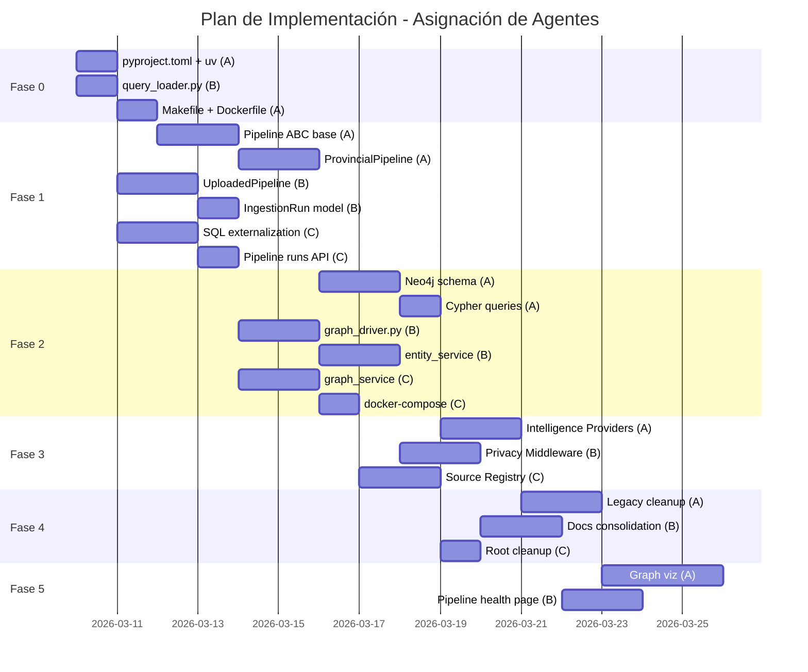

# Watcher v2.0 — Plan de Implementación

## Objetivo

Reestructurar Watcher Agent aplicando patrones de br/acc para mejorar eficiencia, performance y mantenibilidad. Se incluye testing en cada fase, limpieza de código legacy, y consolidación de documentación.

> [!IMPORTANT]
> Cada fase está diseñada para que **múltiples agentes** trabajen en paralelo. Las columnas "Agente" indican asignación ideal para Team Agents.

---

## Fase 0: Fundación y Tooling (Pre-requisito)

**Objetivo:** Preparar la base antes de tocar lógica de negocio.

| # | Tarea | Agente | Archivos | Tests |
|---|-------|--------|----------|-------|
| 0.1 | Migrar de [requirements.txt](file:///Users/germanevangelisti/watcher/watcher-lab/requirements.txt) a [pyproject.toml](file:///Users/germanevangelisti/br-acc/api/pyproject.toml) + `uv` | Agent A | [NEW] `watcher-backend/pyproject.toml`, [DEL] [requirements.txt](file:///Users/germanevangelisti/watcher/watcher-lab/requirements.txt), [requirements-minimal.txt](file:///Users/germanevangelisti/watcher/watcher-backend/requirements-minimal.txt) | `uv sync && uv run python -c "import app.main"` |
| 0.2 | Crear `query_loader.py` + directorio [queries/](file:///Users/germanevangelisti/br-acc/api/src/bracc/services/intelligence_provider.py#59-63) | Agent B | [NEW] `watcher-backend/app/db/query_loader.py`, [NEW] `watcher-backend/app/queries/` | [NEW] `tests/unit/test_query_loader.py` |
| 0.3 | Actualizar [Makefile](file:///Users/germanevangelisti/br-acc/Makefile) para usar `uv run` | Agent A | [MOD] [Makefile](file:///Users/germanevangelisti/br-acc/Makefile) | `make test-backend` pasa |
| 0.4 | Actualizar [Dockerfile](file:///Users/germanevangelisti/br-acc/Dockerfile) | Agent A | [MOD] [watcher-backend/Dockerfile](file:///Users/germanevangelisti/watcher/watcher-backend/Dockerfile) | `docker build` pasa |

**Tests de Fase 0:**
```bash
# Validar migration a uv
uv sync --dev
uv run pytest watcher-backend/tests/unit/test_query_loader.py -v

# Validar que backend arranca
uv run uvicorn app.main:app --host 0.0.0.0 --port 8001 &
curl http://localhost:8001/health
kill %1

# Validar Makefile
make test-backend
```

---

## Fase 1: Pipeline ABC + Query Externalization

**Objetivo:** Introducir el patrón Pipeline y externalizar SQL/Cypher pesados sin romper funcionalidad existente.

| # | Tarea | Agente | Archivos |
|---|-------|--------|----------|
| 1.1 | Crear `BoletinPipeline` base ABC con `IngestionRun` tracking | Agent A | [NEW] `app/pipelines/__init__.py`, `app/pipelines/base.py` |
| 1.2 | Implementar `ProvincialPipeline` (wrap de sync_service + document_processor) | Agent A | [NEW] `app/pipelines/provincial.py` |
| 1.3 | Implementar `UploadedPipeline` (wrap de upload flow) | Agent B | [NEW] `app/pipelines/uploaded.py` |
| 1.4 | Agregar modelo `IngestionRun` a SQLAlchemy | Agent B | [MOD] [app/db/models.py](file:///Users/germanevangelisti/watcher/watcher-backend/app/db/models.py) |
| 1.5 | Extraer 5 queries SQL más complejos a archivos [.sql](file:///Users/germanevangelisti/watcher/watcher-backend/db_queries.sql) | Agent C | [NEW] `app/queries/*.sql`, [MOD] services que los usan |
| 1.6 | Crear endpoint `/api/v1/pipelines/runs` para listar runs | Agent C | [NEW] `app/api/v1/endpoints/pipeline_runs.py` |

**Tests de Fase 1:**
```bash
# Unit tests de pipelines
uv run pytest tests/unit/test_pipeline_base.py -v
uv run pytest tests/unit/test_provincial_pipeline.py -v
uv run pytest tests/unit/test_uploaded_pipeline.py -v

# Integration: pipeline ejecuta extract→transform→load
uv run pytest tests/integration/test_pipeline_flow.py -v -m integration

# API endpoint
uv run pytest tests/integration/test_pipeline_runs_api.py -v

# Smoke: backend arranca y endpoints legacy siguen funcionando
curl http://localhost:8001/api/v1/boletines/
curl http://localhost:8001/api/v1/pipelines/runs
```

| Test | Tipo | Archivo |
|------|------|---------|
| Pipeline ABC contract | Unit | [NEW] `tests/unit/test_pipeline_base.py` |
| ProvincialPipeline extract/transform/load | Unit | [NEW] `tests/unit/test_provincial_pipeline.py` |
| UploadedPipeline flow | Unit | [NEW] `tests/unit/test_uploaded_pipeline.py` |
| IngestionRun model | Unit | [NEW] `tests/unit/test_ingestion_run_model.py` |
| Query loader con archivos .sql | Unit | `tests/unit/test_query_loader.py` (de Fase 0) |
| Pipeline completo → DB | Integration | [NEW] `tests/integration/test_pipeline_flow.py` |
| API /pipelines/runs | Integration | [NEW] `tests/integration/test_pipeline_runs_api.py` |
| Endpoints legacy intactos | E2E | [EXISTING] [tests/e2e/test_full_pipeline.py](file:///Users/germanevangelisti/watcher/watcher-backend/tests/tests/e2e/test_full_pipeline.py) |

---

## Fase 2: Neo4j como Core + Schema Declarativo

**Objetivo:** Promover Neo4j de componente opcional a core del sistema con schema declarativo.

| # | Tarea | Agente | Archivos |
|---|-------|--------|----------|
| 2.1 | Crear `graph/init.cypher` con constraints e índices | Agent A | [NEW] `watcher-backend/graph/init.cypher` |
| 2.2 | Crear `graph/queries/` con queries Cypher externalizados | Agent A | [NEW] `watcher-backend/graph/queries/*.cypher` |
| 2.3 | Refactorizar [neo4j_client.py](file:///Users/germanevangelisti/watcher/watcher-backend/app/db/neo4j_client.py) → `graph_driver.py` con schema init + query loader | Agent B | [MOD] [app/db/neo4j_client.py](file:///Users/germanevangelisti/watcher/watcher-backend/app/db/neo4j_client.py) → [RENAME] `app/db/graph_driver.py` |
| 2.4 | Actualizar [entity_service.py](file:///Users/germanevangelisti/watcher/watcher-backend/app/services/entity_service.py) para escribir a Neo4j en pipelines | Agent B | [MOD] [app/services/entity_service.py](file:///Users/germanevangelisti/watcher/watcher-backend/app/services/entity_service.py) |
| 2.5 | Actualizar [graph_service.py](file:///Users/germanevangelisti/watcher/watcher-backend/app/services/graph_service.py) para usar queries externalizados | Agent C | [MOD] [app/services/graph_service.py](file:///Users/germanevangelisti/watcher/watcher-backend/app/services/graph_service.py) |
| 2.6 | Agregar Neo4j al [docker-compose.yml](file:///Users/germanevangelisti/br-acc/docker-compose.yml) como servicio core | Agent C | [MOD] [docker-compose.yml](file:///Users/germanevangelisti/br-acc/docker-compose.yml) |

**Tests de Fase 2:**
```bash
# Unit: query loader para .cypher
uv run pytest tests/unit/test_graph_query_loader.py -v

# Unit: schema parsing
uv run pytest tests/unit/test_graph_schema.py -v

# Integration: escritura y lectura en Neo4j
uv run pytest tests/integration/test_neo4j_integration.py -v -m integration

# Integration: entity_service → Neo4j
uv run pytest tests/integration/test_entity_graph.py -v -m integration

# Smoke: docker compose up incluye neo4j healthy
docker compose up -d && docker compose exec neo4j cypher-shell -u neo4j -p test "RETURN 1"
```

| Test | Tipo | Archivo |
|------|------|---------|
| Cypher query loader | Unit | [NEW] `tests/unit/test_graph_query_loader.py` |
| Schema init parsing | Unit | [NEW] `tests/unit/test_graph_schema.py` |
| Neo4j CRUD | Integration | [NEW] `tests/integration/test_neo4j_integration.py` |
| Entity → Graph | Integration | [NEW] `tests/integration/test_entity_graph.py` |

---

## Fase 3: Intelligence Tiering + Privacy Middleware

**Objetivo:** Abstraer niveles de análisis, agregar privacy layer.

| # | Tarea | Agente | Archivos |
|---|-------|--------|----------|
| 3.1 | Crear [IntelligenceProvider](file:///Users/germanevangelisti/br-acc/api/src/bracc/services/intelligence_provider.py#77-115) protocol + `FreeProvider` + `ProProvider` | Agent A | [NEW] `app/services/intelligence_provider.py` |
| 3.2 | Refactorizar [watcher_service.py](file:///Users/germanevangelisti/watcher/watcher-backend/app/services/watcher_service.py) para usar providers | Agent A | [MOD] [app/services/watcher_service.py](file:///Users/germanevangelisti/watcher/watcher-backend/app/services/watcher_service.py) |
| 3.3 | Crear `CUITMaskingMiddleware` | Agent B | [NEW] `app/middleware/masking.py` |
| 3.4 | Crear `SecurityHeadersMiddleware` | Agent B | [NEW] `app/middleware/security.py` |
| 3.5 | Integrar middlewares en [main.py](file:///Users/germanevangelisti/br-acc/api/src/bracc/main.py) | Agent B | [MOD] [app/main.py](file:///Users/germanevangelisti/watcher/watcher-backend/app/main.py) |
| 3.6 | Crear `source_registry.yml` y endpoint `/sources/health` | Agent C | [NEW] `watcher-backend/config/source_registry.yml`, [NEW] `app/api/v1/endpoints/sources.py` |

**Tests de Fase 3:**
```bash
# Unit: providers
uv run pytest tests/unit/test_intelligence_providers.py -v

# Unit: middleware
uv run pytest tests/unit/test_masking_middleware.py -v
uv run pytest tests/unit/test_security_middleware.py -v

# Integration: análisis con FreeProvider (sin API keys)
uv run pytest tests/integration/test_free_analysis.py -v -m integration

# Integration: CUIT masking en responses
uv run pytest tests/integration/test_api_masking.py -v -m integration
```

| Test | Tipo | Archivo |
|------|------|---------|
| FreeProvider sin LLM | Unit | [NEW] `tests/unit/test_intelligence_providers.py` |
| CUIT masking regex | Unit | [NEW] `tests/unit/test_masking_middleware.py` |
| Security headers | Unit | [NEW] `tests/unit/test_security_middleware.py` |
| FreeProvider end-to-end | Integration | [NEW] `tests/integration/test_free_analysis.py` |
| Masking en responses | Integration | [NEW] `tests/integration/test_api_masking.py` |

---

## Fase 4: Limpieza de Código Legacy

**Objetivo:** Eliminar código muerto y archivos obsoletos **después de validar que servicios esenciales funcionan**.

> [!CAUTION]
> Esta fase solo se ejecuta cuando las Fases 1-3 están **verdes** en tests.

### 4.1 — Archivos a eliminar (backend)

| Archivo | Razón |
|---------|-------|
| [watcher-backend/demo_agents_with_data.py](file:///Users/germanevangelisti/watcher/watcher-backend/demo_agents_with_data.py) | Script demo, no usado |
| [watcher-backend/view_db.py](file:///Users/germanevangelisti/watcher/watcher-backend/view_db.py) | Debug tool, no producción |
| [watcher-backend/check_config.py](file:///Users/germanevangelisti/watcher/watcher-backend/check_config.py) | Setup tool legacy |
| [watcher-backend/migrate_agent_workflows.py](file:///Users/germanevangelisti/watcher/watcher-backend/migrate_agent_workflows.py) | Migración one-shot ya ejecutada |
| [watcher-backend/migrate_db.py](file:///Users/germanevangelisti/watcher/watcher-backend/migrate_db.py) | Migración one-shot ya ejecutada |
| [watcher-backend/db_queries.sql](file:///Users/germanevangelisti/watcher/watcher-backend/db_queries.sql) | Queries debug, reemplazado por [queries/](file:///Users/germanevangelisti/br-acc/api/src/bracc/services/intelligence_provider.py#59-63) |
| [watcher-backend/package-lock.json](file:///Users/germanevangelisti/watcher/watcher-backend/package-lock.json) | No aplica a backend Python |
| `watcher-frontend-legacy/` | Frontend v1 deprecated (conservar README si hay valor) |

### 4.2 — Consolidación de docs/ (31 archivos → 6)

**Estructura propuesta:**

```
docs/
├── README.md                    # Índice de documentación
├── architecture.md              # Fusión de AGENTIC_ARCHITECTURE + ARQUITECTURA_ANALISIS_PERSISTENTE + ARQUITECTURA_ALMACENAMIENTO
├── api-reference.md             # Fusión de API_ENDPOINTS + nuevo
├── deployment.md                # Fusión de ENV_SETUP + INSTALLATION + QUICK_START
├── development.md               # Fusión de PIPELINE_WATCHER_ACTUAL + SCRIPTS_PIPELINE + testing
└── changelog.md                 # Resumen de cambios (fusión de WIZARD_*, FIXES_*, EPIC_*, FASE*)
```

**Eliminar** (valor nulo o absorbido):
- [ANALISIS_PRECISION_BUSQUEDA.md](file:///Users/germanevangelisti/watcher/docs/ANALISIS_PRECISION_BUSQUEDA.md) → absorbido en architecture
- `DSLAB_*.md` (5 archivos) → mover a `watcher-lab/docs/`
- `EPIC_*.md` (2) → absorbido en changelog
- `FIXES_*.md` (1) → absorbido en changelog
- `MEJORAS_*.md` (2) → absorbido en changelog
- `WIZARD_*.md` (4) → absorbido en changelog
- [PYTHON_39_LIMITATION.md](file:///Users/germanevangelisti/watcher/docs/PYTHON_39_LIMITATION.md) → obsoleto (ya en Python 3.11+)
- [GPT-portal.MD](file:///Users/germanevangelisti/watcher/docs/GPT-portal.MD) → legacy, valor cuestionable
- [SISTEMA_LOGS_TIEMPO_REAL.md](file:///Users/germanevangelisti/watcher/docs/SISTEMA_LOGS_TIEMPO_REAL.md) → absorbido en architecture
- [TEST_RESULTS.md](file:///Users/germanevangelisti/watcher/docs/TEST_RESULTS.md) → generado por CI, no debe ser estático
- [NUEVAS_FUNCIONALIDADES_UI.md](file:///Users/germanevangelisti/watcher/docs/NUEVAS_FUNCIONALIDADES_UI.md) → absorbido en changelog
- `docs/architecture/` (6 archivos) → fusionados en `docs/architecture.md` y `docs/api-reference.md`

### 4.3 — Limpieza del root

| Archivo root | Acción |
|--------------|--------|
| [boletines.zip](file:///Users/germanevangelisti/watcher/boletines.zip) (73MB) | Agregar a [.gitignore](file:///Users/germanevangelisti/br-acc/.gitignore), eliminar si no está tracked |
| [coverage.xml](file:///Users/germanevangelisti/watcher/coverage.xml) (171KB) | Agregar a [.gitignore](file:///Users/germanevangelisti/br-acc/.gitignore) |
| [test-results.xml](file:///Users/germanevangelisti/watcher/test-results.xml) | Agregar a [.gitignore](file:///Users/germanevangelisti/br-acc/.gitignore) |
| `htmlcov/` | Ya debería estar en [.gitignore](file:///Users/germanevangelisti/br-acc/.gitignore) |
| [.coverage](file:///Users/germanevangelisti/watcher/.coverage) | Ya debería estar en [.gitignore](file:///Users/germanevangelisti/br-acc/.gitignore) |
| PDFs research (`*.pdf` en root) | Mover a `docs/research/` |

**Tests de Fase 4:**
```bash
# Validar que nada se rompió después de la limpieza
make test
make lint

# Validar imports no broken
uv run python -c "from app.main import app; print('OK')"

# E2E: flujo completo sigue funcionando
uv run pytest tests/e2e/ -v
```

---

## Fase 5: Frontend — Graph Visualization + Pipeline Health

**Objetivo:** Mejorar visualización del grafo y agregar dashboard de salud de pipelines.

| # | Tarea | Agente | Archivos |
|---|-------|--------|----------|
| 5.1 | Mejorar Graph Explorer con expand-on-click y colores por tipo | Agent A | [MOD] `src/pages/conocimiento/` o nuevo page |
| 5.2 | Crear página Pipeline Health `/pipeline/health` | Agent B | [NEW] `src/pages/pipeline/health.tsx` |
| 5.3 | Crear API hook `usePipelineRuns` | Agent B | [NEW] `src/lib/api/pipeline.ts` |
| 5.4 | Panel de detalles de nodo en grafo | Agent A | [NEW] `src/components/features/graph-detail-panel.tsx` |

**Tests de Fase 5:**
```bash
# Frontend unit tests
cd watcher-frontend && npm run test -- --run

# Visual verification (manual via browser)
# 1. Navegar a http://localhost:5173/pipeline/health
# 2. Verificar que muestra lista de pipeline runs
# 3. Navegar al Graph Explorer
# 4. Click en un nodo → panel lateral muestra detalles
```

---

## Diagrama de Paralelismo por Agente



---

## Resumen de Tests Nuevos

| Fase | Unit | Integration | E2E | Total |
|------|------|-------------|-----|-------|
| 0 | 1 | 0 | 0 | 1 |
| 1 | 4 | 2 | 0 | 6 |
| 2 | 2 | 2 | 0 | 4 |
| 3 | 3 | 2 | 0 | 5 |
| 4 | 0 | 0 | 1 (rerun existing) | 1 |
| 5 | 1 | 0 | 1 (manual) | 2 |
| **Total** | **11** | **6** | **2** | **19** |

Sumados a los 18 tests existentes = **37 test files** totales.

**Comando para correr todos los tests:**
```bash
uv run pytest watcher-backend/tests/ -v --tb=short
cd watcher-frontend && npm run test -- --run
```

---

## Verification Plan

### Automated Tests
1. **Post Fase 0:** `uv sync --dev && uv run pytest tests/unit/test_query_loader.py -v`
2. **Post Fase 1:** `uv run pytest tests/unit/test_pipeline_*.py tests/integration/test_pipeline_*.py -v`
3. **Post Fase 2:** `uv run pytest tests/unit/test_graph_*.py tests/integration/test_neo4j_*.py tests/integration/test_entity_graph.py -v`
4. **Post Fase 3:** `uv run pytest tests/unit/test_intelligence_*.py tests/unit/test_*_middleware.py tests/integration/test_free_*.py tests/integration/test_api_masking.py -v`
5. **Post Fase 4:** `make test` (full suite — all must pass)
6. **Post Fase 5:** `cd watcher-frontend && npm run test -- --run`

### Manual Verification
1. **Post Fase 4:** Verificar que `docker compose up -d` arranca todos los servicios sin errores
2. **Post Fase 5:** Navegar a `http://localhost:5173`, verificar dashboard, graph explorer, y pipeline health page

---

## Docs Finales (Post-Implementación)

```
docs/
├── README.md           # Índice con links a cada doc
├── architecture.md     # Stack, diagrama, layers, decisiones
├── api-reference.md    # Endpoints agrupados por módulo
├── deployment.md       # Docker, env vars, producción
├── development.md      # Setup dev, testing, pipelines, contributing
└── changelog.md        # Historial de cambios significativos

watcher-lab/docs/       # DS Lab docs (movidos desde docs/)
├── DSLAB_GUIA_USO.md
└── DSLAB_TROUBLESHOOTING.md
```
